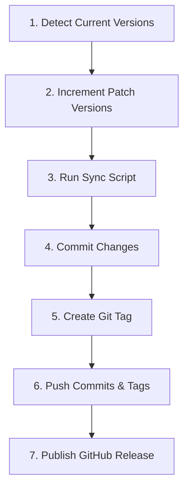

# Release Management

## Overview
Automate version bumping, code committing, git tagging, and GitHub release creation for the Molibot repository.

## When to Use
- The user requests a release, version bump, tag, or GitHub release.
- The project and desktop app versions need to be bumped by 1 (e.g., patch +1).
- Version updates need to be propagated, committed, tagged, and published.

### When NOT to Use
- General code commits that do not represent a release (use standard commit process instead).
- Editing features or files without performing a release.

## Core Pattern
Releasing a version follows a strict sequence to ensure all version identifiers are synchronized across SvelteKit root, Desktop Svelte, Tauri, Cargo, and GitHub.



### Steps

#### 1. Detect Current Versions
Find the current versions inside the following packages:
- Root [package.json](file:///Users/gusi/Github/molipibot/package.json) (under `"version"`)
- Desktop [package.json](file:///Users/gusi/Github/molipibot/apps/desktop/package.json) (under `"version"`)

#### 2. Increment Versions (Carry-over / Base-10 Rule)
For both root and desktop apps, increment the version numbers. The segments are `major.minor.patch`. Each segment has a maximum value of `9` (no two-digit segments are allowed). When incrementing:
- Add 1 to the `patch` version.
- If `patch > 9`, reset `patch` to `0` and increment `minor` by 1.
- If `minor > 9`, reset `minor` to `0` and increment `major` by 1.

Example mappings:
- `2.3.9` -> `2.4.0`
- `0.3.6` -> `0.3.7`
- `2.9.9` -> `3.0.0`

Write these updated versions back to their respective package files.

#### 3. Sync Desktop Version
Run the Svelte/Tauri/Cargo synchronization script from the workspace root:
```bash
node scripts/sync-desktop-version.mjs
```
This propagates the version from `apps/desktop/package.json` to:
- `apps/desktop/src-tauri/Cargo.toml`
- `apps/desktop/src-tauri/tauri.conf.json`
- `apps/desktop/src-tauri/Cargo.lock`

#### 4. Commit Changes
Stage all modified files relating to version bumping and commit:
```bash
git add package.json apps/desktop/package.json apps/desktop/src-tauri/Cargo.toml apps/desktop/src-tauri/Cargo.lock apps/desktop/src-tauri/tauri.conf.json
git commit -m "release: bump versions to v2.3.10 (desktop v0.3.7)"
```
*(Replace `v2.3.10` and `v0.3.7` with the actual versions)*

#### 5. Create Git Tag
Create a git tag using the root package version:
```bash
git tag v2.3.10
```

#### 6. Push Commits & Tags
Push the changes to the remote branch:
```bash
git push && git push --tags
```

#### 7. Publish GitHub Release
Extract the latest version changes from `CHANGELOG.md`. Write them to a temporary file (e.g., `release_notes.md` in the scratch folder), and run the `gh` command:
```bash
gh release create v2.3.10 --title "v2.3.10" --notes-file release_notes.md
```
Delete the temporary file after the release is created.

---

## Quick Reference

| Action | Command / File to Edit |
|--------|------------------------|
| Check Git Status | `git status` |
| Sync Desktop App Versions | `node scripts/sync-desktop-version.mjs` |
| Create Local Git Tag | `git tag v<root_version>` |
| Push Commits & Tags | `git push && git push --tags` |
| Create GitHub Release | `gh release create v<root_version> --title "v<root_version>" --notes-file <file>` |

---

## Common Mistakes

| Mistake | Prevention |
|---------|------------|
| Forgetting to run `sync-desktop-version.mjs` | Always run the sync script after editing `apps/desktop/package.json` to keep Tauri and Cargo files in sync. |
| Forgetting `--tags` in push | Standard `git push` does not push tags. Always append `git push --tags`. |
| Dirty Git state when tagging | Ensure all other changes are clean or committed before starting the release process. |
| Missing or wrong tag format | The git tag must start with `v` followed by the root version (e.g., `v2.3.10`). |
