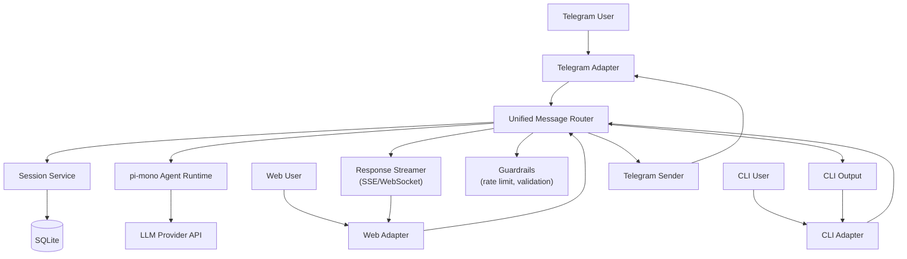

# Molibot V1 Architecture (Telegram + CLI + Web)

## 1. V1 Functional List

### Must (V1)
1. Unified message pipeline for Telegram, CLI, and Web.
2. Telegram bot messaging (receive, process, reply).
3. CLI interactive session (`molibot cli`).
4. Web chat with streaming response.
5. Conversation persistence in SQLite.
6. Basic production guardrails (rate limit, payload limit, health check, logs).

### Later (Post V1)
1. WhatsApp / Lark / Slack adapters.
2. Cross-channel identity linking.
3. Long-term memory with vector retrieval.
4. Tooling marketplace and workflow automation.
5. Admin operations dashboard.

## 2. Technical Architecture Diagram



## 3. Component Responsibilities
- `Telegram Adapter`: Convert Telegram updates to unified message format; send text responses with retry/backoff.
  - Implementation choice for V1: `grammY` (`grammy` npm package) for update routing, middleware, and webhook handling.
- `CLI Adapter`: Read terminal input, route requests, print streamed output.
- `Web Adapter`: HTTP + SSE/WebSocket endpoints for browser chat.
- `Unified Message Router`: Single orchestration path for all channels.
- `Session Service`: Load/save conversation history and session metadata.
- `pi-mono Agent Runtime`: Prompt assembly, LLM call, optional tool wrapper.
- `Guardrails`: Input validation, payload caps, rate limits, and safe defaults.

## 4. Data Model (V1 Minimal)

```sql
CREATE TABLE conversations (
  id UUID PRIMARY KEY,
  channel VARCHAR(20) NOT NULL, -- telegram | cli | web
  external_user_id VARCHAR(255) NOT NULL,
  created_at TIMESTAMP NOT NULL DEFAULT NOW(),
  updated_at TIMESTAMP NOT NULL DEFAULT NOW()
);

CREATE TABLE messages (
  id UUID PRIMARY KEY,
  conversation_id UUID NOT NULL REFERENCES conversations(id),
  role VARCHAR(20) NOT NULL, -- user | assistant | system
  content TEXT NOT NULL,
  token_count INT,
  created_at TIMESTAMP NOT NULL DEFAULT NOW()
);
```

## 5. Two-Week Sprint Plan

### Week 1: Core + Telegram + CLI
- Day 1: Project bootstrap, env config, health endpoint, logging baseline.
- Day 2: Unified message schema + router skeleton.
- Day 3: SQLite schema + session repository.
- Day 4: Telegram adapter (webhook, send/reply, error handling).
- Day 5: CLI adapter + end-to-end test (CLI and Telegram both work).

### Week 2: Web + Stabilization + Release Ready
- Day 6: Web API endpoints + SSE/WebSocket streaming.
- Day 7: Web chat UI integration with session continuity.
- Day 8: Guardrails (rate limits, payload limits, retries, timeout policy).
- Day 9: Regression tests across Telegram/CLI/Web + bug fixes.
- Day 10: Production checklist, deployment docs, V1 release tag.

## 6. Sprint Exit Criteria
1. Telegram, CLI, and Web all route through the same core pipeline.
2. User can continue a session on the same channel with persisted history.
3. Basic operational safety is active (health checks, logs, limits).
4. Deployment guide allows a new environment to run V1 in under 30 minutes.
