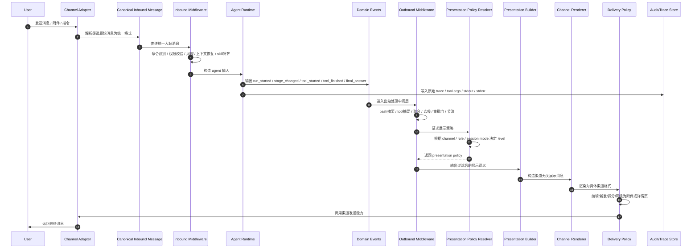

# Agent 多渠道消息架构与展示分级方案

## 目标

本方案用于设计一套支持 Telegram、Feishu、QQ、Web 等多渠道接入的 agent 消息架构，解决以下问题：

- 多渠道接入时，消息格式、交互能力、展示限制不同。
- agent 内部事件很多，但不同端对可见信息的需求不同。
- Web 端需要较强的调试与观测能力；IM 端需要低噪音、高可读性展示。
- tool output、bash output、阶段状态、审批消息、最终结果，需要统一抽象与分层处理。

核心设计原则：

1. agent 不直接输出某个渠道的最终展示文本。
2. 渠道解析、业务编排、领域事件、展示构建、渠道渲染分层解耦。
3. 展示策略由统一的 Presentation Policy 控制，而不是散落在各渠道适配器中。
4. 不同端根据 channel、role、session mode 决定展示 level。
5. 聊天端默认显示状态、审批、结果；Web 端可展示 timeline、trace、audit 等详细信息。

## 总体架构

建议将整体链路拆分为以下模块：

- Channel Adapter：接入 Telegram / Feishu / QQ / Web 的 webhook、SDK、发送接口。
- Canonical Message Layer：统一入站消息格式。
- Inbound Middleware：命令识别、权限校验、风控、上下文恢复、skill 补齐、附件解析。
- Agent Runtime：执行 agent、工具调用、任务编排。
- Domain Events：agent 执行期间输出的统一领域事件。
- Outbound Middleware：tool output 摘要、bash 摘要、事件聚合、节流、审批门、去噪。
- Presentation Policy Resolver：根据端、角色、会话模式决定展示 level。
- Presentation Builder：将领域事件组装成渠道无关的展示消息对象。
- Channel Renderer：将展示消息转换为 Telegram / Feishu / QQ / Web 对应格式。
- Delivery Policy：决定是否编辑消息、拆分消息、节流发送、降级为附件或详情页。
- Audit / Trace Store：存储原始事件、tool args、stdout/stderr、trace 供调试与审计。

## 核心分层

### 1. Canonical Inbound Message

这是所有渠道进入系统后的统一输入格式，用于屏蔽 Telegram、Feishu、QQ 的差异。

示例字段：

- channel
- userId
- chatId
- messageId
- text
- attachments
- mentions
- replyTo
- locale
- metadata

这一层只解决“消息从哪里来、原始内容是什么”，不承担展示逻辑。

### 2. Domain Events

agent runtime 不直接产出“最终聊天文案”，而是产出语义化领域事件。

典型事件包括：

- run_started
- plan_ready
- stage_changed
- tool_started
- tool_finished
- approval_required
- final_answer
- run_failed

领域事件面向系统编排和展示构建，是整个架构最关键的中间层。

### 3. Presentation Message

领域事件经过摘要、聚合、策略过滤后，转换为渠道无关的展示消息对象，例如：

- status message
- result message
- approval message
- error message
- object card
- kv list
- diff list
- code block

这一步的目标是把“系统内部语义”转为“用户可理解的信息块”，但仍然不绑定具体渠道格式。

## 消息流通链路

下图展示从用户输入到最终消息送达的完整时序。



## 入站链路设计

入站链路负责“用户消息如何进入 agent”。建议将入站逻辑统一放在 Inbound Middleware 中。

### 入站处理职责

- 命令识别，例如 `/reset`、`/debug on`、`/approve`。
- 用户身份、租户、权限、黑白名单校验。
- 关联 session、恢复上下文。
- 提取附件与引用消息。
- 按规则注入 skill、system prompt patch、业务上下文。
- 拦截不应进入 agent 的消息，例如心跳、系统通知、群内无关对话。

### 设计原则

- 入站层只决定“是否进入 agent、以什么上下文进入 agent”。
- 不在入站层拼装最终用户展示文本。
- 对渠道差异的处理尽量停留在 Channel Adapter 和 Canonical Message 层。

## 出站链路设计

出站链路负责“agent 的执行结果如何变成用户能看到的消息”。

### 出站处理职责

- tool output 摘要。
- bash output 摘要。
- 事件聚合：多次 tool 调用合并为阶段状态。
- 噪音控制：过滤低价值中间事件。
- 审批门：高风险动作转为 approval_required。
- 节流与去重：避免短时间连续刷屏。
- 长消息裁剪与拆分。
- 根据不同端能力做展示降级。

### 设计原则

- 原始 stdout/stderr 默认不直接进入 IM 端聊天流。
- 默认展示状态、审批、结果；原始日志进入 Audit/Trace Store。
- 出站层输出的应该是“结构化展示对象”，不是最终渠道文本。

## 展示分级体系

建议将展示策略设计成独立的 Presentation Policy，并定义至少四个 level。

| Level | 面向对象 | 典型展示内容 |
|---|---|---|
| minimal | 普通 IM 用户 | 结论、少量状态、审批 |
| standard | 默认产品用户 | 阶段进度、关键中间结果、最终结果 |
| verbose | Web 工作台 / 高级用户 | 阶段树、tool 摘要、产物、耗时 |
| debug | 开发者 / 内部运维 | 完整事件流、tool args、bash 命令、stdout/stderr、trace |

### Level 的设计要点

- level 不是渠道的别名，而是独立维度。
- 同一渠道可支持多个 level，例如 Telegram 普通用户是 standard，管理员可切换 verbose。
- Web 通常支持 verbose / debug，但普通用户也可以只看 standard。

## 展示策略决策

建议增加 Presentation Policy Resolver，根据多个维度综合决定最终展示策略。

决策输入包括：

- channel：web / telegram / feishu / qq
- role：user / admin / developer
- session mode：normal / verbose / debug
- tenant policy：租户级配置
- task type：普通问答、代码执行、审批任务、批处理任务

推荐思路：

`final policy = merge(channel capability, tenant policy, role policy, session override)`

这样可避免把规则写死在某个渠道适配器里。

## Presentation Policy 示例

可定义如下策略结构：

```ts
type PresentationLevel = "minimal" | "standard" | "verbose" | "debug";

type PresentationPolicy = {
  level: PresentationLevel;
  showToolCalls: boolean;
  showToolSummary: boolean;
  showRawToolOutput: boolean;
  showBashCommand: boolean;
  showBashStdout: boolean;
  showBashStderr: boolean;
  showTraceId: boolean;
  showTiming: boolean;
  showIntermediateReasoning: boolean;
  maxProgressMessages: number;
  allowMessageEdit: boolean;
  preferCardsOverCodeBlocks: boolean;
};
```

## 事件可见性控制

建议给 Domain Event 增加 visibility 标签，从源头控制哪些事件可以出现在不同 level 中。

例如：

- `final_answer` -> all
- `approval_required` -> all
- `tool_summary` -> verbose_plus
- `raw_bash_output` -> debug_only
- `trace_id` -> debug_only

这可以有效防止 debug 信息误发到 IM 端。

## Web 与 IM 的展示差异

### IM 端

Telegram / Feishu / QQ 建议默认使用 minimal 或 standard：

- 只展示少量状态消息。
- 展示审批按钮。
- 展示最终结果和关键中间结论。
- 不展示 raw tool call、raw bash output、完整 trace。

### Web 端

Web 建议支持多视图，而不是简单“显示更多文字”。

推荐提供：

- Chat View：模拟用户真正看到的消息流。
- Timeline View：展示 run、stage、tool summary 的时间线。
- Trace View：展示完整事件树、args、stdout/stderr、耗时、重试。
- Audit View：查看任务最终执行记录与审批轨迹。

这样 Web 不只是“更详细”，而是“更适合调试和观测”。

## 表示层与渲染层职责分离

### Presentation Builder

负责把领域事件转换为渠道无关的展示对象，例如：

- 状态消息
- 审批消息
- 结果消息
- object card
- kv list
- diff list
- code block

### Channel Renderer

负责将展示对象转换为具体渠道格式：

- Telegram：文本 + inline keyboard + 代码块 + 卡片式纵向排版
- Feishu：卡片消息 / 富文本
- QQ：Markdown / 按钮 / 文件
- Web：富文本 / timeline / trace panel

这两层不能混淆。Builder 解决“显示什么”，Renderer 解决“怎么显示”。

## Delivery Policy

即使渲染完成，也建议在发送前加一层 Delivery Policy，专门处理发送策略。

包括：

- 是否编辑已有消息。
- 是否新发消息。
- 是否拆分成多条。
- 是否降级为附件或详情页链接。
- 是否节流。
- 是否折叠过长内容。

例如：

- Telegram 支持 edit 时可优先编辑主进度消息。
- Feishu / QQ 不适合高频多条消息时，可只发阶段节点。
- Web 则可以流式追加 timeline item。

## Tool 与 Bash 输出处理建议

### 默认策略

- 原始输出进入 Audit/Trace Store。
- 前台优先展示结构化摘要。
- 规则优先，模型兜底。

### 推荐流程

1. 预处理 stdout/stderr，清洗 ANSI、截断、脱敏。
2. 规则抽取：退出码、耗时、文件数、错误数、产物。
3. 生成统一 ToolRunSummary。
4. Presentation Policy 决定当前端是否只看摘要，还是允许看更多细节。
5. 复杂情况下再调用小模型生成 human summary。

## Telegram / Feishu / QQ / Web 的默认建议

| Channel | 默认 level | 默认策略 |
|---|---|---|
| Telegram | standard | 少量状态 + 审批 + 结果，必要时编辑主消息 |
| Feishu | standard | 阶段消息 + 卡片消息，减少刷屏 |
| QQ | minimal / standard | 简洁摘要 + 按钮 + 附件 |
| Web | verbose | 同时提供 chat / timeline / trace 视图 |

## 实施建议

### 第一阶段

先实现最小闭环：

- Canonical Inbound Message
- Domain Events
- Outbound Middleware
- Presentation Policy Resolver
- Presentation Builder
- Telegram / Web Renderer

### 第二阶段

再补充：

- visibility 标签
- debug level
- Web trace view
- 审批门
- 规则摘要器 + 小模型兜底摘要器

### 第三阶段

最后扩展：

- Feishu / QQ renderer
- 多租户策略
- per-user / per-session 展示级别切换
- 审计导出与 run 回放

## 结论

本方案的核心不是“让 agent 直接输出消息”，而是围绕 agent 构建一套分层清晰的消息系统：

- 入站统一格式。
- agent 输出领域事件。
- 出站中间层负责摘要、聚合、审批和去噪。
- 展示策略根据 channel、role、session mode 决定可见信息层级。
- 展示构建与渠道渲染分离。
- Web 提供详细观测能力，IM 端保持低噪音、高可读性。

最终形成一套既适合多渠道交互、又适合开发调试和生产运营的 agent 消息架构。
