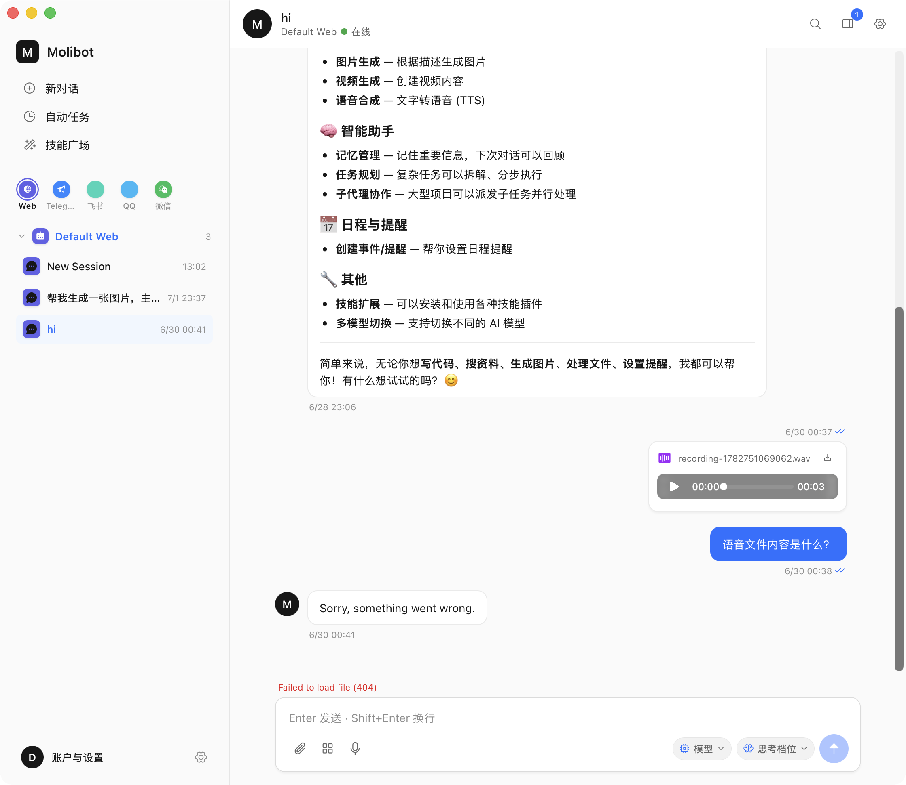
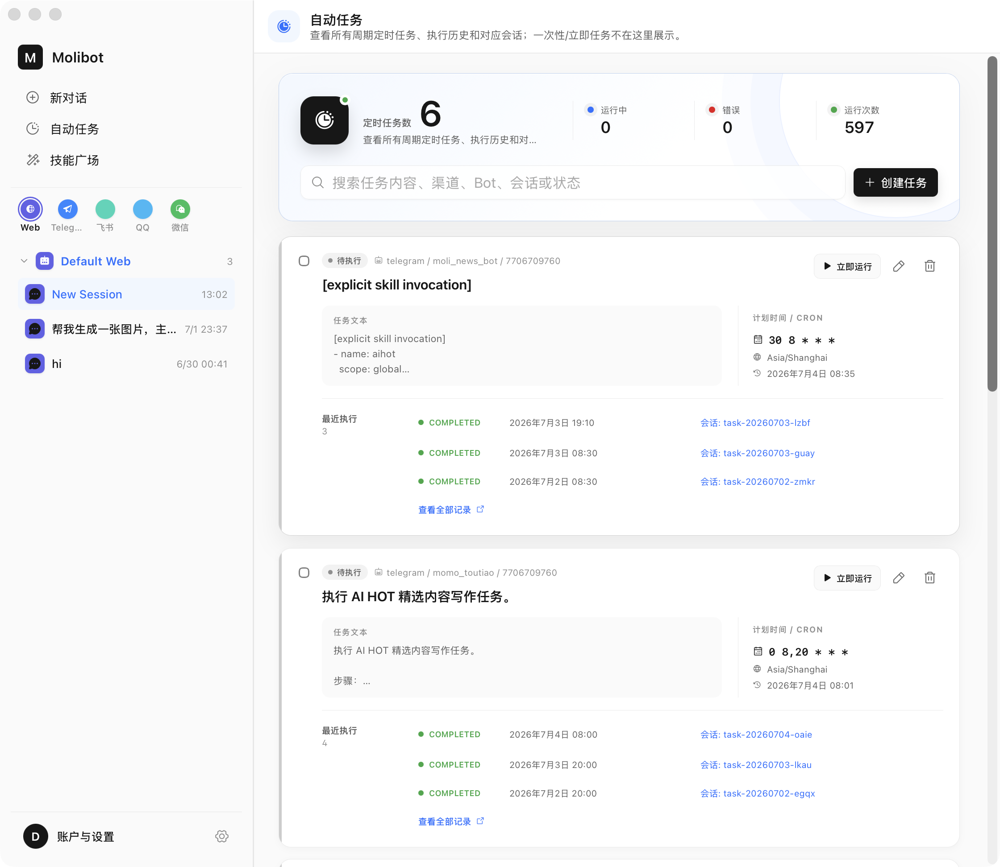
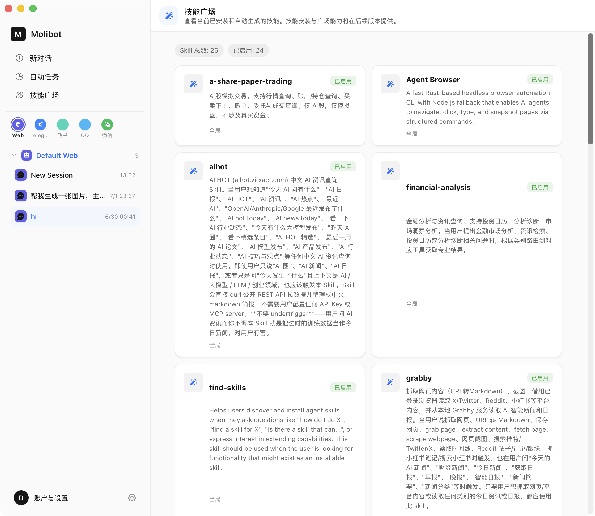

# Chat Workspace Design Audit

Date: 2026-07-04  
Baseline: `DESIGN.md` (Geist light theme and shared dark-theme tokens)  
Scope: Desktop Chat shell, session/sidebar navigation, Chat transcript/composer, Automations, Skills, responsive behavior, and shared interaction states.

## Evidence

### Step 1 — Chat conversation — Needs improvement

The two-pane structure, selected session, transcript column, and persistent composer are clear. The main gaps were unscoped technical errors near the composer, an English generic assistant failure inside a Chinese UI, missing focus-ring coverage, undersized navigation targets, and truncated channel labels.

### Step 2 — Automations — Functional but visually dense

Task creation, search, status, schedule, recent runs, sessions, and maintenance actions are discoverable. The screen used too many nested surfaces and custom radii/shadows, duplicated the task title in its body, exposed English execution states, and mixed compact 28–38px controls with the design system’s 40px default.

### Step 3 — Skills — Needs structural improvement

Counts, enabled state, and scope are visible. The two-column grid inherited the tallest card height, producing large blank areas. Twenty-six entries had no search, descriptions were unbounded, and “技能广场” implied marketplace/install capabilities that the page does not provide.

## Strengths

- The overall shell consistently uses Geist typography, neutral surfaces, blue focus/action color, and a stable left navigation.
- Chat, Automations, and Skills remain in one workspace instead of opening unrelated windows.
- Chat message width, timestamps, attachment cards, and the persistent composer establish a usable conversation hierarchy.
- Automations exposes real operational data and actions rather than a decorative dashboard.
- Skills exposes enabled state and scope without leaking filesystem paths.
- Light-theme contrast appears generally strong for primary content; status is paired with text rather than color alone.

## Confirmed issues and changes applied

| Priority | Area | Evidence-backed issue | Change applied |
|---|---|---|---|
| P1 | Skills | Long descriptions stretched every card in a grid row, producing large empty areas. | Cards now align to their own content height; descriptions default to three lines and can be expanded. |
| P1 | Skills | No search for 26 entries. | Added name/description/scope/Bot search with a clear no-results state. |
| P1 | Chat errors | File-media 404 was repeated as a detached composer error and did not identify the affected attachment. | Media load failures stay on the attachment’s retry state; the detached duplicate is removed. |
| P1 | Chat errors | Generic assistant fallback remained English and gave no next action. | Exact fallback responses are localized and now tell the user to retry or inspect model/run configuration. |
| P1 | Accessibility | Interactive Chat controls lacked a consistent visible keyboard focus treatment. | Added the documented two-layer focus ring to buttons, tabs, links, summaries, selects, and the resizer. |
| P1 | Responsive | The 680px breakpoint was unreachable because the Chat window has a 720px minimum width; the stored inline sidebar width would also override a media-query custom property. | Moved the compact workspace breakpoint to 820px and directly overrides grid columns/resizer position so the real minimum window receives one-column Skills and compact navigation. |
| P2 | Automations | Four nested surface levels, decorative rings, mixed radii, and heavier elevation conflicted with the restrained Geist hierarchy. | Removed decorative rings and lift motion; standardized cards/panels to 6px/12px radii and subtle shared elevation. |
| P2 | Automations | One-line task titles were repeated inside the task-text panel. | The detail panel now appears only when text remains after the title line. |
| P2 | Automations | Execution statuses were English in Chinese UI. | Added localized labels for running, retry waiting, completed, failed, stopped, and skipped. |
| P2 | Navigation | Primary rows were 34–36px and Telegram was truncated even at wide width. | Navigation/session rows are 40px; channel cells and avatars are wider while staying inside the sidebar. |
| P2 | Naming | “技能广场” described future marketplace behavior, not the current inventory. | Renamed it to “技能” and removed future-marketplace copy from the active screen. |

## Remaining opportunities

1. Human-readable schedules: raw Cron is still the most prominent schedule value. Add a derived phrase and next-run preview once the backend exposes a reliable calculation API; keep Cron as secondary detail.
2. Task-state semantics: `待执行` can coexist with completed recent runs, which reads as contradictory. Rename the task-level state to “已启用 / 暂停 / 运行中 / 异常” when the runtime has an explicit enabled state.
3. Skill detail model: expanding text works for now, but richer skills need a dedicated detail sheet with source, scope, capabilities, tools/MCP servers, and enable controls.
4. Composer grouping: attachment, files, voice, model, thinking, and send are still presented in one horizontal row. A future pass could group input tools and execution settings more clearly without hiding frequent actions.
5. Responsive sidebar: the compact 820px layout is now reachable, but a true single-pane sidebar drawer would be better if the desktop minimum width is reduced below 720px later.

## Accessibility risks and limits

- The screenshots cannot prove contrast ratios, screen-reader announcements, complete keyboard order, zoom behavior, or modal focus trapping.
- Source inspection confirms semantic buttons, tab roles, labels on icon controls, alert roles for composer errors, keyboard-operable sidebar resizing, reduced-motion handling, and visible focus rings after this pass.
- Card descriptions may contain arbitrary third-party language and formatting; the UI can control layout but cannot translate skill-authored metadata safely.
- The supplied screenshots cover the light desktop state only. Dark theme and minimum-window layout were verified through shared tokens, media queries, diagnostics, and tests rather than new screenshots, per the user’s instruction.

## Conclusion

Before this pass, the Chat shell broadly matched Geist but did not fully meet `DESIGN.md`: Skills had a structural grid defect, error recovery and localization were incomplete, keyboard focus was inconsistent, the responsive breakpoint was unreachable, and Automations used excessive surface/radius/elevation variation. The confirmed inconsistencies above have been corrected. Remaining items require new runtime data or a larger product-flow decision rather than CSS cleanup.
