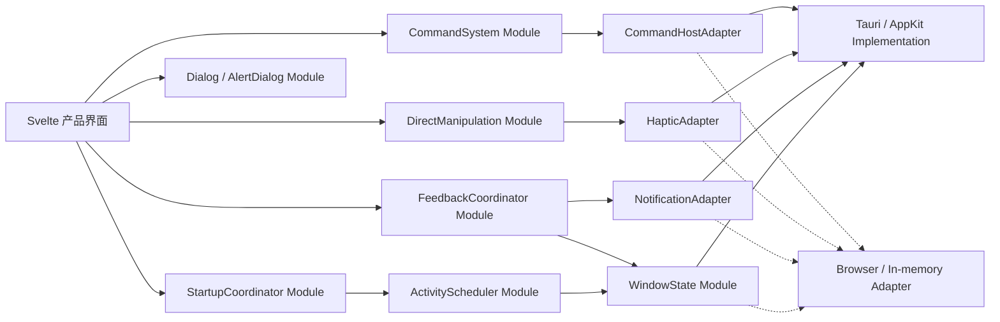

# Molibot Desktop 原生体验开发看板（技术方案）

状态：Draft，等待产品负责人确认拆分；尚未创建 GitHub Issues  
父项：GitHub Issue #13 — Molibot macOS App 界面改造报告  
范围：Desktop（Tauri 2 + Svelte 5），不改 Channel，不重做已完成的 Geist 视觉基线

## 1. 目标与完成定义

本计划不把“苹果风格”理解成全屏毛玻璃、统一放大圆角或堆叠弹性动画。目标是让 Molibot Desktop 在以下方面像一个真正的 macOS App：

- 菜单、快捷键、窗口关闭/重开、通知和触觉反馈符合平台习惯。
- 启动、失败、重连和后台恢复都有可预测、可操作的状态。
- Dialog、AlertDialog、Drawer、拖拽和 resize 具有一致的焦点、取消、速度和中断语义。
- 活动/非活动窗口、明暗主题、降低动态、降低透明度、增强对比度和 860×620 窗口均有明确行为。
- 产品状态只在共享 Desktop/Agent 上层编排；Channel 继续只负责消息收发和平台适配。

整套计划完成的判定：15 张卡全部验收通过，打包后的 macOS App 完成一次键盘、VoiceOver、明暗主题、窗口生命周期、通知权限、Force Touch 可选触觉和后台恢复回归。

## 2. 技术边界

### 2.1 不做一个 `NativeHost` 大对象

原生能力按问题域建立小 Interface，并把复杂性藏进深 Module。Svelte 页面只消费业务语义，不直接散落 `invoke`、`listen`、计时器、焦点陷阱或弹簧公式。



### 2.2 深 Module 清单

| Module | 小 Interface | Implementation 隐藏内容 | Adapter / 测试替身 | Leverage |
| --- | --- | --- | --- | --- |
| `CommandSystem` | `snapshot(context)`、`execute(id, context)` | 稳定 ID、标签、快捷键、可用性、禁用原因、目标路由 | `TauriCommandHostAdapter` / `MemoryCommandHostAdapter` | App Menu、Tray、⌘K 共用一份命令语义 |
| `StartupCoordinator` | `dispatch(event)` → `state + effects` | checking/starting/delayed/error/recovered 状态机、超时和重试 | 纯函数 + fake clock | Chat 和 Settings 使用同一启动事实 |
| `Dialog` / `AlertDialog` | `open`、关闭策略、初始焦点、完成回调 | Portal、focus trap、inert、scroll lock、焦点恢复、退出生命周期 | DOM 组件测试 | 所有 Chat/Project/Settings 覆盖层 |
| `WindowState` | `snapshot()`、`subscribe()`、细粒度关闭偏好读写 | Focused/ThemeChanged/ScaleFactorChanged/CloseRequested、持久化 | Tauri / in-memory；临时目录 store | 材质、通知、后台调度、关闭行为 |
| `DirectManipulation` | `begin/move/end/cancel/interrupt` | Pointer capture、迟滞、速度采样、投影、rubber-band、带初速度弹簧 | fake pointer + fake RAF | Inspector、Drawer、Sidebar resize |
| `FeedbackCoordinator` | `publish(FeedbackEvent)` | 去重、窗口上下文、用户偏好、live region/通知/声音/触觉路由 | Notification/Haptic no-op adapters | 命令、任务、服务、手势统一反馈 |
| `ActivityScheduler` | `schedule(policy, task)`、`wake(reason)`、`dispose()` | 可见性、窗口活动、退避、合并、立即唤醒 | fake clock + in-memory window state | 状态、重连、未读、任务、Trace、媒体轮询 |

### 2.3 建议目录

```text
apps/desktop/src/lib/native/
  commandSystem.ts
  commandHost.ts
  startupCoordinator.ts
  windowState.ts
  directManipulation.ts
  feedbackCoordinator.ts
  activityScheduler.ts

apps/desktop/src/lib/components/ui/
  dialog/
  alert-dialog/

apps/desktop/src-tauri/src/
  app_menu.rs
  desktop_preferences.rs
  native_feedback.rs
  window_lifecycle.rs
```

Desktop 的 Dialog 源码放在 Desktop 自己的 UI 目录，并在 `apps/desktop/package.json` 正式声明 `bits-ui`。禁止通过跨目录长相对路径复用根应用组件。

## 3. 看板总览

| ID | 执行状态 | 卡片 | 复杂度 | Blocked by | 完成后可演示 |
| --- | --- | --- | --- | --- | --- |
| NATIVE-01 | 待批准，可直接开工 | 统一命令系统并接入 macOS App Menu | L | 无 | 菜单、Tray、⌘K 执行同一命令 |
| NATIVE-02 | 待批准，可直接开工 | 可恢复启动状态机与调度器试点 | M | 无 | 启动超时后可重试、看诊断，不再无限转圈 |
| NATIVE-03 | 待批准，可直接开工 | 共享 Dialog/AlertDialog 语义与 Chat 试点 | L | 无 | 会话浏览/预览/确认具备完整焦点和退出语义 |
| NATIVE-04 | 待批准，依赖阻塞 | Project 全流程迁移到共享 Dialog | M | NATIVE-03 | 创建、重命名、删除、设置行为一致 |
| NATIVE-05 | 待批准，依赖阻塞 | Tasks 弹层迁移到共享 Dialog | M | NATIVE-03 | 创建、历史、编辑、详情、删除语义一致 |
| NATIVE-06 | 待批准，依赖阻塞 | Provider/媒体/实体编辑弹层迁移 | M | NATIVE-03 | 编辑、详情、危险确认不再各自管理焦点 |
| NATIVE-07 | 待批准，依赖阻塞 | Memory 弹层迁移到共享 Dialog | M | NATIVE-03 | 候选、记忆、来源和高级管理行为一致 |
| NATIVE-08 | 待批准，依赖阻塞 | 用户可控的关闭窗口/菜单栏驻留行为 | M | NATIVE-01 | 关闭、⌘W、⌘Q、重开均符合明确偏好 |
| NATIVE-09 | 待批准，依赖阻塞 | 可搜索的 ⌘K 命令与设置发现 | M | NATIVE-01 | 搜索 22 个设置入口和上下文动作 |
| NATIVE-10 | 待批准，可直接开工 | Tasks Inspector 速度感知手势 | L | 无 | 快甩/慢拖、取消、反向打断均连续 |
| NATIVE-11 | 待批准，依赖阻塞 | Sidebar resize 与 Drawer 复用直接操控模块 | M | NATIVE-10 | 两类表面复用同一 Pointer/取消语义 |
| NATIVE-12 | 待批准，依赖阻塞 | 活动/非活动窗口材质与无障碍状态 | M | NATIVE-08 | 失焦、主题、缩放、降低透明度实时生效 |
| NATIVE-13 | 待批准，依赖阻塞 | 上下文感知反馈与系统通知 | L | NATIVE-08 | 前台应用内反馈，后台才发原生通知 |
| NATIVE-14 | 待批准，依赖阻塞 | 支持硬件的 macOS 触觉反馈 | S | NATIVE-10, NATIVE-13 | 手势跨越 snap/commit 点时给一次同步触觉 |
| NATIVE-15 | 待批准，依赖阻塞 | Desktop 后台活动预算与唤醒恢复 | M | NATIVE-02, NATIVE-08 | 失焦/隐藏后降频或暂停，回来立即恢复 |

推荐并行顺序：

1. Foundation：NATIVE-01、02、03、10 可并行。
2. Convergence：完成对应基础卡后推进 NATIVE-04～09、11。
3. Platform：推进 NATIVE-12、13、15。
4. Tactile：最后推进 NATIVE-14，避免触觉先于正确的视觉/状态反馈。

## 4. 开发卡片

### NATIVE-01 — 统一命令系统并接入 macOS App Menu

**Parent:** #13  
**Blocked by:** 无

**User stories**

- 作为键盘用户，我从 App Menu、Tray 或 ⌘K 看到的动作名称、快捷键和可用状态一致。
- 作为 macOS 用户，我能使用标准 Molibot、Edit、Window 菜单和 ⌘, / ⌘Q / ⌘W。

**What to build**

- 新建 `CommandSystem`，稳定 ID 至少覆盖 `app.open-chat`、`app.open-settings`、`app.quit`、`chat.new`、`chat.search`、`service.restart`、`diagnostics.open` 和工作区导航。
- `snapshot(context)` 输出可序列化标签、快捷键、scope、enabled 与 disabled reason；`execute(id, context)` 是唯一产品命令入口。
- Tauri `app_menu.rs` 使用原生预定义菜单项和产品命令项；Rust 启动时保留安全的英文 fallback，WebView ready 后同步当前语言和状态。
- 原生菜单事件通过低频事件送入 Svelte；监听随组件生命周期释放。Tray 改为消费同一稳定 ID，不再保留独立动作 switch。
- 仅开放所需 Tauri listen/emit 权限。

**Acceptance**

- 菜单、Tray、⌘K 的同一动作拥有同一 ID、标签、快捷键、enabled 状态和执行结果。
- 切换中英文后原生产品菜单和 WebView 命令在一个状态刷新周期内同步。
- 窗口隐藏时 Open/Settings/Quit 仍可执行；Quit 继续经过现有 orderly service shutdown。
- 浏览器预览使用 Memory Adapter，不因缺少 Tauri 而报错。

**Verify / rollback**

- TS 契约测试覆盖命令投影、禁用原因、未知 ID；Rust 测试覆盖菜单事件到稳定 ID 的映射。
- 打包 App 手测菜单、Tray、快捷键、隐藏窗口和重开。
- 回滚时保留现有 Tray handler 作为一个提交内的 fallback；验收后删除旧分支，不能长期双路执行。

### NATIVE-02 — 可恢复启动状态机与调度器试点

**Parent:** #13  
**Blocked by:** 无

**User stories**

- 作为用户，我能知道 Molibot 正在检查、启动、等待还是失败，并能重试或打开诊断。
- 作为长时间打开 App 的用户，我不会看到无限 spinner 或每秒永久轮询。

**What to build**

- `StartupCoordinator` 用纯 reducer 表达 `checking → starting → delayed → ready` 与 `error → retrying → recovered`。
- 8 秒仍未 ready 时进入 `delayed`：停止无限旋转，显示 Retry、Diagnostics、Open Logs；错误保留可复制摘要。
- `ActivityScheduler` 首次用于 `desktop_status`：前 8 秒 1s，随后 2s/4s/8s 退避，上限 10s；document hidden 时暂停，重新可见立即 wake。
- Chat 与 Settings 从同一个 readiness 投影读取，不各自推断服务状态。

**Acceptance**

- 任一启动路径在 8 秒后都不会继续只有 spinner；用户始终有下一步动作。
- Retry 在 300ms 内发起一次新检查且不叠加 timer；ready 后轮询停止或切换为明确健康策略。
- hidden 状态不继续 1s 请求；visible 后立即刷新一次。
- 中英、明暗、reduced-motion、860×620 均可操作。

**Verify / rollback**

- fake clock 覆盖全部状态转换、退避、wake、dispose 和重复 Retry。
- 组件测试覆盖 action 可见性和 aria-live；打包 App 模拟端口未启动、延迟启动、版本不兼容和恢复。
- 保留原 `refreshStatus()` 请求函数，仅替换调度权；回滚不改服务 API。

### NATIVE-03 — 共享 Dialog/AlertDialog 语义与 Chat 试点

**Parent:** #13  
**Blocked by:** 无

**User stories**

- 作为键盘或 VoiceOver 用户，我打开弹层后不会把焦点移到背景，关闭后会回到原触发点。
- 作为用户，我在退出动画期间点击、Escape 或选择内容不会触发两次动作。

**What to build**

- 在 Desktop 本地引入 shadcn-svelte 兼容的 `Dialog`、`AlertDialog` 源码和 `bits-ui` 依赖。
- Module 统一 Portal、focus trap、背景 inert、scroll lock、初始焦点、Escape/遮罩策略、焦点恢复和嵌套顺序。
- 用组件生命周期完成关闭，不再由调用者维护 150ms `setTimeout`；reduced-motion 直接完成退出。
- 首批迁移 Conversation Browser、Chat/Project 文件预览和 onboarding；用 Trace stop/clear 作为 AlertDialog 试点。
- 共享样式进入语义 CSS，不在页面新增零散 `<style>`。

**Acceptance**

- Tab/Shift+Tab 不离开 modal；背景不可交互；关闭后焦点回到仍存在的 trigger。
- Escape、遮罩、关闭按钮、选择项四条路径各只提交一次；busy 状态可明确禁止关闭。
- AlertDialog 初始焦点落在安全动作，不自动聚焦危险按钮。
- 进入/退出对称，reduced-motion 下无等待 timer，窄窗口无横向溢出。

**Verify / rollback**

- DOM 测试覆盖 focus loop、inert、return focus、nested dialog、单次完成和 reduced motion。
- 浏览器与打包 App 跑键盘/VoiceOver 冒烟。
- 每个迁移点独立提交；若某工作流回归，可回退单个调用者而不复制 primitive。

### NATIVE-04 — Project 全流程迁移到共享 Dialog

**Parent:** #13  
**Blocked by:** NATIVE-03

**User stories**

- 作为 Project 用户，我在创建、选择目录、重命名、删除和设置时得到一致、不会丢焦点的交互。

**What to build**

- 迁移 ProjectList、ProjectTree、ProjectSettingsDialog 及 Project Chat 文件预览。
- 两步创建流程在一个 Dialog 内保持步骤、焦点和返回语义；目录选择返回后恢复到正确控件。
- 删除使用 AlertDialog；busy/save 期间明确关闭策略；保存继续使用固定 `.settings-footbar`。

**Acceptance**

- 创建、重命名、删除、设置、预览五条路径符合 NATIVE-03 的焦点和单次提交合同。
- 目录选择取消不关闭整个创建流程；保存失败保留输入和可读错误。
- 中英、明暗、860×620 和键盘全流程通过。

**Verify / rollback**

- Project 组件测试覆盖两步流程、取消、失败和焦点恢复；不改 Projects API/store 合同。
- 按工作流拆提交，允许单工作流回退。

### NATIVE-05 — Tasks 弹层迁移到共享 Dialog

**Parent:** #13  
**Blocked by:** NATIVE-03

**User stories**

- 作为自动任务用户，我在创建、查看历史、编辑、查看执行详情和删除时获得一致的键盘、关闭和错误恢复行为。

**What to build**

- 迁移 Tasks 的创建、历史、编辑、执行详情和删除五类弹层。
- 创建/编辑继续使用固定 footbar；历史分页和执行 transcript 不改变 store/API 行为。
- 删除调用者自管的共享 `taskDialogElement`、遮罩 keydown 和焦点 microtask，交给 Dialog/AlertDialog。

**Acceptance**

- 五条路径都符合 NATIVE-03 的 focus trap、inert、return focus 和单次提交合同。
- 删除确认初始焦点安全；busy/save 期间关闭策略明确；失败不丢任务草稿。
- 中英、明暗、固定 footbar、860×620 和现有细粒度 Tasks API 不回归。

**Verify / rollback**

- 交互测试覆盖五类 modal 的代表路径、删除取消和保存失败。
- 只替换 Tasks 调用者；不同时改 Providers、Memory 或任务业务 store。

### NATIVE-06 — Provider/媒体/实体编辑弹层迁移

**Parent:** #13  
**Blocked by:** NATIVE-03

**User stories**

- 作为设置页用户，我编辑 Provider、Agent、MCP、Profile、Channel 或查看媒体任务时，不会因遮罩、Escape 或保存失败丢失输入与焦点。

**What to build**

- 迁移 Providers 编辑/删除、Image/Video 任务详情，以及 Agents、MCP、Profiles、Channels 中具有 modal 语义的 entity editor。
- 只把真正阻塞背景的 surface 迁为 Dialog；内联编辑器继续保持内联，避免为统一外观改变信息架构。
- Provider 删除使用 AlertDialog；保存继续走各实体细粒度 API 和固定 footbar，不提交整个 settings 对象。

**Acceptance**

- 每个实体编辑器保存失败保留草稿和错误；busy 状态不会被 Escape/遮罩误关。
- Provider 删除默认焦点安全且只提交一次；媒体详情的下载/重试/关闭不互相触发。
- 中英、明暗、860×620 和现有 Provider/媒体/实体 API 合同不回归。

**Verify / rollback**

- 每类 surface 至少一个交互测试；Provider 删除与媒体详情必须覆盖单次动作。
- 按 Provider、media、entity editor 分提交，允许独立回退但不保留双焦点实现。

### NATIVE-07 — Memory 弹层迁移到共享 Dialog

**Parent:** #13  
**Blocked by:** NATIVE-03

**User stories**

- 作为记忆中心用户，我编辑候选/正式记忆、查看来源或进入高级管理时，输入、焦点和来源上下文始终可恢复。

**What to build**

- 迁移 candidate edit、memory edit、source preview 和 advanced management 四类 surface。
- 保留三 Tab 投影、候选确认、allowInjection、来源/version 和高级维护行为；本卡不改变记忆业务合同。
- 关闭后恢复到触发该记忆记录的控件；记录已因筛选消失时恢复到最近稳定容器。

**Acceptance**

- 四条路径符合共享 Dialog 语义；保存失败不丢内容，来源预览关闭后回到正确记录。
- 完成 NATIVE-03～07 后，除共享 primitive、非模态 ⌘K 与真正 Drawer 外，业务 Svelte 不再直接声明 `aria-modal="true"`。
- 中英、明暗、860×620、键盘和记忆细粒度 API 不回归。

**Verify / rollback**

- 交互测试覆盖候选编辑、正式记忆保存失败、来源关闭焦点恢复和高级管理 Escape。
- 只替换 Memory UI surface，不改 memory store、API、trace 或治理逻辑。

### NATIVE-08 — 用户可控的关闭窗口/菜单栏驻留行为

**Parent:** #13  
**Blocked by:** NATIVE-01

**User stories**

- 作为用户，我能明确选择关闭 Chat 窗口时继续驻留菜单栏，还是退出 Molibot。
- 作为 macOS 用户，⌘W、红色关闭按钮、⌘Q、Dock reopen 和第二实例行为一致。

**What to build**

- 建立 `WindowState` / `WindowHostAdapter`，接收 Focused、ThemeChanged、ScaleFactorChanged、CloseRequested。
- 新增细粒度偏好 `closeBehavior: "background" | "quit"`，默认 `background` 以保持现有行为。
- General 设置使用共享 SettingRow/Switch；保存通过专用 Tauri command，不提交整个 settings 大对象。
- `background`：关闭主 Chat 时 hide，服务继续；`quit`：关闭主 Chat 走现有 orderly shutdown。Settings 关闭只影响 Settings 窗口。⌘Q 始终退出。
- 偏好存储封装可注入路径，测试只用临时目录。

**Acceptance**

- 两种偏好在重启后保持；未知字段不被覆盖。
- 所有退出路径最多触发一次 supervisor stop；无 terminal 队列或服务进程泄漏。
- Dock reopen、Tray Open、single-instance 均恢复并聚焦 Chat。

**Verify / rollback**

- Rust 临时目录测试覆盖默认值、写入、重启、损坏文件 fallback 和未知字段保留。
- 打包 App 手测两个窗口、两种偏好、⌘W/⌘Q、重开与服务进程。
- 回滚保留默认 background；不得读取或写入真实用户测试数据。

### NATIVE-09 — 可搜索的 ⌘K 命令与设置发现

**Parent:** #13  
**Blocked by:** NATIVE-01

**User stories**

- 作为用户，我输入自然词即可找到所有设置页、工作区和当前上下文动作，并知道动作为什么不可用。

**What to build**

- 将现有四项 shortcut menu 改为带输入框的 command palette，数据只来自 `CommandSystem.snapshot()`。
- 覆盖 22 个 Settings destination、Chat/Automations/Skills/Agents、New Chat、Search、Diagnostics、Restart 等动作。
- 支持中英文 label、keyword/synonym、快捷键显示、最近执行加权、当前上下文动作、disabled reason；不做远程搜索。
- 保持非模态语义：打开后聚焦输入，Arrow Up/Down、Enter、Escape 完整，关闭恢复焦点。

**Acceptance**

- 输入中文、英文或技术名能稳定找到对应设置；同一命令的标签/快捷键与 App Menu 一致。
- disabled 命令可被发现但不能执行，并提供可读原因。
- 空查询显示最近/推荐动作；结果排序确定、可测试，不记录敏感参数。

**Verify / rollback**

- 纯函数测试覆盖 tokenize、locale、排序、disabled、recent；组件测试覆盖 keyboard/return focus。
- 保留旧四命令作为 catalog 初始项，不保留第二份 DOM 菜单。

### NATIVE-10 — Tasks Inspector 速度感知手势

**Parent:** #13  
**Blocked by:** 无

**User stories**

- 作为触控板用户，我能慢拖查看位置、快速甩动关闭，并可在动画中反向抓住 Inspector。
- 作为键盘或 reduced-motion 用户，我仍有等价、即时的操作。

**What to build**

- 建立 `DirectManipulation` Module；Tasks 窄屏 Inspector 是第一个 production Adapter。
- Pointer capture + 8px activation hysteresis；采样最近 80ms 的加权速度；投影 horizon 初值 180ms 并限幅。
- 越界使用内部 rubber-band；松手按投影位置/方向选 snap point。
- 使用可注入 initial velocity 的小型解析/稳定弹簧 solver；不用无法注入释放速度的 Svelte `Spring`，也不新增 motion framework。
- settle 期间 pointerdown 立即中断，从当前视觉位置继续；pointercancel/失焦安全回位。

**Acceptance**

- 慢拖不足阈值回位，快甩可凭速度越过；反向甩不误关。
- 动画期间重新按下无跳变；每帧只更新 transform，稳定 60Hz 设备不触发布局读写循环。
- reduced-motion 保留 1:1 跟手，但松手直接到目标；按钮/键盘关闭始终可用。

**Verify / rollback**

- fake clock/RAF 测试速度采样、投影、bounds、snap、interrupt、cancel 和 reduced motion。
- 浏览器录制慢拖/快甩/反向中断；打包 App 用触控板复测。
- 旧 96px 阈值实现只保留到新测试通过的同一分支，随后替换而非叠加。

### NATIVE-11 — Sidebar resize 与 Drawer 复用直接操控模块

**Parent:** #13  
**Blocked by:** NATIVE-10

**User stories**

- 作为用户，我在 resize sidebar、滑动关闭 Memory Trace Drawer 或取消指针时得到一致、不中断的行为。

**What to build**

- Chat sidebar 从 window `mousemove/mouseup` 迁移到 Pointer Events/capture，使用 DirectManipulation 的 continuous 模式，保留 min/max 和键盘调节。
- MemoryTraceDrawer 使用 snap 模式和速度投影；关闭按钮/Escape 仍是等价入口。
- WindowDragMask 改用统一 pointer qualification 后调用 Tauri start dragging，但不对系统窗口拖拽追加自定义物理效果。
- resize 完成后才持久化最终宽度，move 期间不写 localStorage。

**Acceptance**

- mouse、trackpad、touch/stylus pointer、pointercancel 都不会留下 dragging 状态或全局 listener。
- Sidebar 键盘调节、持久化和 860px 最小窗口不回归；Drawer 动画可中断。
- 三个调用者不复制速度、capture、cancel 或 reduced-motion 逻辑。

**Verify / rollback**

- 组件测试覆盖 pointerId、capture lost、cancel、min/max 和一次持久化。
- 打包 App 验证系统 window drag 不受 WebView 手势抢占。

### NATIVE-12 — 活动/非活动窗口材质与无障碍状态

**Parent:** #13  
**Blocked by:** NATIVE-08

**User stories**

- 作为多窗口用户，我能一眼看出 Molibot 是否处于活动状态；系统主题和辅助功能变化无需重启。

**What to build**

- WindowState 将 active、native theme、scale factor 投影为根节点 data attributes；Svelte 只消费状态，不直接监听 Tauri。
- 只为 titlebar/sidebar/command palette/settings footbar 定义 active/inactive material token；内容卡片保持安静不透明。
- 增加明确的 reduced-transparency、increased-contrast、reduced-motion 路径；系统偏好改变时实时刷新。
- inactive 状态降低 accent/阴影/饱和度，不降低正文可读性；高对比度取消透明混色和细弱边框。

**Acceptance**

- Focused/ThemeChanged/ScaleFactorChanged 触发一次确定状态更新，无轮询。
- 明暗 × active/inactive × reduced transparency × increased contrast 的关键 chrome 截图基线通过。
- 没有全屏 blur、每卡片 glass 或 JS 驱动布局动画。

**Verify / rollback**

- WindowState adapter 测试 + CSS token 合同测试；打包 App 验证失焦、系统主题切换和外接屏缩放。
- token 级回滚，不改变布局 DOM 或业务状态。

### NATIVE-13 — 上下文感知反馈与系统通知

**Parent:** #13  
**Blocked by:** NATIVE-08

**User stories**

- 作为前台用户，我在同一因果位置看到成功/失败反馈，不被系统通知重复打扰。
- 作为后台用户，我能收到任务完成/失败通知，并可点击回到相关窗口。

**What to build**

- `FeedbackCoordinator.publish(event)` 接受结构化事件：command result、task terminal、service recovered/failed；以 event ID + terminal state 去重。
- 前台始终使用应用内状态/live region；仅窗口 inactive/hidden、用户开启且权限允许时发送系统通知。
- 集成 Tauri notification plugin，用户开启开关时才请求权限；拒绝后显示可恢复说明，不循环弹权限。
- 通知点击恢复 Chat/Tasks 对应上下文；系统声音独立偏好。反馈事件不得写入 Session、memory、Channel 消息或模型上下文。

**Acceptance**

- 同一任务终态最多一个系统通知；前台不重复通知，后台恢复后不会补发旧通知。
- permission default/denied/granted 三态明确；未安装/浏览器预览走 no-op adapter。
- live region 不泄露技术堆栈或密钥；失败可跳到诊断。

**Verify / rollback**

- Coordinator 矩阵测试覆盖 window state × preference × permission × event type × duplicate。
- 打包 App 手测权限、后台通知、点击恢复、声音开关； capability 只新增 notification/event 必需权限。
- 插件失败时保留应用内反馈，不影响任务执行。

### NATIVE-14 — 支持硬件的 macOS 触觉反馈

**Parent:** #13  
**Blocked by:** NATIVE-10, NATIVE-13

**User stories**

- 作为使用 Force Touch 触控板的用户，我在拖拽越过明确 snap/commit 边界时得到一次与视觉同步的轻触觉。

**What to build**

- `native_feedback.rs` 使用 `objc2-app-kit` 的 `NSHapticFeedbackManager`，仅启用 `NSHapticFeedback` feature。
- 每次用户主动跨越 snap/commit 边界时获取 default performer，使用 Alignment/Generic pattern 与视觉 commit 同帧；每次 gesture 每个边界最多一次。
- 只在 NATIVE-10/11 的直接操控事件上触发；后台任务完成、错误、通知到达禁止触觉。
- macOS 不支持/系统关闭/无触控板/浏览器/其他平台全部安全 no-op；提供“交互触觉：跟随系统/关闭”细粒度偏好。

**Acceptance**

- 支持设备上触觉与 snap 视觉反馈同步，不在来回抖动时连续触发。
- 系统可抑制触觉；调用失败不影响手势、不报用户错误。
- 非用户主动事件的自动化测试断言 haptic call 为 0。

**Verify / rollback**

- Rust adapter 测试命令映射和 no-op；fake adapter 测试 debounce/边界一次性。
- 支持 Force Touch 的打包 Mac 做人工验收；CI 不把“实际震动”作为可自动断言条件。
- cargo feature 和调用点可独立回退，手势视觉反馈保留。

### NATIVE-15 — Desktop 后台活动预算与唤醒恢复

**Parent:** #13  
**Blocked by:** NATIVE-02, NATIVE-08

**User stories**

- 作为长期驻留菜单栏的用户，Molibot 在后台不持续高频请求；回到前台时数据立即赶上。

**What to build**

- 把 App status、Chat reconnect/unread、Tasks、Trace、Agent Studio、media task 的数据 timer 迁入 `ActivityScheduler`；录音计时等 UI 时钟不迁入。
- 定义三类 policy：critical（启动/重连）、interactive（当前可见任务/Trace）、background（未读/媒体）。每类有明确前台 interval、后台退避/暂停和 wake 行为。
- document visible + Tauri window active 共同决定预算；focus/visible/network/service recovered 触发 coalesced wake。
- 每个 key 同时最多一个 in-flight 请求；dispose 后无 timer/listener；慢请求不叠加。

**Acceptance**

- hidden/inactive 60 秒内不再保持 1s/2.5s/3s 高频轮询；回到前台 300ms 内触发一次合并刷新。
- 同一资源无重叠请求；terminal/ready 状态按 policy 停止或降频。
- 任务、Trace、未读和媒体状态在恢复后正确，无重复入站任务或 Channel 分支。

**Verify / rollback**

- fake clock 测试所有 policy、in-flight 去重、pause/wake/dispose；请求计数成为验收证据。
- 打包 App 用系统监控/DevTools 对比前台、失焦、隐藏三种请求频率。
- 每类 timer 单独迁移提交；发现回归可回退单一 policy，不复制旧 timer 与新 scheduler。

## 5. 每张 Issue 的统一 Definition of Done

- 产品行为端到端可见，不只提交底层 Interface 或 CSS token。
- 相关 Module 同时具备 production Adapter 与 in-memory/browser Adapter；测试使用替身或临时存储。
- 中英、明暗主题、860×620、键盘、reduced-motion；涉及材质时再加 reduced-transparency/increased-contrast。
- 组件/纯函数/Rust 测试与打包 App 验证按卡片风险完成；`svelte-check`、Desktop tests、`cargo test/check`、production build、`git diff --check` 通过。
- 不在 Channel 新增编排；临时反馈/控制不持久化到 Session 或模型上下文。
- 实现后按项目规则更新 `features.md`、`prd.md`、`CHANGELOG.md`；只有入口/维护导航变化时才改 `README.md`。
- 用完成后的 Implementation 替换旧路径，禁止新旧 listener、timer、焦点管理或物理算法长期叠加。

## 6. GitHub 发布规则（批准后执行）

每张 Issue 使用：

```markdown
Parent: #13

## What to build
...

## Acceptance criteria
...

## Blocked by
...
```

统一标签：`enhancement`、`ready-for-agent`。按依赖顺序创建；不编辑、不关闭父 Issue #13。GitHub body 保持自包含但不粘贴仓库文件路径，文件级技术细节以本看板为准。

## 7. 对抗式审查

1. **最容易翻车：把 Adapter 做成万能 Host。** 修正：按 command/window/notification/haptic 分开，任何新方法都必须证明与现有 Interface 同属一个问题域。
2. **最容易翻车：为了“原生”堆 blur 和 spring。** 修正：材质只用于 chrome；固定位置/颜色反馈仍用短 transition；只有直接操控使用带初速度物理。
3. **最容易翻车：基础设施卡没有用户价值。** 修正：NATIVE-01/02/03/10 都包含一个 production pilot 和可演示行为，不接受只建目录/类型。
4. **最容易翻车：事件、listener、timer 双路运行。** 修正：每个迁移点执行 replace-don't-layer，并以单 listener、单 in-flight、dispose 后零调用为测试门槛。
5. **最容易翻车：自动测试代替真实 macOS 验收。** 修正：菜单、窗口生命周期、通知、inactive material、外接屏 scale 和 Force Touch 都要求 packaged-app 手测；CI 只验证可确定的 contract。
