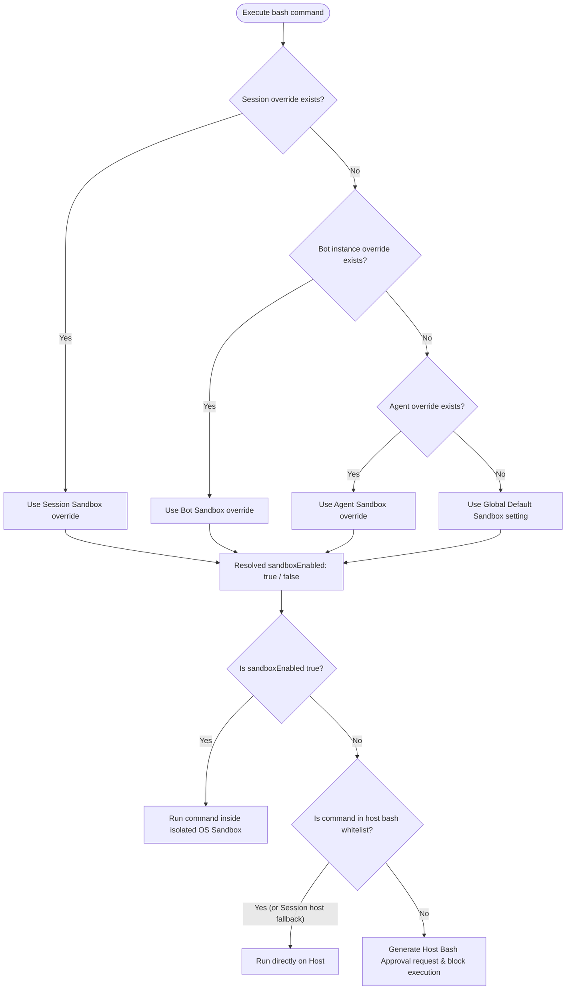

# Sandbox Deciding Policy & Host Bash Approval Flow

This document explains the multi-level sandbox control logic, the host bash approval sequence, and the automatic resumption mechanism using structured diagrams.

---

## 1. Sandbox Control & Override Hierarchy

When the agent attempts to execute a shell command (such as `bash`), the system resolves whether the command should run inside the Sandbox or on the Host (with or without approval). It evaluates settings based on the following priority hierarchy:

---

## 2. Host Bash Approval & Auto-Resume Sequence

The diagram below outlines the full lifecycle of a sensitive shell command: from the moment the agent requests a bash execution, through the approval process, the automatic context rewriting, and the seamless resumption.

```mermaid
sequenceDiagram
    autonumber
    actor User as User (Chat/Web)
    participant Channel as Channel Runtime (Telegram/Web)
    participant Runner as MomRunner
    participant TR as ToolRuntime / bash.ts
    participant DB as SQLite (approval_requests)

    %% Command Invocation
    Runner->>TR: executeToolCall("bash", "echo hello")
    Note over TR: Run resolved sandboxEnabled check (false)
    Note over TR: Check Host Bash whitelist & session grant
    TR->>DB: Save approval request (State: PENDING)
    TR-->>Runner: Block and return (waiting_for_approval)
    Runner-->>Channel: Return waiting_for_approval
    Channel-->>User: Render Approval Card / Buttons

    %% Approval and execution
    User->>Channel: Clicks "Approve" / "Approve Session"
    Channel->>Channel: Execute command on Host, capture stdout/stderr
    Channel->>DB: Mark request as EXECUTED

    %% Automatic Resumption
    rect rgb(30, 41, 59)
        Note over Channel: [Auto-Resume Initiation]
        Channel->>Channel: Load chat message context history
        Channel->>Channel: Locate target assistant's toolCall & matching toolResult
        Channel->>Channel: Rewrite toolResult content with command stdout/stderr
        Channel->>Channel: Save updated context back to Session Store
        Channel->>Channel: Reset runner cache in RunnerPool (clear stale state)
        Channel->>Runner: Trigger run() in background (isEvent: true)
    end

    %% Final completion
    Runner->>TR: (Skip bash, result is already rewritten in context)
    Runner->>Runner: Continue LLM turn with output data
    Runner-->>Channel: Complete turn & send final response text
    Channel-->>User: Render final assistant response
```

---

## 3. Related Files Reference (Relative Paths)

- **Helpers & Execution**: [helpers.ts](../src/lib/server/agent/tools/helpers.ts)
- **Sandbox Deciding Logic**: [sandbox.ts](../src/lib/server/agent/tools/sandbox.ts)
- **Subagent Overrides**: [subagent.ts](../src/lib/server/agent/tools/subagent.ts)
- **Runner Entry Point**: [runner.ts](../src/lib/server/agent/core/runner.ts)
- **Chat Control Commands**: [channelCommands.ts](../src/lib/server/agent/commands/channelCommands.ts)
- **Resume flow (Multi-channel)**: [baseRuntime.ts](../src/lib/server/channels/shared/baseRuntime.ts)
- **Resume flow (Web Chat)**: [+server.ts](../src/routes/api/chat/+server.ts)
- **DB Migrations & Storage**: [settings/store.ts](../src/lib/server/settings/store.ts)
- **Override Settings Schemas**: [settings/schema.ts](../src/lib/server/settings/schema.ts)
- **Override Sanitization**: [settings/sanitize.ts](../src/lib/server/settings/sanitize.ts)
