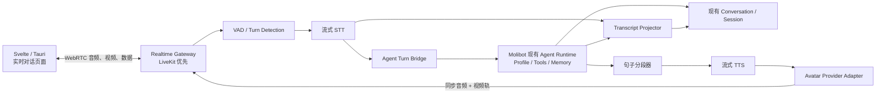

# Molibot 实时语音数字人对话方案

> 状态：方案草案  
> 调研日期：2026-07-26  
> 目标：在不另建一套 Agent 的前提下，为 Molibot 增加类似真人视频通话的实时语音数字人界面。

## 1. 结论

现在的技术已经可以实现以下完整体验：

- 用户打开一个独立的「实时对话」页面，看到会眨眼、呼吸、说话并有嘴型同步的数字人。
- 用户直接说话，不需要按住录音再发送；系统自动判断用户是否说完。
- 数字人能够边生成边说话，用户插话时立即停下。
- 页面实时显示双方字幕，对话结束后仍作为普通 Molibot Session 保存和继续。
- 用户可以选择不同形象和声音；形象切换与 Agent 身份、记忆、工具能力相互独立。
- 底层继续使用 Molibot 现有 Agent、工具、Memory、Profile、Session 和任务执行能力。

这不是一个简单的「把 TTS 配到头像上」功能。它实际包含四条低延迟链路：

1. 实时传输：持续发送麦克风音频、接收数字人音视频。
2. 实时理解：语音活动检测、流式转写、轮次判断。
3. Agent 执行：复用现有 Session 上下文、工具和运行状态。
4. 数字人渲染：把回复音频实时转成同步嘴型、表情和动作的视频流。

推荐把它定义为现有 Agent 的一种新交互表面，而不是新 Channel，也不是第三方数字人平台里的另一套机器人。

## 2. 产品边界

### 第一版必须有

- 独立的实时对话页面。
- 麦克风连续收音和自动轮次检测。
- 自然打断（barge-in）：用户一开口，数字人停止当前播报。
- 一个可用的真人数字人，以及至少 3 个可切换的公共形象。
- listening、thinking、speaking、reconnecting 等明确状态。
- 双方实时字幕。
- 最终转写与 Agent 回复进入当前 Molibot Session。
- 结束通话后，可回到普通文字界面继续同一个 Session。
- 麦克风、声音、形象选择和网络失败恢复。
- 中文、英文、明暗主题和窄屏适配。

### 第一版不做

- 不默认打开用户摄像头。用户只需要麦克风也能和数字人“视频通话”。
- 不默认保存原始录音或视频，只保存文字记录。
- 不训练用户自己的真人分身；先使用供应商公共形象。
- 不做多人视频会议。
- 不自研照片级真人视频生成模型。
- 不让数字人供应商托管 Molibot 的 Agent 逻辑、Memory 和 Session。

## 3. 推荐架构



### 3.0 Molibot 当前基础与缺口

现有代码并不是从零开始：

- 已有 Svelte/Tauri 对话界面和浏览器/原生麦克风录音。
- 已有 STT 路由，能把完整音频文件发给 OpenAI-compatible transcription 接口。
- 已有 macOS 与 Xiaomi TTS 生成能力。
- 已有逐 token SSE、Session Store、Agent runner、工具 activity、abort、steer 和 follow-up。

但这些能力目前是“录完一段再发送”的离散回合：

- `MediaRecorder` 结束后才形成完整文件，不能持续上传音频帧。
- 当前 STT 是完整文件转写，不返回流式 partial/final transcript。
- SSE 是服务端到前端的单向文字流，不适合双向低延迟媒体。
- 当前 TTS 生成的是完整音频文件，不是可中断的流式音频轨。
- Session 消息还没有 realtime `callId` / `turnId` 幂等语义。

所以实现重点应是新增实时媒体与 turn 协调层，而不是重写已有 Agent 或 Session。

### 3.1 Realtime Gateway

职责：

- 创建和销毁一次实时通话。
- 签发短期连接凭证，不能把供应商长期 API Key 暴露给前端。
- 传输麦克风音频、数字人音视频和状态事件。
- 处理弱网、断线重连、音轨替换和通话结束。
- 输出 WebRTC 指标：连接时间、丢包、抖动、往返延迟。

第一版建议使用 LiveKit Cloud。它负责 WebRTC 房间、媒体轨和 TURN 中继，前端只需要把数字人看成一个远端视频参与者。以后如果有私有化或成本要求，再评估自建 LiveKit。

收音必须启用浏览器可用的 echo cancellation、noise suppression 和 auto gain control，并在检测到扬声器回声导致 VAD 反复自触发时提示使用耳机。否则数字人播放的声音可能被麦克风重新当成用户输入，形成自己和自己说话的回路。

SSE 继续用于现有文字对话，但不能承担实时双向音频；实时页面需要 WebRTC。WebSocket 可用于状态或供应商侧音频流，但不应替代浏览器媒体传输层。

### 3.2 RealtimeConversationService

这是共享上层服务，不放在 `channels/web` 或任何具体 Channel 内。它维护统一状态机：

```text
idle
  → connecting
  → listening
  → thinking
  → speaking
  ↘ reconnecting
  → ended | error
```

它还负责：

- 将一次通话绑定到一个现有 `conversationId`。
- 保证每个语音 turn 只进入 Session 一次。
- 将打断、停止、审批、工具执行和 Agent busy 状态映射为实时 UI 事件。
- 在结束或崩溃时完成最后一轮文字记录并释放媒体资源。

### 3.3 Agent Turn Bridge

第一版推荐使用级联式链路：

```text
流式 STT → Molibot 现有 Agent → 流式 TTS
```

而不是让一个实时语音模型直接取代现有 Agent。

原因：

- Molibot 的 Profile、工具、Memory、审批、队列和项目工作区仍然是真实能力来源。
- 文字和语音打开同一 Session 时，行为不会变成两套。
- 第三方 Avatar 或语音供应商不会成为 Session 的真相来源。
- 以后更换 STT、TTS、Avatar，不需要迁移 Agent。

Agent 生成的文本不必等整段结束才开始朗读。句子分段器在遇到完整短句或合理停顿后，把稳定文本送入流式 TTS。这样既能降低首句延迟，又不会因为逐 token 合成造成声音破碎。

### 3.4 Avatar Provider Adapter

需要定义供应商无关的接口，至少包含：

```text
start(callId, avatarId, voiceConfig)
pushAudio(audioChunk)
interrupt()
switchAvatar(avatarId)
getVideoTrack()
stop()
```

上层只认 `avatarId`、音频和视频轨，不直接依赖供应商的 room、replica、context 等概念。

切换形象时应遵守：

- 只在 `listening` 或空闲状态执行，不在一句话中途换脸。
- 新 Avatar 视频轨 ready 后再做 150–250ms 淡入替换，避免黑屏。
- 默认仅换形象，不自动更换 Agent Profile 或 Session。
- 声音可以与形象绑定为预设，也允许用户单独选择。

## 4. 技术路线对比

| 路线 | 画面效果 | 延迟 | 成本 | 隐私/离线 | 换人 | 适合 Molibot |
|---|---|---:|---:|---|---|---|
| 云端照片级数字人（LiveAvatar、Tavus 等） | 最像真人 | 中等 | 按分钟 | 依赖云端 | 容易 | 效果基准/备选 |
| 国内云数智人（腾讯云等） | 真人/3D 均可 | 国内网络较稳 | 并发月费较高 | 依赖云端 | 取决于资产 | 中国大陆商业发布备选 |
| Live2D 本地渲染 | 二次元/插画风 | 很低 | 资产和授权为主 | 最好 | 很容易 | 低成本备选 |
| Web 3D / VRM 本地渲染 | 卡通或半写实 | 很低 | 模型制作成本 | 较好 | 容易 | 第二阶段可选 |
| 本地开源真人数字人 | 可接近真人 | 取决于 GPU | 设备一次性成本 | 最好 | 中等 | 本地优先路线 |

### 4.1 本地开源路线（现在优先）

本地真人 Avatar 主要有三个技术档位：

| 方案 | 硬件 | 真人感 | 实时性 | 建议 |
|---|---|---|---|---|
| LiteAvatar | CPU 即可 | 中等，更像轻量 2D 真人 | 官方称 CPU 30fps | 适合当前 Apple M4 先验证 |
| LiveTalking + MuseTalk 1.5 | Linux + NVIDIA GPU | 高，基于真人视频只重绘嘴部 | RTX 3080Ti/3090 可达实时 | **推荐的正式路线** |
| Ditto / SoulX-FlashHead | 高端 NVIDIA GPU | 更自然的头部和表情 | 需 4090、A100 或更高 | 第二阶段研发备选 |

#### A. 当前 Mac 本机验证

当前设备是 Apple M4 / 32GB，建议先测 LiteAvatar：

- LiteAvatar 以音频预测嘴部参数，官方声称不需 GPU 也可达 30fps，代码为 MIT License。
- 它的优势是轻、无每分钟费用，而且适合将 Avatar worker 随 Molibot 桌面端本地运行。
- 它的上限也很明显：嘴型可用，但头部、肢体和微表情不如云端照片级方案自然。
- 官方没有把 macOS/Apple Silicon 列为已验证环境，Python/ONNX 依赖能否在 arm64 顺利安装仍必须通过 Phase 0 实测，不能只根据 CPU 30fps 的理论值承诺。

MuseTalk 虽然能在 Mac 上修改为 ONNX/CoreML 运行，但现有社区测试在 M4 Max 上也只有约 10–11fps；当前这台基础版 M4 不应把它当作 25fps 正式方案。

#### B. 局域网 GPU Avatar 主机

如果要更像真人，最实际的方案是放一台 Linux + NVIDIA GPU 主机：

```text
Molibot Desktop（Mac）
    ↔ 局域网 WebRTC
Avatar Worker（Linux + RTX GPU）
    LiveTalking + MuseTalk 1.5
```

- LiveTalking 已提供 WebRTC、音频驱动、打断、待机动作、自定义形象和 API，适合直接改造成 Molibot 的 Avatar worker。
- MuseTalk 1.5 只重绘参考视频中的人脸/嘴部，处理中英日等音频；官方代码和模型允许商业使用，但仍要核对所用的第三方模型。
- LiveTalking 公布的数据中，MuseTalk 在 RTX 3080Ti 约 42fps、RTX 3090 约 45fps，已超过其 25fps 实时门槛。
- Avatar 主机可以完全断开公网；Molibot 只向它发送 TTS 音频，它返回音视频轨。

一定要把 LiveTalking 当成编排参考和 worker 底座，不要启用它自带的 LLM 作为另一套 Agent。同时，其仓库要求公开平台发布的视频带 LiveTalking 水印/标识，正式发布前需要把这项要求纳入设计。

#### C. 全本地语音链

如果连 STT/TTS 也不想调远程 API，可以在 Mac 上使用：

- `whisper.cpp` + Metal/Core ML：本地实时 STT。
- Silero VAD：CPU 单块处理通常低于 1ms。
- MLX-Audio：针对 Apple Silicon，支持 Kokoro、Qwen3-TTS、SparkTTS 等模型和流式播放。
- Molibot 现有 macOS 系统 TTS：可作为最简单、无额外模型的降级路径。

这样只有 Molibot 文字 Agent 自身的模型请求可能走网络；音频、嘴型、形象和视频全部留在本地。如果以后连 Agent 也改成本地模型，整条链路可以完全离线。

#### D. 许可证避坑

| 项目 | 判断 |
|---|---|
| MuseTalk | 官方声明代码与训练模型可商用；第三方依赖另行核对 |
| LiteAvatar | MIT，适合做本地轻量验证 |
| LiveTalking | Apache-2.0，但 README 要求公开平台发布时带水印/标识 |
| Ditto / SoulX-FlashHead | 仓库为 Apache-2.0；仍要复核下载模型卡片与素材授权 |
| Wav2Lip | **不作商业首选**；官方 README 明确限于研究/学术/个人用途 |
| Duix Mobile | 是自定义 Community License，不是 MIT/Apache；超过许可门槛需单独申请，而且定制形象需联系供应方 |

“代码在 GitHub”不等于“模型、训练数据、样例形象都可商用”。上线前必须把代码、模型权重、人脸素材和输出标识分开审核。

### 4.2 若使用云端，供应商测试顺序

1. **LiveAvatar LITE**
   - 只使用它的实时视频 Avatar，Molibot 自己提供 STT、Agent 和 TTS。
   - 有公共形象库、Web SDK，也允许自管 WebRTC。
   - 最符合“保留现有 Agent，只增加一个脸”的边界。

2. **Tavus + LiveKit**
   - Tavus CVI 使用 WebRTC，LiveKit 当前有 Node.js Avatar 插件。
   - 适合作为 Node 技术栈兼容性和真人感的对照组。

3. **腾讯云智能数智人**
   - 如果产品主要在中国大陆公开使用，应做一次真实网络和商务成本测试。
   - 官方支持实时语音交互和云渲染，但按并发路数计费，个人或小流量产品未必划算。

供应商不能只看官方 Demo。必须用同一套中文测试脚本，在目标网络、目标桌面 WebView、同一个麦克风下比较首帧、首音、唇形、打断和连续 20 分钟稳定性。

### 4.3 为什么不直接用数字人平台的 FULL / iframe 模式

这种方式最快能看到一个会说话的人，但通常会让供应商接管 ASR、LLM、TTS 和会话。这样虽然像 Molibot，实际上不是 Molibot：

- 现有工具、审批、Memory 和 Profile 难以完整复用。
- 对话历史可能存在第三方平台与本地 Session 两份真相。
- 后续更换供应商会同时迁移 Agent 行为。

FULL 模式只适合 1–2 天的效果验证，不作为正式架构。

## 5. Session 与记录设计

### 5.1 两种 Session 不应混为一谈

- **Molibot Session**：现有 `Conversation.id`，是长期上下文和历史记录的唯一真相。
- **Realtime Call**：一次临时音视频连接，有独立 `callId`；挂断后结束。

一次 Molibot Session 可以进行多次 Realtime Call，也可以在文字与语音界面之间来回切换。Avatar 供应商返回的 session/room ID 只用于连接和排障，不能替代 `Conversation.id`。

### 5.2 建议的数据记录

新增独立的实时运行记录，而不是把连接细节塞进普通消息：

```text
realtime_calls
  id
  conversation_id
  provider
  avatar_id
  started_at
  ended_at
  end_reason
  connection_metrics

realtime_turns
  id
  call_id
  conversation_id
  user_message_id
  assistant_message_id
  state
  interrupted
  latency_metrics
```

普通 Session 中只保存最终内容：

- 用户消息：最终 STT 文本。
- Assistant 消息：Agent 的最终文本。
- Partial transcript：只存在前端内存，持续替换，不逐字写盘。
- 工具活动：继续使用 Molibot 现有 activities 记录。
- 原始音频/视频：默认不保存；用户明确开启“录制”后，作为独立附件保存。

每个 turn 必须有稳定的 `turnId` 和幂等约束，防止重连、重复 final 事件或恢复流程把同一句话写两次。

用户打断普通回答时，保存 Agent 已实际生成的部分并标记 `interrupted=true`，不生成一段用户从未听到的完整回复。已经进入工具执行的长任务可以继续，但其最终结果属于后续 Session 消息，不能伪装成数字人在被打断前已经说过的内容。

### 5.3 字幕与真实回答

界面同时显示：

- 正在识别的用户临时字幕。
- 已确认的用户字幕。
- Agent 正在形成的 Assistant 字幕。
- 数字人当前正在说的句子。

第一版让“保存的 Assistant 文本”和“朗读文本”来自同一份回答，仅在送入 TTS 前剥离 Markdown 标记、代码块朗读和冗长 URL。以后如确实需要“屏幕详细回答 + 口头简短回答”，再增加明确的 `spokenText` 字段，不能偷偷让历史记录和实际说过的话分叉。

## 6. 实时打断与长任务

### 用户插话

检测到用户开始说话后：

1. 立即停止本地音频播放。
2. 调用 Avatar `interrupt()`，让嘴型和动作回到 listening。
3. 取消尚未送出的 TTS chunk。
4. 根据语义选择停止、steer 或 follow-up 现有 Agent run。
5. 新语音完成转写后，作为一个新的幂等 turn 进入共享运行层。

目标是用户开口后 300ms 内听不到旧回答，而不是等 STT 完成后才停止。

### Agent 正在调用工具

数字人进入 thinking 动画，页面继续显示现有工具 activity。短任务可以播报一句简短状态；长任务不能让一个“沉默的人脸”无限等待，应允许：

- 用户随时停止。
- 用户把补充信息排队或 steer 给当前执行。
- Agent 任务在通话断开后继续运行。
- 任务完成后把最终结果写回原 Session；如果用户仍在线，再朗读摘要。

媒体通话生命周期不能拥有 Agent 任务生命周期，否则网络断开会误杀仍有价值的工具执行。

### 延迟预算与流式策略

正常闲聊不能等每个阶段完整结束，而应形成连续流水线：

```text
用户还在说话
  → STT 已持续产生临时文本
用户说完
  → 立即提交最终文本给 Agent
Agent 产生第一个稳定短句
  → 立即送入流式 TTS
TTS 产生第一批音频
  → Avatar 立即开始嘴型和播放
```

建议的单轮首音预算：

| 阶段 | 目标 |
|---|---:|
| 判断用户说完 | 200–500ms |
| 流式 STT final 收尾 | 100–300ms |
| Agent 首 token / 首短句 | 300–1,500ms，取决于所选模型 |
| 流式 TTS 首音频 | 150–400ms |
| Avatar 缓冲与开始播放 | 80–300ms |
| 用户说完到听到首音 | 常规目标 1–3 秒 |

这些阶段存在重叠，不能简单全部相加。例如 STT 在用户说话时已经工作，Agent 产出首个完整短句后 TTS 就开始，不等全文完成。

实时打断走独立快速路径：

```text
本地 VAD 检测到 speech-start
  → 清空播放器短缓冲
  → cancel 当前 TTS
  → Avatar interrupt
  → 再由最终转写决定 abort / steer / follow-up Agent
```

因此停止旧声音不应等待 STT、LLM 或工具调用。播放器应使用 20–40ms 音频 chunk，并把待播缓冲控制在约 100ms；打断目标为 P95 小于 300ms。

出现十几到几十秒等待通常是以下实现错误或真实长任务：

- 录完整段音频后才上传 STT。
- 等 Agent 全文生成完才调用 TTS。
- 等 TTS 输出完整 WAV 后才驱动 Avatar。
- 每句话都重新加载 STT/TTS/Avatar 模型。
- 使用离线视频生成脚本代替常驻实时 worker。
- Agent 正在搜索、调用工具或执行长任务。

本地服务启动时应常驻并预热模型，Avatar 在用户进入实时页面时提前完成角色预处理。冷启动可以有数秒加载时间，但进入通话后的每个普通回合不应重复承担冷启动成本。

简单 VAD 会把咳嗽、环境声和“嗯、对”都当作打断。第一版可以采用激进 barge-in；后续可接入本地 semantic VAD，区分真正插话、短促附和和背景噪声，避免数字人被任何声音误停。

## 7. 前端页面轮廓

```text
┌─────────────────────────────────────────────────────────────┐
│ Molibot / 当前 Session                         字幕  设置  × │
├─────────────────────────────────────────────────────────────┤
│                                                             │
│                    数字人视频主画面                         │
│                                                             │
│              ● 正在倾听 / 思考中 / 正在说话                │
│              「实时字幕显示在画面下部」                     │
│                                                             │
├─────────────────────────────────────────────────────────────┤
│  [麦克风]  [打断/停止]  [切换形象]  [音量]       [结束通话] │
└─────────────────────────────────────────────────────────────┘
```

字幕抽屉打开后显示按 turn 分组的可滚动记录；结束通话时提示“记录已保存到当前 Session”。Avatar 选择器显示预览图、名称、风格和预计成本，不在通话中暴露供应商术语。

必须支持：

- 用户拒绝麦克风权限后的可恢复引导。
- 没有远端视频时的静态头像和纯语音降级。
- 弱网自动降分辨率。
- `prefers-reduced-motion`。
- 明暗主题、中英即时切换和移动宽度。
- Tauri 冷启动、第一次授权、切换 Session、服务中断恢复的真实走查。

### 隐私与安全

- 麦克风和可选录制必须分别征得许可；允许说话不等于允许长期保存录音。
- 前端只拿短期房间 token，STT、TTS、Avatar 和 LiveKit 长期密钥只保存在服务端。
- 设置页明确显示当前音频、文字和视频分别会发往哪个服务商。
- 自定义真人形象必须确认肖像授权；公开发布时要明确提示对方正在与 AI 数字人交互。
- 原始音频、供应商 transcript 和媒体日志设置短保留期，并提供删除入口。

## 8. 分阶段交付

### Phase 0：技术验证，3–5 个工作日

- 用一个固定 Session 跑通本地 WebRTC。
- 在当前 M4 上实测 LiteAvatar 的帧率、CPU、内存和视觉效果。
- 如果有可用 NVIDIA 设备，对 LiveTalking + MuseTalk 1.5 做局域网实测。
- 云端 Avatar 只作视觉和延迟基准，不作首发依赖。
- 只验证麦克风 → STT → 固定文本/TTS → Avatar。
- 记录首帧、首音、打断、唇形、20 分钟稳定性和实际分钟成本。

出口条件：确定“M4 本机轻量模式”或“局域网 NVIDIA 高质量模式”中的首发路线。

### Phase 1：纯实时语音，1–2 周

- 先不显示真人视频，只做连续语音、实时字幕、打断和同 Session 落盘。
- 接通 Molibot 现有 Agent runner、工具 activity、停止、steer 和 follow-up。
- 增加实时 call/turn 幂等记录和断线恢复。

出口条件：关掉屏幕也能完成一场自然、可恢复、记录不重复的语音对话。

### Phase 2：数字人 V1，1–2 周

- 接入选定的本地 Avatar worker。
- 完成 speaking/listening/thinking 动作映射。
- 支持公共形象切换、音频与视频同步、纯语音降级。
- 完成实时对话页面和字幕抽屉。

出口条件：同一个 Session 可以从文字界面进入数字人通话，再返回文字界面无缝继续。

### Phase 3：产品化，1–2 周

- 弱网、重连、供应商超时、额度耗尽、麦克风切换。
- 设置字段 round-trip、临时数据库测试和真实冷启动冒烟。
- 成本统计、延迟指标、隐私提示和可选录制。
- 中英、明暗主题、移动宽度和无障碍检查。

单人开发的现实总周期约为 4–7 周。若使用供应商 FULL 模式可以更快看到 Demo，但不能算完成上述 Molibot 集成。

## 9. 验收指标

建议第一版以这些指标作为出口，而不是只看“能说话”：

| 指标 | 目标 |
|---|---:|
| 点击开始到看到 Avatar 首帧 | P95 < 5 秒 |
| 用户说完到听到回复首音（无需工具） | P50 < 1.5 秒，P95 < 2.5 秒 |
| 用户开口到旧声音停止 | P95 < 300ms |
| 音画同步偏差 | 绝大多数时间 < 150ms |
| 安静环境中文最终转写准确率 | 核心测试集 > 95% |
| 20 分钟通话 | 无重复消息、无永久假 speaking 状态 |
| 断网后恢复 | Session 不丢、不重复，可降级为文字或纯语音 |
| 结束通话 | 麦克风和远端媒体轨全部释放 |

包含工具调用的首音延迟不应和闲聊共用一个指标。工具任务应单独统计“开始反馈时间”和“最终完成时间”。

## 10. 成本判断

总成本由五部分叠加：

```text
WebRTC/房间分钟
+ STT 音频分钟
+ Agent 模型与工具
+ TTS 字符或音频分钟
+ Avatar 视频分钟
```

截至调研日期：

- 本地 Avatar 没有逐分钟调用费，成本转为一次性 GPU、电费、形象素材和维护时间。
- LiveAvatar LITE 为 1 credit/分钟，FULL 为 2 credits/分钟；不同套餐对单次最长时长、并发和超额单价有不同限制。
- 腾讯云云渲染实时交互按形象类型和并发路数收费，官方价格表中的基础 2D/3D 卡通为 3,500 元/月/路起，形象资产另计。
- Live2D 本地渲染不会产生逐分钟 Avatar 云渲染费，但仍有模型资产、SDK 许可和 STT/TTS/Agent 成本。

因此：

- 自用或小规模测试：海外按分钟 Avatar 最容易启动。
- 中国大陆稳定商业服务：应比较国内云数智人的网络和合规收益是否值得固定并发费。
- 高频长时间使用：应认真评估 Live2D/VRM 本地渲染或自建 Avatar worker。

页面应在开始前显示预计计费方式，在通话中显示时长；服务端设置单次最长时长和额度上限，避免忘记挂断持续扣费。

## 11. 最可能翻车的五个点

### 1. “实时模型”和 Molibot Agent 变成两套大脑

修正：Molibot Session 和 Agent runtime 是唯一真相；供应商只负责媒体、STT/TTS 或 Avatar 的明确子能力。

### 2. 看起来会说话，但不能自然打断

修正：打断由 VAD 的 speech-start 事件立即触发，不能等待一句话转写完成。音频播放、TTS 队列和 Avatar 必须共用同一个 cancel token。

### 3. 重连后同一句话写入两次

修正：为 call 和 turn 建立持久化 ID、唯一约束和终态状态机；partial transcript 永不直接写成普通消息。

### 4. 工具执行让数字人长时间僵住

修正：媒体 call 与 Agent run 分离；thinking 有清楚的视觉和简短语音反馈，允许停止、插队和通话结束后继续运行。

### 5. 供应商 Demo 很好，真实中文和桌面 WebView 不稳定

修正：先做 Phase 0 横向实测；用目标设备、目标网络、同一中文脚本和 20 分钟长连接数据做选择，不依据宣传视频选型。

## 12. 实施前需要产品负责人确认的决定

1. 首版要的是照片级真人，还是可以接受 Live2D/3D 角色。
2. 主要是自己使用，还是准备向中国大陆用户公开发布。
3. 每月可接受的 Avatar 与语音服务预算。
4. 首版是否只用公共形象，还是必须支持上传照片生成专属数字人。
5. “实时记录”是否只保存文字；原始音频/视频是否需要可选保存。

在这些决定确认前，可以安全推进 Phase 0；不应提前锁定供应商或购买长期并发套餐。

## 13. 官方资料

- OpenAI Realtime API：<https://platform.openai.com/docs/api-reference/realtime>
- LiveKit 虚拟 Avatar 架构与供应商插件：<https://docs.livekit.io/agents/models/avatar/>
- LiveKit 前端实时媒体与 Avatar：<https://docs.livekit.io/frontends/build/virtual-avatars/>
- LiveAvatar FULL / LITE 模式：<https://docs.liveavatar.com/>
- LiveAvatar credits：<https://docs.liveavatar.com/docs/faq/credits>
- Tavus CVI：<https://docs.tavus.io/sections/conversational-video-interface/overview-cvi>
- Live2D Web MotionSync：<https://docs.live2d.com/en/cubism-sdk-manual/use-on-scene-motion-sync-web/>
- 腾讯云智能数智人：<https://cloud.tencent.com/document/product/1240>
- 腾讯云数智人价格指南：<https://cloud.tencent.com/document/product/1240/101944>
- WebRTC API：<https://developer.mozilla.org/en-US/docs/Web/API/WebRTC_API>
- LiveTalking：<https://github.com/lipku/LiveTalking>
- MuseTalk 1.5：<https://github.com/TMElyralab/MuseTalk>
- LiteAvatar：<https://github.com/HumanAIGC/lite-avatar>
- OpenAvatarChat：<https://github.com/HumanAIGC-Engineering/OpenAvatarChat>
- Ditto TalkingHead：<https://github.com/antgroup/ditto-talkinghead>
- SoulX-FlashHead：<https://github.com/Soul-AILab/SoulX-FlashHead>
- whisper.cpp：<https://github.com/ggml-org/whisper.cpp>
- MLX-Audio：<https://github.com/Blaizzy/mlx-audio>
- LiveTalk-Unity（Apple CoreML 性能参考）：<https://github.com/arghyasur1991/LiveTalk-Unity>
- Wav2Lip（非商业限制）：<https://github.com/Rudrabha/Wav2Lip>
- Duix Mobile 许可参考：<https://github.com/duixcom/Duix-Mobile>
