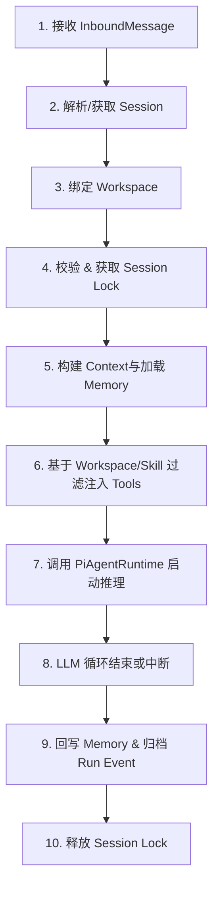

# Agent 精简优化架构改造设计与执行规范 v2.2

**日期：** 2026-05-28
**定位：** 生产级落地架构与执行规范 (融合 v2.0 接口、v2.1 框架与 v2.2 评审修订)
**目标：** 不重构无关模块，收拢主生命周期链路，拆解 `runner.ts` 巨型对象，建立统一工具执行和审批治理，以 Workspace 替代 ACP 确立逻辑安全边界。

---

## 1. 改造定位与总体原则

### 1.1 一句话核心
> **拆解 `runner.ts`（约 3226 行 God Object），将其 turn 生命周期、工具执行和审批治理收纳至独立模块，并在复用现有 BaseChannelRuntime、PersistentTaskQueue 和 host bash 审批等基础设施的基础上，以 Workspace 替换 ACP 建立干净的代码与权限边界。**

### 1.2 核心修订原则 (基于 v2.2 评审反馈)
1. **物理目录绝对不碰：** Workspace ID 仅作为逻辑权限、工具/记忆隔离和审计隔离的标识，**不迁移、不重命名、不影响**当前 channel/bot/profile 下的物理 `workspaceDir` / `chatDir` / `scratch` 目录结构。
2. **ACP 隔离式下线：** 第一阶段仅删除 active references（隔离 active 路径、不实例化服务、`/acp` 路由返回 inactive），**暂不物理删除 `acp/` 源码库**，待整体稳定后在收尾阶段一次性物理清除。
3. **TurnOrchestrator 渐进接入：** 不一蹴而就搬空 `runner.ts`。TurnOrchestrator 采用增量 (additive) 模式接入，元数据先行统一，管道按照 `Web -> stream -> shared IM -> Telegram -> CLI` 顺序灰度测试。
4. **工具灰度升级、禁止 bypass：** ToolRuntime 按工具组灰度注册，一旦工具组迁移完成，其旧直调路径锁死，不提供全局 bypass 开关；`high` / `critical` 级工具禁止绕回。
5. **审批切片细分：** 审批与 Tool 统一动作在 Phase 3 拆分为 Built-in 收口、Host Bash 兼容映射、Subagent 审批冒泡、Debounce与超时四大细分子阶段，确保步步可测。

---

## 2. 目标架构与职责边界

### 2.1 目标架构图

```text
┌────────────────────────────────────────────────────────┐
│                     Channel Layer                      │
│        Web / CLI / Telegram / Feishu / Weixin / QQ     │
│             (extends BaseChannelRuntime)               │
│ 职责：消息物理收发 / 平台协议适配 / 面向用户的 UI 渲染    │
└───────────────────────────┬────────────────────────────┘
                            │ (Normalized InboundMessage)
                            ▼
┌────────────────────────────────────────────────────────┐
│                   TurnOrchestrator                     │
│ 职责：会话锁控制 / 关联解析 Workspace / 聚合 Context /   │
│       驱逐 Deadlock / 写入/读取 Memory / 记录 Run Event │
└───────────────────────────┬────────────────────────────┘
                            │ (Prepared Context & Filtered Tools)
                            ▼
┌────────────────────────────────────────────────────────┐
│                    PiAgentRuntime                      │
│ 职责：Prompt 拼装 / 托管 Pi Agent Loop / 决定模型路由  │
└───────────────────────────┬────────────────────────────┘
                            │ (LLM Tool Call)
                            ▼
┌────────────────────────────────────────────────────────┐
│                      ToolRuntime                       │
│ 职责：Tool 查找与匹配 / 鉴权 / 内联 policy 校验决策      │
│       分发至 Sandbox/Host 处理器 / 输出可审计事件      │
└─────────────────────┬──────────────┬───────────────────┘
                      │              │
        (If Pending)  ▼              ▼ (If Allowed)
  ┌───────────────────────┐      ┌───────────────────────┐
  │    ApprovalBroker     │      │   Execution Sandbox   │
  │ 职责：Scope 管理/匹配 │      │   (toolSandbox.ts /   │
  │ Debounce 聚合 / Timeout│      │    HostBashStore)     │
  └───────────────────────┘      └───────────────────────┘
```

### 2.2 核心模块职责划分

| 模块 | 职责与行为边界 | 不做的事 |
| :--- | :--- | :--- |
| **Channel Layer** | 消息收发、平台 markdown/卡片适配、Inbound 转换 | 维护 Session 状态、拦截 Tool、读写 Memory |
| **TurnOrchestrator** | 维护 Turn 生命周期、申请 Lock、构建 Context、加载 Memory/Skills | 推理循环、执行 Tool、执行 Approval UI 逻辑 |
| **PiAgentRuntime** | LLM 交互循环（推理与调用提取）、基础 Model 切换与流输出 | 会话控制、存储 Settings、直接读写 DB |
| **ToolRuntime** | 统一管理 built-in/MCP/Host/Plugin 工具，评估安全风险与 Fallback | 执行具体的审批等待 UI 逻辑、长期保留 Scope Grant |
| **ApprovalBroker** | 管理一次性/Turn/Session/Workspace/持久授权，审批聚合与过期 | 处理沙盒内的代码执行 |
| **Workspace** | 提供运行的逻辑上下文边界、技能白名单、工具白名单、内存隔离边界 | 负责物理目录移动、物理 Coding target 管理 |

---

## 3. 核心数据结构与接口定义

所有新增接口与结构将统一在 `src/lib/server/agent/tools/toolTypes.ts` 和 `src/lib/server/approval/approvalTypes.ts` 中维护。

### 3.1 Workspace 模型
```typescript
export interface Workspace {
  id: string;                  // Workspace 唯一 ID，默认为 "personal"
  name: string;                // 易读的名称
  rootPath?: string;           // 逻辑根路径 (第一阶段为 reserved 字段，不干涉物理 workspaceDir)
  enabledSkillPaths?: string[]; // 绑定的 Skill 路径白名单
  enabledToolIds?: string[];   // 启用的 Tool ID 白名单
  sandboxProfileId?: string;   // 关联的沙箱安全配置 ID
  approvalProfileId?: string;  // 关联的审批策略配置 ID
  memoryScope: 'global' | 'workspace' | 'session'; // 记忆隔离级别
  createdAt: string;
  updatedAt: string;
}
```
> **重要设计约束：**
> Workspace ID 仅作为逻辑权限、工具/记忆隔离和审计隔离的标识，**不迁移、不重命名、不影响**当前 channel/bot/profile 下的物理 `workspaceDir` / `chatDir` / `scratch` 目录结构。

### 3.2 Tool 规范定义
```typescript
export interface ToolDefinition {
  id: string;
  name: string;
  description: string;
  inputSchema: unknown; // JSON schema 定义
  risk: 'low' | 'medium' | 'high' | 'critical';
  source: 'builtin' | 'mcp' | 'plugin' | 'host' | 'skill_script';
  requiredPermissions?: string[]; 
  handler: (input: any, ctx: ToolExecutionContext) => Promise<ToolResult>;
}

export interface ToolExecutionContext {
  runId: string;
  sessionId: string;
  workspaceId: string;
  actorId: string;
  cwd: string;
  
  // 受控 API，不暴露底层文件系统与执行句柄
  fs: SafeFsApi;
  shell: SafeShellApi;
  network: SafeNetworkApi;
  
  emit: (event: RunEvent) => void;
}
```

### 3.3 策略决策与审批模型
```typescript
export type PolicyDecision =
  | { type: 'allow' }
  | { type: 'sandbox' }
  | { type: 'approval_required'; request: ApprovalRequest }
  | { type: 'deny'; reason: string };

export type ApprovalScope = 'once' | 'turn' | 'session' | 'workspace' | 'persistent';

export interface ApprovalGrant {
  id: string;
  scope: ApprovalScope;
  capability: string;         // 被授权的能力标识，如 "bash:git commit"
  actorId: string;
  workspaceId?: string;
  sessionId?: string;
  runId?: string;
  actionFingerprint?: string; // 对操作特征的哈希，如命令特征或路径特征
  expiresAt?: string;         // ISO 格式的过期时间
  createdAt: string;
  revokedAt?: string;
}

export interface ApprovalRequest {
  id: string;
  runId: string;
  sessionId: string;
  workspaceId: string;
  actorId: string;
  capability: string;
  riskLevel: 'low' | 'medium' | 'high' | 'critical';
  
  action: {
    type: 'bash' | 'file_read' | 'file_write' | 'network' | 'mcp_tool' | 'secret_access';
    command?: string;
    path?: string;
    domain?: string;
    toolName?: string;
  };
  
  reason: string;
  status: 'pending' | 'approved' | 'rejected' | 'expired';
  
  requestedBy: {
    agentId: string;
    parentAgentId?: string;
    depth: number;            // Subagent 的递归层级，用于权限追溯
  };
  
  scopeOptions: ApprovalScope[];
  selectedScope?: ApprovalScope;
  createdAt: string;
  resolvedAt?: string;
}
```

---

## 4. 关键控制流程设计

### 4.1 TurnOrchestrator 生命周期 (10 步流程)



#### 异常恢复与锁管理机制：
* **锁超时 (Lock Timeout)：** TurnOrchestrator 持有锁的最大时长默认设为 10 分钟。超过 10 分钟自动强行释放锁，避免由于网络掉线或 LLM 死循环导致整个会话永久挂起。
* **死锁清理 (Deadlock Clean-up)：** 节点/进程启动时，通过 `TurnOrchestrator` 自动扫描 `runs` 表中状态仍为 `running` 的未完结任务，重置其状态为 `failed`，并释放所有关联的 Session 锁。

### 4.2 统一工具执行流 (ToolRuntime.executeToolCall)
1. **Tool 定位：** 从 `ToolRegistry` 获取目标工具的 `ToolDefinition`。
2. **Policy 校验：** `decidePolicy()` 结合 Workspace 配置做基础的安全校验，产生 `PolicyDecision`：
   * 若为 `allow`，继续执行。
   * 若为 `sandbox`，重定向执行上下文参数为 Sandbox 隔离边界。
   * 若为 `deny`，直接返回错误输出，不传导给宿主机。
   * 若为 `approval_required`，进入审批分支。
3. **查找已有授权：** 调用 `ApprovalBroker.checkGrant()`。若存在可用且未过期的 `ApprovalGrant`，则直接放行。
4. **发起异步审批：** 若无有效授权，创建状态为 `pending` 的 `ApprovalRequest` 并投递至 `ApprovalBroker`：
   * 阻塞当前 Tool 协程。
   * 通过 `TurnOrchestrator` 回调对应 Channel 的 `renderApproval()` 方法，将审批卡片/Inline Keyboard 推送给用户。
   * 用户操作后，写入 `ApprovalGrant`，Tool 协程恢复执行或直接退出。
5. **Sandbox 兜底安全策略：** 沙箱组件报错/崩溃时，**禁止**无审批自动 fallback 到宿主机直接运行。高风险 (`high`/`critical`) 工具遭遇沙箱环境失效时必须立刻 `deny`。
6. **不提供生产级全局 bypass 开关**：ToolRuntime 采用渐进式灰度工具组接入策略。一旦某组工具完成迁移并注册进 `ToolRegistry`，其执行路径在代码级锁死，严禁绕过 `ToolRuntime` 直调旧路径；高风险 (`high` / `critical`) 工具绝对禁止通过任何配置绕回。

### 4.3 审批聚合与 Subagent 权限传递

#### 4.3.1 审批 Debounce 聚合
* 为避免高频操作导致弹窗泛滥（例如连续调用 5 次文件读取工具），低风险/中风险操作支持在 1.5 秒内进行 Debounce 聚合。
* 聚合时，将同类型、同能力的 `ApprovalRequest` 合并为单一提示，如：“Agent 申请读取目录内 5 个文件，是否允许本轮读取？”
* `critical` 级和 `high` 级的命令绝对不允许 Debounce 聚合，必须单笔高亮弹出。

#### 4.3.2 Subagent 审批上提机制
* Subagent **不能**自己决定扩权，其拥有的权限必须小于等于父 Agent 的权限。
* 当 Subagent 执行高风险操作触发审批时，`requestedBy.depth` 用于标记调用深度。
* `ApprovalBroker` 会将该 `ApprovalRequest` 的 `runId` 绑定到主 Run 上。Channel 模块只监听主 Run 的状态，确保用户在父级任务聊天框中进行统一授权，而无需寻找隐藏的 Subagent 聊天会话。

#### 4.3.3 审批过期管理 (Approval Timeout)
* `pending` 状态的审批请求在 5 分钟内未得到用户响应，将自动被 `ApprovalBroker` 标记为 `expired`。
* 此时 Tool 执行协程唤醒，返回 `User approval timeout` 错误给 PiAgentRuntime，允许 Agent 进行非工具重试或主动向用户发出等待提醒，防止进程死等。

### 4.4 Channel ↔ Workspace 关联解析
1. 默认状态下，系统启动时会在数据库中写入默认 workspace（`id: "personal"`，指向用户默认工作空间）。
2. 当 Channel 层接收到新消息时，TurnOrchestrator 会在 Session 初始化阶段将 session ID 与 workspace ID 关联。
3. 用户可在对话中随时发送 `/workspace <id>` 指令，TurnOrchestrator 拦截该命令后执行 Session 重绑定，后续本 Session 内的所有 Turn 均会运行在该 Workspace 定义的上下文、工具以及权限限制下。

---

## 5. 数据库 Schema 变更设计

系统将从原有的 `settings.json` 单一配置逐步迁移到 SQLite，新增以下表结构以支持 Workspace、审批和任务流。

```sql
-- Workspaces 表
CREATE TABLE IF NOT EXISTS workspaces (
  id TEXT PRIMARY KEY,
  name TEXT NOT NULL,
  root_path TEXT,
  enabled_skill_paths TEXT,      -- 存储为 JSON 数组字符串
  enabled_tool_ids TEXT,         -- 存储为 JSON 数组字符串
  sandbox_profile_id TEXT,
  approval_profile_id TEXT,
  memory_scope TEXT DEFAULT 'global',
  created_at TEXT NOT NULL,
  updated_at TEXT NOT NULL
);

-- Sessions 增加 Workspace 关联
ALTER TABLE sessions ADD COLUMN workspace_id TEXT REFERENCES workspaces(id);

-- Runs 任务运行表
CREATE TABLE IF NOT EXISTS runs (
  id TEXT PRIMARY KEY,
  session_id TEXT NOT NULL,
  workspace_id TEXT REFERENCES workspaces(id),
  actor_id TEXT NOT NULL,
  channel_id TEXT NOT NULL,
  status TEXT NOT NULL,          -- 'running' | 'waiting_for_approval' | 'completed' | 'failed' | 'aborted' | 'expired'
  started_at TEXT NOT NULL,
  finished_at TEXT,
  error TEXT
);

-- Approval Requests 表
CREATE TABLE IF NOT EXISTS approval_requests (
  id TEXT PRIMARY KEY,
  run_id TEXT NOT NULL REFERENCES runs(id),
  session_id TEXT NOT NULL,
  workspace_id TEXT NOT NULL REFERENCES workspaces(id),
  actor_id TEXT NOT NULL,
  capability TEXT NOT NULL,
  risk_level TEXT NOT NULL,
  action_type TEXT NOT NULL,
  action_detail TEXT,            -- 存储为 JSON 格式的 command, path, domain 等
  reason TEXT,
  status TEXT NOT NULL,          -- 'pending' | 'approved' | 'rejected' | 'expired'
  requested_by_depth INTEGER DEFAULT 0,
  created_at TEXT NOT NULL,
  resolved_at TEXT
);

-- 为审批和查询建立优化索引
CREATE INDEX IF NOT EXISTS idx_approval_requests_run_status ON approval_requests(run_id, status);
CREATE INDEX IF NOT EXISTS idx_approval_requests_session_status ON approval_requests(session_id, status);
CREATE INDEX IF NOT EXISTS idx_approval_requests_workspace_cap_status ON approval_requests(workspace_id, capability, status);
CREATE INDEX IF NOT EXISTS idx_approval_requests_created ON approval_requests(created_at);

-- Approval Grants 表
CREATE TABLE IF NOT EXISTS approval_grants (
  id TEXT PRIMARY KEY,
  scope TEXT NOT NULL,           -- 'once' | 'turn' | 'session' | 'workspace' | 'persistent'
  capability TEXT NOT NULL,
  actor_id TEXT NOT NULL,
  workspace_id TEXT REFERENCES workspaces(id),
  session_id TEXT,
  run_id TEXT REFERENCES runs(id),
  action_fingerprint TEXT,
  expires_at TEXT,
  created_at TEXT NOT NULL,
  revoked_at TEXT
);
```

---

## 6. 改造分阶段实施路径

整个改造分为 5 个 Phase 渐进式进行，确保每步皆可测试、可回退。

### Phase 1：ACP active references 下线 + Workspace 基础层引入 (预估 1-2 周)
* **核心任务：**
  1. 保留 `src/lib/server/acp/` 源码不进行物理删除，将其置为 inactive 状态。
  2. 清理所有 active 引用：
     * Channel runtime 不再实例化 ACP service。
     * `/acp`、`/approve`、`/deny` 统一拦截并返回 inactive-path 说明。
     * Settings 配置与引导路径不再展示 ACP 管理菜单。
     * 清理 `settings/defaults.ts`、`settings/store.ts` 与 `settings/schema.ts` 中的强引用。
  3. 执行 SQL 脚本创建 `workspaces` 表，初始化 `"personal"` workspace。
  4. 新增 `WorkspaceStore` CRUD 操作与 `WorkspaceResolver`。
* **修改/新建文件清单：**
  * `[NEW]` `src/lib/server/workspaces/workspaceTypes.ts`
  * `[NEW]` `src/lib/server/workspaces/workspaceStore.ts`
  * `[MODIFY]` `src/lib/server/agent/runner.ts` (下线 ACP 业务，暂保留旧 import 做兼容)
  * `[MODIFY]` `src/lib/server/settings/store.ts` (下线 ACP schema 关联)
* **验收标准：**
  * [ ] 编译通过。
  * [ ] 数据库初始化包含 `"personal"` 默认 workspace，现有物理文件目录结构没有任何变动。
  * [ ] 启动系统，多渠道（Web/CLI）多轮对话正常解析出 workspace ID (`"personal"`) 并填入 Session 结构。

---

### Phase 2：增量 TurnOrchestrator 引入与管道灰度迁移 (预估 2-3 周)
* **核心任务：**
  1. 新增 `agent/turnOrchestrator.ts`。
  2. 采用增量 (additive) 方式迁移：
     * 先在 TurnOrchestrator 中统一 runId、sessionId、workspaceId 元数据，不做大规模职责搬移。
     * 迁移 Web Chat 与流式消息接口接入 `TurnOrchestrator.executeTurn()`。
     * 验证稳定后，按 `shared IM -> Telegram -> CLI` 顺序分批重定向各管道。
     * 逐步在新流程稳定运行的前提下，将 Session Lock、Memory 读写、Skill 加载、Run Event 记录等生命周期逻辑移出 `runner.ts`，精简 `runner.ts`（PiAgentRuntime）。
  3. 实现 Session 锁超时释放逻辑和死锁自动回收机制。
* **修改/新建文件清单：**
  * `[NEW]` `src/lib/server/agent/turnOrchestrator.ts`
  * `[MODIFY]` `src/lib/server/agent/runner.ts` (逐步精简)
  * `[MODIFY]` `src/lib/server/channels/shared/baseRuntime.ts` (灰度切流)
  * `[DELETE]` `src/lib/server/channels/shared/messageRouter.ts` (删除遗留代码)
* **验收标准：**
  * [ ] 灰度切换期间，各渠道消息收发、附件、停止、锁状态运行稳定。
  * [ ] 并发消息触发 Session 锁生效，锁超时（10 分钟）正常自动释放；进程重启自动清理 running 挂起状态。
* **回滚机制：** `BaseChannelRuntime` 保留全局开关 `USE_NEW_TURN_ORCHESTRATOR`，异常时可切回旧 `runner.run()`。

---

### Phase 3：ToolRuntime 与 ApprovalBroker 切片迁移 (预估 2-3 周)
为了降低重构爆炸面，本阶段按四步切片演进：

#### Phase 3A：ToolRuntime 搭建与 Built-in 工具收口
* **任务：** 新建 `toolRuntime.ts` 与 `toolTypes.ts`，统一 ToolDefinition。将 built-in tools（共 26+）迁移至 `ToolRegistry` 并接入 `ToolRuntime` 执行，打通统一工具审计事件。
* **验收：** built-in 执行日志带有完整的逻辑 `runId` / `workspaceId` / `sessionId`。

#### Phase 3B：ApprovalBroker 引入与 Host Bash 审批 Scope 固化
* **任务：** 新建 `approvalBroker.ts`、`approvalStore.ts` 以及相关表。迁移现有 `HostBashStore` 存储结构，将 legacy once/session/persistent 审批语义映射进新 `ApprovalScope`。
* **验收：** 宿主机 Host Bash 拦截与原有审批链路表现一致，但数据转移至 SQLite `approval_requests` 与 `approval_grants` 中。

#### Phase 3C：Subagent 审批冒泡
* **任务：** subagent 执行时将 `requestedBy.depth` 标记透传，新审批请求挂在 parent runId 上，Channel 端自动在主聊天会话中渲染审批提示。
* **验收：** 子代理执行敏感操作时，用户能直接在主会话看到审批并授权。

#### Phase 3D：Debounce 聚合与超时 Expire
* **任务：** 实现 1.5 秒低/中风险审批 Debounce 合并逻辑；实现 5 分钟超时 expire 机制并唤醒 Tool 协程返回 `timeout`。
* **验收：** 批量文件读写触发 Debounce 聚合为一个卡片；长时间未授权不挂死进程，5分钟后自动以超时状态解冻。

---

### Phase 4：Settings 渐进式配置拆分 (预估 1-2 周)
* **核心任务：**
  1. 隔离 settings.json 为引导及静态参数配置，动态变更转入 SQLite。
  2. 第一批迁移对象：`workspaces`、`channel_settings`、`plugin_settings`。
  3. 编写启动时的迁移器，校验若 SQLite 无配置则从 settings.json 加载并落库，防止因配置迁移导致的老用户配置丢失。
  4. 清理 `sanitizeSettings` 等辅助逻辑。
* **验收标准：**
  * [ ] UI 修改 Channel / Plugin 设置直接持久化写入 SQLite。
  * [ ] 启动检测成功完成 settings.json 数据平滑迁移。

---

### Phase 5：清理 Legacy 代码与冗余 fallback (预估 1 周)
* **核心任务：**
  1. 在新主干稳定运行 1-2 周后，彻底物理删除 `src/lib/server/acp/` 整个目录。
  2. 物理清除 runner.ts 中的兼容 fallback 逻辑、老路由与过渡开关。
  3. 全渠道进行最后一轮彻底的回归测试。
* **验收标准：**
  * [ ] 系统中不包含任何 ACP 遗留代码文件，编译路径彻底闭环。
  * [ ] `runner.ts` 最终行数实现 < 1500 行的精简目标。

---

## 7. 风险与控制点

| 序号 | 风险描述 | 对应控制与规避策略 |
| :--- | :--- | :--- |
| **1** | ACP 强删导致编译爆炸 | **隔离式下线**。Phase 1 只清引用不删代码，待 Phase 5 稳固后再物理强删。 |
| **2** | Workspace 拆分导致现有数据损坏 | **目录解耦**。在设计中声明 Workspace 不干涉物理 `workspaceDir`。 |
| **3** | ToolRuntime 重构范围过广挂起系统 | **灰度迁移**。Built-in -> Host Bash -> MCP -> Plugin，逐组迁移，一旦迁移禁止 bypass。 |
| **4** | 审批弹窗频率激增破坏体验 | **Debounce & 范围继承**。子代理继承父授权，非 critical 执行 1.5 秒 Debounce。 |
```
