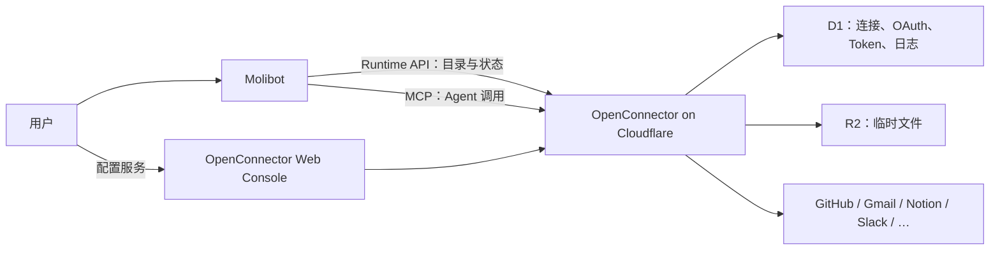

# OpenConnector Cloudflare 部署与 Molibot 集成方案

> 状态：Cloudflare 已部署；Molibot V1 目录、状态同步与只读 Agent MCP 接入已实施  
> 更新日期：2026-08-01  
> 上游项目：[oomol-lab/open-connector](https://github.com/oomol-lab/open-connector)

## 1. 产品目标

将 OpenConnector 部署到自有 Cloudflare 账户，并作为 Molibot 的统一第三方服务连接网关。用户在 Molibot 内可以：

- 配置一次 OpenConnector 服务地址和 Runtime Token；
- 查看 OpenConnector 支持的服务目录；
- 按关键词、分类和连接状态筛选服务；
- 查看已经连接的服务和账户；
- 跳转到 OpenConnector 对应服务的配置页；
- 配置完成后通过 Molibot 的“刷新”按钮主动同步连接状态，普通页面进入只读本地缓存；
- 让 Agent 通过远程 MCP 调用已经授权的服务。

第一版不在 Molibot 内复制 OpenConnector 的凭据表单和 OAuth 管理后台。Molibot 负责发现、展示、跳转和状态同步，OpenConnector 持有第三方凭据并完成授权。

## 2. 架构与权限边界



- Molibot 共享 Agent/App 层负责配置、目录聚合、状态同步、MCP 注册和后续审批；Channel 层不实现连接器业务。
- OpenConnector 负责 Provider 目录、第三方凭据、OAuth、Token 刷新、Action 策略和脱敏日志。
- Molibot 第一版只保存权限受限的 Runtime Token，不保存 Admin Token。
- Admin Token 只用于 OpenConnector Web Console 和 `/api/*` 管理接口。

## 3. Cloudflare 部署设计

### 3.1 资源

- Cloudflare Worker：HTTP Runtime、MCP 和 Web Console；
- D1：连接、OAuth 配置与状态、Runtime Token、运行日志和幂等记录；
- R2：临时中转文件；
- Static Assets：Web Console；
- 可选自定义域名，例如 `connector.example.com`。

第一版选择 R2，不选择 KV。R2 更适合邮件附件、Drive 文件和图片等后续场景，也没有 KV 的 25 MiB 单文件限制。

### 3.2 密钥

- `OOMOL_CONNECT_ADMIN_TOKEN`：管理后台与管理 API；
- `OOMOL_CONNECT_ENCRYPTION_KEY`：加密 D1 中的第三方凭据、OAuth 配置和敏感响应；
- 部署完成后由 Console 创建 Molibot 专用 Runtime Token。

三者必须分别生成、不能复用。Encryption Key 必须保存到外部密码管理器；遗失或直接替换会导致已有加密数据不可恢复。

### 3.3 生产安全基线

- `OOMOL_CONNECT_ORIGIN` 使用最终 HTTPS 域名，保证 OAuth 回调稳定；
- Molibot 使用独立、可撤销、最小权限 Runtime Token；
- 第一阶段只允许少量只读 Action；
- 默认禁止 Provider proxy；
- R2 配置过期文件生命周期清理；
- 升级前备份 D1，每次部署前单独执行远程 migrations；
- 生产环境固定 OpenConnector tag 或 commit，不长期跟随未固定的 `latest`/`main`。

## 4. Molibot 第一版范围

### 4.1 一次配置

新增独立设置实体，而不是要求用户分别理解 Runtime API、MCP URL 和 Header：

```ts
interface OpenConnectorSettings {
  enabled: boolean;
  baseUrl: string;
  runtimeToken: string;
  consoleUrl?: string;
  mcpServerId: string;
}
```

保存后由共享上层派生远程 MCP 配置：

```ts
{
  id: "open-connector",
  transport: "http",
  http: {
    url: `${baseUrl}/mcp`,
    headers: { Authorization: `Bearer ${runtimeToken}` }
  }
}
```

设置页提供服务地址、Runtime Token、显式显示/隐藏、连接测试、保存、清除和打开管理后台。Token 默认不进入页面，只在用户点击眼睛按钮时通过本地 Desktop API 单次读取。保存走细粒度 API，并覆盖 save → 新建 store → load 的临时数据库 round-trip 测试。

### 4.2 服务目录和状态

Molibot 后端使用 Runtime Token 读取：

- `GET /v1/health`：连接测试；
- `GET /v1/providers`：服务目录；
- `GET /v1/apps`：App 目录；
- `GET /v1/apps`：连接安全投影；只把 `status: active` 计为已连接。`/v1/apps/authenticated` 只适合过滤调用方显式传入的 service 集合，无参数调用会返回空数组；
- `GET /v1/apps/services/:service`：服务详情；
- `GET /v1/actions?service=:service`：服务 Actions；
- `GET /v1/actions/:actionId`：Action 详情。

前端不直接携带 Runtime Token 请求 OpenConnector。Molibot 服务端代理目录请求，常规摘要只返回 `tokenConfigured`；只有本地 Desktop 的显式显示操作返回已保存 Token。目录页支持搜索、分类筛选和连接状态筛选，以紧凑服务行展示名称、图标和连接状态。

至少区分：未配置、服务不可达、可连接、需要 OAuth App、已连接、多账户、无需认证、仅目录和授权失效。

### 4.3 配置跳转

OpenConnector Console 支持服务详情深链：

```text
{consoleUrl}/providers/{service}
```

点击“连接”或“管理”时在系统浏览器打开。Molibot 不把 Admin Token 放入 URL；用户完成配置后点击“刷新”主动同步。成功请求会把 Provider、活跃连接状态及最终 Logo URL 原子写入按 Runtime 地址隔离的本地 JSON 缓存，普通页面进入只读取该文件，不访问 OpenConnector。此缓存仅服务于设置页目录展示，Agent 的 MCP 请求仍实时直连 Runtime。

### 4.4 Agent MCP 接入

OpenConnector 复用 Molibot 已有远程 Streamable HTTP MCP 客户端。Agent 使用：

- `list_apps`
- `list_connections`
- `search_actions`
- `get_action_guide`
- `execute_action`

新增配套 Skill，要求 Agent 先确认连接、搜索 Action、读取 Action Guide，再执行；不得猜测 Action ID、静默切换账户或把凭据写入对话。

### 4.5 第一版不做

- 不在 Molibot 内复制动态 API Key/OAuth 表单；
- 不保存 OpenConnector Admin Token；
- 不默认开放全部 Action 或 Provider proxy；
- 不在各 Channel 分别实现连接器逻辑；
- 不承诺自托管后所有 OAuth 服务立即可用：每个 OAuth Provider 仍需用户提供自己的 OAuth App。

## 5. 后续写操作安全

OpenConnector 的 MCP `execute_action` 不接受 HTTP Action API 支持的 `Idempotency-Key`。因此：

- 第一版只开放只读 Action；
- 后续在 Molibot 共享 Agent 层按 `provider + actionId + connectionName` 增加风险分类和审批；
- 外部发送、删除、付款和权限变更每次审批；
- 高风险写操作可新增原生 HTTP 工具，生成并复用 `Idempotency-Key`；
- 网络中断且执行状态不明时，不自动重试非幂等写操作；
- 审批、用户提示和排障事件分别处理，不污染模型对话。

## 6. 分阶段交付

### A. Cloudflare 部署

- Worker、D1、R2 和 Static Assets 正常；
- 本地 Worker 冷启动通过；
- 远程 migrations 成功；
- `/health` 返回 `{"ok":true}`；
- Console 可用 Admin Token 登录；
- 重启后配置仍存在；
- 加密密钥和备份策略已记录。

### B. Molibot 目录与只读接入

- 用户只配置一次 base URL 与 Runtime Token；
- 服务目录、筛选、详情和连接状态正常；
- 服务卡片能打开正确的 Provider 页面；
- 返回 Molibot 后刷新状态；
- Remote MCP 只暴露给显式加载它的 Session；
- 一个真实只读 Action 验证成功。

### C. OAuth 与多账户

- 一个 OAuth Provider 完成 OAuth App、回调、授权和刷新验证；
- `default`、`work`、`personal` 等连接不会串号；
- 多账户时 Agent 必须显式选择或询问。

### D. 写操作与审批

- 共享层具备 Action 风险分类；
- 所有 Channel 使用同一审批路径；
- 重复审批、超时、停止、失败和恢复保持幂等；
- 高风险操作具备幂等执行或明确的不可重试保护。

## 7. Cloudflare 手动部署步骤

以下步骤以 OpenConnector 官方当前文档为准；生产部署前先选择一个具体 tag 或 commit。

### 7.1 准备环境

```bash
node --version
npm --version
git --version
```

Node.js 需要 22 或更高版本。然后：

```bash
git clone https://github.com/oomol-lab/open-connector.git
cd open-connector
npm install
cp wrangler.example.jsonc wrangler.local.jsonc
npx wrangler login
```

`wrangler.local.jsonc` 已被上游忽略，不要提交真实 Cloudflare resource ID 或密钥。

### 7.2 创建 Cloudflare 资源

```bash
npx wrangler d1 create open-connector
npx wrangler r2 bucket create open-connector-transit-files
```

把 D1 输出中的 `database_id` 和 R2 bucket 名填入 `wrangler.local.jsonc`。保持 `TRANSIT_FILES_BACKEND` 为 `r2`，确认 `TRANSIT_FILES` binding 只绑定一次。

### 7.3 本地 Worker 验证

为本地预览生成两份独立临时值，写入上游仓库已忽略的 `.env`：

```text
OOMOL_CONNECT_ADMIN_TOKEN=<local-admin-token>
OOMOL_CONNECT_ENCRYPTION_KEY=<local-encryption-key>
```

然后：

```bash
npx wrangler d1 migrations apply open-connector --local --config wrangler.local.jsonc
npm run dev:cloudflare
```

另开终端：

```bash
curl http://localhost:8787/health
```

期望返回 `{"ok":true}`。再打开 `http://localhost:8787`，使用本地 Admin Token 登录，确认 Provider 目录可以加载。

### 7.4 配置生产密钥

分别执行两次：

```bash
openssl rand -base64 32
```

第一份作为 Admin Token，第二份作为 Encryption Key，并立即保存到密码管理器。然后：

```bash
npx wrangler secret put OOMOL_CONNECT_ADMIN_TOKEN --config wrangler.local.jsonc
npx wrangler secret put OOMOL_CONNECT_ENCRYPTION_KEY --config wrangler.local.jsonc
```

不要把密钥写入 Wrangler 配置、命令参数、文档或聊天消息。

### 7.5 迁移并部署

```bash
npx wrangler d1 migrations apply open-connector --remote --config wrangler.local.jsonc
npm run deploy:cloudflare
```

`deploy:cloudflare` 不自动执行 D1 migrations；以后每次升级都要先迁移。用 Wrangler 输出的 URL 验证：

```bash
curl https://<worker-name>.<account-subdomain>.workers.dev/health
```

期望返回 `{"ok":true}`，然后打开相同 URL，用生产 Admin Token 登录 Console。

### 7.6 域名与 OAuth

如果使用 OAuth Provider，先绑定最终自定义域名，再设置：

```text
OOMOL_CONNECT_ORIGIN=https://connector.example.com
```

重新部署后，从 Console 或 `/api/oauth/configs` 读取每个 Provider 的 `expectedRedirectUri`，把完全一致的地址填入第三方 OAuth App。不要在最终域名确定前批量注册回调。

### 7.7 创建 Molibot Runtime Token

进入 Console 的 Access 页面：

1. 创建 `molibot-readonly` 持久 Runtime Token；
2. 第一阶段只允许选定 Provider 的只读 Actions；
3. `allowedProxies` 保持为空；
4. 保存只显示一次的 `oct_...` Token；
5. 等 Molibot 设置页实现后再通过密码输入框保存，不在聊天中发送。

### 7.8 完成检查表

- [ ] 生产 `/health` 正常；
- [ ] Web Console 可登录，Provider 目录可加载；
- [ ] D1 远程 migrations 已完成；
- [ ] Admin Token 与 Encryption Key 独立且已备份；
- [ ] R2 已绑定并设置生命周期规则；
- [ ] 最终域名和 `OOMOL_CONNECT_ORIGIN` 一致；
- [ ] Molibot Runtime Token 只读且 `allowedProxies` 为空；
- [ ] 已记录固定的 OpenConnector tag/commit，供升级和回滚。

## 8. 参考资料

- [OpenConnector README](https://github.com/oomol-lab/open-connector)
- [Cloudflare Deployment](https://github.com/oomol-lab/open-connector/blob/main/docs/cloudflare.md)
- [Runtime API And MCP](https://github.com/oomol-lab/open-connector/blob/main/docs/runtime-api.md)
- [Credentials And Local Storage](https://github.com/oomol-lab/open-connector/blob/main/docs/credentials.md)
- [Configuration](https://github.com/oomol-lab/open-connector/blob/main/docs/configuration.md)
