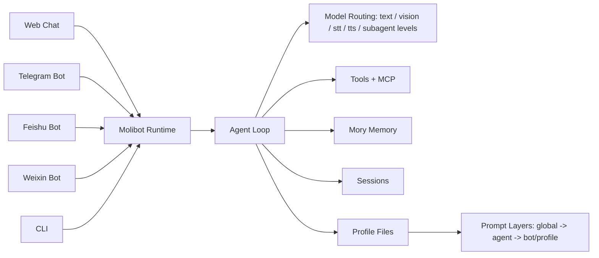

# Molibot

<p align="center">
  
</p>

<h2 align="center">A Simpler OpenClaw-Style Personal AI Assistant</h2>

<p align="center">
  Multi-Channel · Agent Profiles · MCP Ecosystem · Local-First Data
</p>

<p align="center">
  <a href="https://deepwiki.com/gusibi/molibot">
    
  </a>
</p>

<p align="center">
  
  
  
  
  
</p>

Molibot 是一个面向个人和小团队的本地优先 AI 助手。
一套 runtime，同时跑 Web / Telegram / Feishu / Weixin / CLI，并且共享同一套配置与会话能力。

## Table of Contents

- [Key Highlights](#key-highlights)
- [Architecture](#architecture)
- [Feature Snapshot](#feature-snapshot)
- [Quick Start](#quick-start)
- [First-Time Setup Flow](#first-time-setup-flow)
- [Web Chat Usage](#web-chat-usage)
- [Telegram Commands](#telegram-commands)
- [Settings Pages](#settings-pages)
- [Data Layout](#data-layout)
- [Common Commands](#common-commands)
- [Production Deployment](#production-deployment)
- [Environment](#environment)
- [Docs](#docs)
- [Documentation Workflow](#documentation-workflow)
- [Current Status](#current-status)

## Key Highlights

- **Multi-Channel in One Runtime**: `Web + Telegram + Feishu + Weixin + CLI`
- **Message Return & Display Layout Optimization**: Centralizes message formatting across Telegram, Feishu, QQ, and Weixin. Implements a unified `DisplayFormatter` to render model thinking/reasoning blocks and tool progress cleanly. Supports fine-grained channel instance configurations (`toolProgress` and `showReasoning`) toggleable directly in chat using `/toolprogress` and `/showreasoning` bot-scoped commands, including `/showreasoning new` for live latest-reasoning progress on editable channels.
- **Compact Single-Tool Progress**: When `toolProgress` is set to `new`, the running-state line is now compressed to `⏳ <tool>...` instead of repeating a separate "running" label, so long tool names remain visible.
- **Telegram Overlong Edit Resilience**: Telegram editable status/answer/detail messages share one chunked text-delivery path. If `editMessageText` hits `MESSAGE_TOO_LONG`, Molibot keeps the first chunk in the edited message and sends the rest as follow-up messages instead of aborting the run. Streaming answers retain all chunk message IDs so later refreshes edit existing chunks instead of repeatedly creating a new second message.
- **Telegram Native Media Replies**: Telegram attachment uploads preserve source media extensions when a custom title is provided, and detected MP4/WebM/MOV files use native `sendVideo` with streaming enabled so generated videos arrive as video messages instead of extensionless generic uploads.
- **Committed Main Answer Protection**: Runner and channel contexts now distinguish draft answers from committed main answers. If the model returns multiple terminal assistant messages in one turn, Molibot shows them as separate replies instead of overwriting the earlier complete answer.
- **Scheduled Event Runtime Guardrails**: watched event tasks now use channel/bot-scoped SQLite execution leases with a 10-minute default timeout, capped retries, timeout-triggered abort, startup recovery, `/stop` visibility across stale runner states, and suppression of duplicate same-slot retries when a late-running attempt still finishes successfully.
- **Feishu Approval Terminal Cards**: approval clicks return a button-free processing card within Feishu's three-second callback window, then edit the original card into a terminal result after background execution; request-level deduplication prevents HTTP/WebSocket callback races and repeated execution.
- **Reliable Bash Stop Finalization**: `/stop` terminates an aborted bash/Agent run without empty-response retries or model fallback, drops pending progress updates, and returns the session to idle after the command process is killed.
- **Sandbox Multi-Level Control & Approval Auto-Resume**: Supports sandbox overrides with a resolution priority order of `Session Override > Bot Instance Override > Agent Override > Global Default`. Direct chat control is enabled via the `/sandbox` command; when the effective sandbox is OFF, `bash` runs as Host Bash with full access and does not require Host Bash approval. Approved bash commands auto-rewrite execution context history and dynamically resume runners in the background; stdout/stderr stays in the Agent tool context for the final response instead of being sent as a standalone chat message. If the previous turn is still releasing its session lock, the shared runtime waits for up to one hour before falling back to a visible "session still busy" notice. Common approval replies such as `审批通过` are recognized directly. Built-in tools automatically target isolated venv, GOPATH, and GOCACHE environments in `MOLIBOT_TOOLING_DIR` (defaulting to `~/.molibot/tooling`).
- **Local LaunchAgent Runtime**: Local macOS runs can be managed by `launchd` using the LaunchAgent plist template in `launchd/`, so Molibot is not tied to a foreground terminal session and can be restarted automatically.
- **Built-In Web Search**: `webSearch` is now a shared Agent-layer tool with route-based fallback across DuckDuckGo, Brave, Tavily, Exa, Serper, Baidu Qianfan, Baidu Fast, Baidu Web, Ark, Grok, and Bocha. Routing is intent-based (`china`, `global`, `official_docs`, `research`) instead of fragile Chinese/news keyword buckets, and automatic engine selection can use priority, random, or in-process round-robin among configured engines. Search stays date-aware through tool guidance without mechanically prepending full current dates to provider keywords, so live lookups keep concise queries unless a specific date is actually useful. The system prompt prioritizes this dedicated tool for current web lookups instead of bash curl, browser search, or legacy skill scripts. `/settings/search` manages engine credentials, routing, timeouts, max results, live test queries, effective default base URLs, and redacted request diagnostics for each test attempt; the test panel can also force a specific engine and shows the exact `WebSearchResponse` payload returned by the runtime. Search results include source-level citations, citation-linked results, and provider metadata so final answers can cite real URLs consistently.
- **Built-In Image Generation**: `imageGenerate` is a shared Agent-layer deferred tool supporting Agnes-Image-2.0-Flash, Google Imagen, Volcengine (Seedream), and ModelScope. It standardizes configurations mapping `AGNES_API_KEY`, `GOOGLE_API_KEY`, `VOLCENGINE_API_KEY`, and `MODELSCOPE_API_KEY` env variables. The Agent semantically routes image generation/editing intent in any language through `toolSearch select:imageGenerate` before skill or bash fallbacks. The tool automatically resolves auto engine selection with the configured default engine first, treats a configured default engine with an API key as enabled for older settings compatibility, performs sandbox path guard validation on output files, saves output PNGs to the session's dated scratch directory, returns provider `Remote URL` values when available, and attempts to upload generated images directly back to the active chat channel. Channel upload failures are reported as upload errors while preserving the successful image result. Executed image generation tasks are synchronized and saved to the SQLite settings database (`image_tasks` table). Settings are fully manageable via the `/settings/image` UI page, which supports credentials setup, custom base URL endpoints, per-engine enable switches, default engine selection, live image generation tests, a sticky bottom save bar (`.settings-footbar`), and a visual tasks list showing past records with Task ID copy, request parameters display, and visual image preview modal.
- **Built-In Video Generation**: `videoGenerate` is a shared Agent-layer deferred tool supporting Agnes Video and Volcengine (Doubao Seedance) engines. It maps credentials from `AGNES_API_KEY` and `VOLCENGINE_API_KEY`. Users can customize the exact model ID for each provider via the settings UI. The Agent routes video generation intent in any language through `toolSearch select:videoGenerate`. The tool accepts array/string/JSON-string reference images but only submits public HTTP(S) URLs, rejecting local paths and Base64/data URLs before provider calls; for image-to-video, the Agent should use the `Remote URL` returned by `imageGenerate`. Status queries use SQLite as the cache source: completed tasks return the stored remote URL, fresh processing tasks return cached progress, and stale processing tasks query the provider once and write the remote `videoUrl` back to DB without downloading the `.mp4` locally. Settings are fully manageable via the `/settings/video` page, which supports credentials, custom models, custom base URLs, live generation tests, a visual task list with Task ID copying, inline HTML5 video results playback through redirect URLs, and a fault-tolerant background poller that safely stops failed/4xx tasks after 3 consecutive failures to prevent infinite loops.
- **Deferred Tool List Consistency**: Prompt-exposed deferred tools and the runtime `deferredEntries` registry stay aligned; `webSearch` is now registered in both places so `toolSearch` can discover the same deferred names the prompt advertises.
- **Deferred-Only Web Search Exposure**: `webSearch` is discoverable through the deferred tool registry, but its lightweight stub is intentionally not exposed as a top-level callable tool. `toolSearch` stays the only load path, which avoids duplicate `webSearch` names in provider `tools` requests.
- **System Prompt Boundary Refactor**: Simplifies and modularizes the static system prompt by removing duplicated event scheduler details, tool schemas, and low-level sandbox OS implementation details (such as `sandbox-exec` and `bubblewrap`). The scattered global guardrails are now merged into one `Core Directives` section, keeping prompt policy boundaries easier to inspect and regress-test while aligning the `bash` tool definition schema.
- **ACP Externalized Dependency**: Legacy ACP has been physically cleaned up from the main codebase and relocated to `package/acp/` as an external dependency mapping to `#acp/*`.
- **Minimum Workspace Boundary**: runtime startup creates a default `personal` workspace registry entry, and new run archives carry `workspaceId` for future workspace-scoped tools, approvals, and memory policy
- **Agent v2.2 Runtime Integration & Review Optimization**: TurnOrchestrator now manages the complete turn lifecycle—including session concurrency locking, 10-minute timeout releases, memory synchronizations, context compactions, and status archiving. `runner.ts` has been refactored and slimmed by delegating these concerns to the orchestrator. All built-in and MCP tools are registered to ToolRegistry and wrapped with ToolRuntime to enforce policy/approval checking, supporting subagent approval bubbling, depth tracking (`requestedByDepth` propagation), and documented actor auth boundaries.
- **Agent runner.ts Slimming & Input Enrichment Extraction**: Extracted top-level helpers and media/vision enrichment blocks from `runner.ts` into standalone modular files (`runnerHelpers.ts` and `runnerInputEnricher.ts`). Completely removed the legacy `blockedOnHostBashApproval` pausing and agent abort logic to transition fully to the new coroutine-blocking model, shrinking `runner.ts` to 1693 lines while preserving all runtime execution pathways.
- **MCP Ecosystem**: stdio/HTTP transport support, skill-gated tool injection, dynamic loading
- **Profile-Driven Chat**: `global -> agent -> bot/profile` prompt layering with file-based governance
- **Advanced Memory System**: `Mory SDK` with layered storage (`long_term`/`daily`), hybrid retrieval, cognitive control
- **Rich Input Support**: text, image, realtime voice recording (Web), media/file ingestion (all channels)
- **Dedicated Vision Routing**: image turns prefer the configured vision route and surface a separate recovery notice when image-model fallback is used
- **Verified Custom Vision Transport**: custom-provider images use native multimodal transport only after `vision` verification passes; otherwise Molibot keeps the model transport text-only and uses a direct image-understanding fallback payload
- **Workspace Vision Smoke Fixture**: `molibot init` installs a tiny `fixtures/vision-smoke.png` under the active data directory so provider vision tests use real workspace image bytes
- **Queue-Safe Image Fallback**: queued channel messages restore image bytes from saved attachments before runner execution, so fallback sees actual image content instead of only a file path
- **MiMo/Anthropic-Compatible Roles**: providers configured as Anthropic keep system instructions in the top-level `system` field, reserve `messages` for conversational roles, and log redacted image-fallback request payloads for debugging
- **Time-Aware Prompting**: each live user turn can carry structured current-time metadata (`message_received_at` / `timezone` / `today`) for better date-sensitive replies
- **Pi/Pae-Style Agent Session Persistence**: live runs append user prompts, assistant partial/error messages, and completed tool results at message boundaries, so failed or budget-limited turns can be continued without restarting from the beginning while transient runtime notices and empty assistant error turns stay out of model context
- **Subagent Model Routing**: delegated scout/planner/worker/reviewer runs use configurable `haiku` / `sonnet` / `opus` / `thinking` model levels plus a subagent fallback route, with early-delegation nudges before parent runs exhaust the 24-tool budget
- **Cross-Channel Subagent Visibility**: delegated runs now emit explicit run/task start/end notices across Web, Telegram, Feishu, Weixin, and other shared text channels, so operators can tell when work moved into a child agent
- **Best-Effort Subagent Progress**: subagent lifecycle notices are UI-only signals delivered through the shared runner queue, so sink failures do not abort delegated work and failed runs still close their visible progress state cleanly
- **Subagent Artifact Routing**: delegated runs inherit the parent message's dated scratch artifact directory, so generated reports and data files default to `scratch/YYYY/MM/DD/` whether they are created by the parent agent or a subagent
- **Subagent Host Bash Inheritance**: delegated runs use the parent Agent's Host Bash approval context, so existing approvals and current-session sandbox fallback apply inside subagents and new approval prompts reuse the same channel UI
- **Agent Bash Sandbox & Profiles**: optional OS-level sandboxing for main and built-in subagent `bash`, with allowlisted env resolution from host env plus `.env.sandbox.local` (env file takes precedence), redacted diagnostics, startup missing-key warnings, execution-path-aware `Sandbox` / `Host Bash` / `Sandbox disabled` tool-output markers, and pre-defined Named Sandbox Profiles (Observe, Build, Strict) with dynamic matching and custom presets on the settings page
- **Archived Run Details**: successful IM runs now collapse bulky detail threads into one archive notice, while structured per-run detail logs stay available through `/runlog latest` or `/runlog <runId>` and Telegram final answers/notice messages can reply to the original user message for easier thread scanning
- **Weixin Long-Poll Restart Safety**: the vendored Weixin SDK now persists conversation context tokens across restarts and lets `getUpdates` abort immediately on channel stop or hot reload, reducing reply loss and reload lag on Weixin bots
- **Chat Host Tool Approval**: host-only external tools are approved from chat through a pending request flow rooted at the `bash` entry; structured approval payloads can render channel-native buttons/cards, approval immediately continues the stored host action through the original shell command so variables and quoting behave like normal bash, and a pending approval now pauses the current turn in an explicit waiting state instead of ending it as if the run were manually stopped
- **Session-Scoped Sandbox Bypass**: host approval now includes a current-session-only option that approves the blocked request without registering a reusable host tool, then auto-falls back from sandbox denial to plain host bash for the rest of that active session only; `/new` or switching bots clears that temporary bypass automatically
- **Lower-Noise Host Approval Flow**: approved Host Bash execution inherits the runtime environment so existing API keys keep working, session-only approvals can execute the current pending action from the same scratch working directory without creating a durable whitelist entry, Telegram approval buttons acknowledge clicks before long host execution starts, QQ/Weixin/Web share the approval execution path, and waiting-for-approval details stay out of the model context
- **Concise Approval Confirmation Copy**: Host Bash approval cards and text fallbacks show only the action, complete command, and clear approve/session/reject choices; internal IDs, classifier details, permissions, and reasons stay in audit records instead of chat prompts
- **Subagent Approval Pause Semantics**: delegated runs preserve `waiting_for_approval` through chain/parallel summaries, stop chained follow-up tasks when a child is waiting or failed, and keep Web waiting prompts out of normal session history
- **SQLite-Backed Host Bash Audit Trail**: Host Bash pending approvals, durable whitelist entries, and approval history now live in dedicated SQLite tables instead of `settings.json`, and operators can review/manage them from `/settings/host-bash`
- **Text Fallback for Non-Interactive Channels**: when a channel such as Weixin or QQ cannot render host-approval buttons, Molibot now sends explicit reply-based approve/reject instructions plus per-request `/hosttools approve|reject <approvalId>` guidance instead of telling operators to click missing UI
- **Two Host Approval Modes**: a single executable command becomes a reusable approved host capability after one approval, while a compound multi-step shell command is treated as a one-time exact host action approval that runs once and is not saved into the reusable host whitelist
- **Compound Host Bash Classification**: simple safe shell decoration no longer forces one-time approval. Pipelines and same-tool chains that only add safe glue/helpers such as `2>&1`, `| head -30`, or `&& sleep 3` now classify back to the real host capability, while redirects, command substitution, invalid helper forms, and non-reducible multi-capability commands still stay one-time
- **Host Bash URL Classification Fix**: quoted URL query strings no longer look like shell globs to the approval classifier, and static `cd <path>` / simple `echo DONE` wrappers can be ignored as safe helpers around an approved capability
- **Skill Draft Governance**: reusable workflow drafts use a dedicated `skill-drafter` subagent plus skill-creator-aware local fallback so draft names stay concise and reusable instead of mirroring raw user messages or retry prompts
- **Parent-Friendly Subagent Output**: delegated runs keep full details in run traces but compress very long child-agent text before returning it to the parent model, reducing context bloat during report and codebase-heavy workflows
- **Settings shadcn-svelte Baseline**: Settings UI is moving toward source-owned shadcn-svelte components for cleaner, consistent forms and admin pages; `/settings/system`, `/settings/web`, `/settings/ai/providers`, `/settings/tasks`, and `/settings/sandbox` now use the shared component baseline for key forms and controls
- **Unified Settings Frame**: the shared `/settings` shell now uses one DESIGN-driven warm-canvas frame for left navigation, top chrome, page hero, card surfaces, and first-screen action hierarchy before deeper per-page cleanup
- **Settings Frame Restraint**: ordinary settings page headers stay compact instead of expanding into oversized hero blocks, and shared dark-mode card borders are intentionally kept soft and low-contrast
- **Providers Header Alignment**: `/settings/ai/providers` now follows the same compact settings-header rhythm as the rest of the settings workspace instead of keeping a special oversized intro block
- **Softer Card Primitive**: the shared shadcn `Card` base now uses a softer border-and-shadow separation instead of a hard ring outline, which keeps reused management surfaces from looking boxed in
- **Tasks Overflow Hardening**: `/settings/tasks` now wraps long operational text instead of letting file paths, ids, errors, and action controls push the layout out of bounds
- **Current-Session File Workspace**: Web chat now includes a real files pane with searchable attachment inventory, inline preview for common formats, downloads, and copy-path actions
- **Operational Settings UI**: AI routing, agents, tasks, memory, skills, MCP servers
- **Host Bash Management UI**: `/settings/host-bash` shows pending Host Bash approvals, current whitelist state, and historical one-time/session/persistent approval records
- **Safer Settings Persistence**: `settings.json + settings.sqlite` split design with relational tables

## Architecture



If Mermaid is not rendered in your viewer, use this static diagram:


## Feature Snapshot

### Multi-Channel Support
- **Web Chat**: Full-featured with general file upload, image upload, realtime voice recording, current-session file workspace, thinking controls, profile-only identity, theme/i18n support
- **Web Live Run Diagnostics**: streaming chat now surfaces tool/subagent runner events in the live diagnostics panel, including delegated task lifecycle notices
- **Telegram Bot**: Runtime commands, multi-session, multi-bot instances, model switching, task delivery, and group replies via direct `@bot` mentions or replies to bot messages
- **Scheduled Tasks**: watched event JSON remains the scheduling source, while active event execution is coordinated through `event_execution_leases` in SQLite for timeout, retry, restart/stop visibility, and run correlation
- **Telegram Typing Resilience**: `sendChatAction(typing)` timeout exhaustion is treated as non-blocking, so typing-indicator failures do not abort the active run
- **Feishu Bot**: Complete media/file ingestion and outbound delivery, bot settings
- **QQ Bot**: SDK-based integration, group policy metadata, quoted-message context, rich media delivery, typing/streaming helpers, channel-local progress/error compaction, and Molibot-owned queue control
- **Weixin Bot**: SDK-based integration, QR pairing-code login, lifecycle notifications, OGG voice transcoding, native image-message replies, Weixin-safe progress/error compaction, and CDN media delivery
- **CLI**: Local terminal conversation entrypoint

### ACP Externalized Dependency
- Legacy ACP is physically removed from the main codebase and moved to `package/acp/` as a relocatable external package.
- Imports mapping is registered under `#acp/*` in `package.json` for future reuse.

### Workspace Boundary
- `settings.sqlite` contains a lightweight `workspaces` registry with a default `personal` workspace.
- New Web/shared-channel runs carry `workspaceId` into run summaries and run detail archives.
- TurnOrchestrator now centralizes initial run/session/workspace metadata preparation without changing existing session/chat directory layout.

### Pluggable Sandbox Runtime
- **Sandbox Decoupling**: Sandbox runner operations are abstracted into a pluggable `SandboxProvider` interface, decoupling the execution path from the Anthropic Sandbox SDK.
- **Dynamic Swapping**: Dynamic registration using `setSandboxProvider` supports swapping out the default Anthropic Sandbox SDK wrapper (`AnthropicSandboxProvider`) with custom backends (such as Docker, Bubblewrap, or gVisor) at runtime.


### MCP Ecosystem
- **Transport Support**: stdio and HTTP transport
- **Tool Discovery**: Automatic MCP tool discovery and injection
- **Skill-Gated Activation**: Explicit skill invocation required for MCP activation
- **Dynamic Loading**: `load_mcp` tool for runtime server management
- **Settings UI**: Visual editor for MCP server configuration

### Skills and Drafts
- **Multi-Scope Skills**: global, bot, and chat skills load with deterministic precedence
- **WeRead Skill Reliability Guard**: the global WeRead skill now must verify `WEREAD_API_KEY` with an actual env preflight before blaming local configuration, and on API failures it should surface the real `api_name` plus request/error context instead of flattening server-side `用户不存在`-style responses into a generic env-missing diagnosis
- **Skill Draft Review**: `/settings/skill-drafts` lists generated drafts for review and promotion
- **skill-drafter Subagent**: automatic draft saves first ask a read-only `haiku`-level subagent to generate frontmatter metadata, then fall back to local normalization if the subagent cannot return valid JSON
- **skill-creator Metadata Rules**: automatic drafts normalize `name`, `description`, and `aliases` separately from raw user text, keeping user messages as trigger context rather than unusable skill identifiers

### Profile-Driven Architecture
- **Three-Layer System**: Global, Agent, Bot/Profile prompt system
- **File-Based Management**: AGENTS.md, SOUL.md, TOOLS.md, IDENTITY.md, USER.md, etc.
- **Automatic Inheritance**: Profile inheritance and overlay
- **Prompt Preview**: Source attribution in preview

### Advanced Memory System (Mory)
- **Layered Storage**: `long_term` and `daily` tiers
- **Hybrid Retrieval**: Keyword + recency ranking
- **Cognitive Control**: Write scoring, conflict resolution, episodic consolidation
- **Mory SDK**: Standalone Node package with SQLite/pgvector support
- **Gateway API**: Pluggable backends (JSON file default, Mory optional)

### AI Routing and Configuration
- **Multi-Provider**: Support for multiple custom providers using OpenAI-compatible or Anthropic Messages protocols
- **Capability Tags**: Per-model tags (text/vision/stt/tts/tool/audio_input)
- **Verification States**: tested/untested/failed status tracking
- **Inline Provider Tests**: Single-model connection test results stay inside the tested model card
- **Endpoint Diagnostics**: Model error records show both transport base URL and computed endpoint URL
- **Route-Scoped Switching**: Independent model selection for text/vision/stt/tts and subagent fallback, with subagent level mappings for haiku/sonnet/opus/thinking
- **Subagent Budget Strategy**: codebase-heavy runs are prompted to delegate early, and sustained parent-tool use triggers a transient subagent recommendation before the hard tool-call limit is reached
- **Cross-Provider Fallback**: Automatic fallback on retryable errors
- **Provider Model Discovery**: Custom providers can batch pull remote `/models` and add discovered models one-by-one from the Settings UI
- **Safe Provider Model Save**: settings persistence now tolerates accidental duplicate/empty model rows per provider and prevents SQLite unique-key save failures

### Operational Tools
- **Task Management**: Event-file tasks with manual trigger/retry
- **Memory Management**: Search/flush/edit/delete operations
- **Skills Management**: Global/bot/chat scoped skill inventory
- **Host Tool Approval**: chat-first approval registry and controlled runner for external tools that require host IPC or other host-only capabilities while sandbox is enabled; `bash` first checks approved host capabilities, auto-requests approval after sandbox permission failures for eligible single commands, pauses the current run while that approval is pending, keeps that waiting state distinct from a manual stop, persists approved executables for direct reuse, routes compound shell installs through one-time exact approvals instead of promoting them into the reusable whitelist, and sends an explicit chat acknowledgement when an approval is rejected. When the effective sandbox is OFF, Host Bash executes directly without a second approval layer.
- **Session Approval Override**: non-global `This Session` approval and `/hosttools approve-session <approvalId>` let operators keep sandbox on by default while auto-bypassing repeated sandbox denials only inside the current chat session
- **Usage Tracking**: Per-request token accounting with dashboards
- **Settings**: Relational tables with single-entity save flow

### Developer Experience
- **Python Sandbox**: Isolated virtualenv for bash tool execution
- **OS Tool Sandbox**: Optional `@anthropic-ai/sandbox-runtime` boundary for agent shell execution only; Browser, Computer Use, MCP, and channel transports remain explicit host-access surfaces
- **Theme System**: Solar Dusk palette with light/dark mode
- **i18n**: Global zh-CN/en-US language switching for the Web UI, Web Chat commands, and shared Telegram/Feishu/QQ/Weixin command responses
- **TypeScript**: Full type coverage across codebase

## Product Surfaces

| Surface | Maturity | Key Capabilities |
|---------|----------|------------------|
| **Web Chat** | ⭐⭐⭐ Production-Ready | Image upload + realtime voice recording + thinking controls + profile-only identity + theme/i18n |
| **Telegram** | ⭐⭐⭐ Production-Ready | Multi-bot, runtime commands, model switching, task delivery, media handling |
| **Feishu** | ⭐⭐⭐ Production-Ready | Bot settings, media/file ingress and outbound handling |
| **QQ** | ⭐⭐⭐ Production-Ready | SDK-based gateway, group/private chat, rich media, quoted context, channel-local progress/error compaction, Molibot-owned queue control |
| **Weixin** | ⭐⭐⭐ Production-Ready | SDK-based integration, OGG voice transcoding, native image replies, Weixin-safe progress/error compaction, CDN media delivery |
| **CLI** | ⭐⭐ Ready | Local terminal conversation entrypoint |
| **ACP** | 📦 Externalized | Relocated to `package/acp/` as a relocatable external package |
| **MCP** | ⭐⭐⭐ Active | stdio/HTTP transport, skill-gated injection, dynamic loading |
| **Mory** | ⭐⭐⭐ Active | Layered storage, hybrid retrieval, cognitive control, standalone SDK |

## Quick Start

### 1) Install

```bash
npm install
npm link
```

### 2) Bootstrap

```bash
cp .env.example .env
molibot init
```

### 3) Run

```bash
molibot
# same as: molibot dev
```

Open: `http://localhost:3000`

## First-Time Setup Flow

1. `/settings/ai`: Configure providers and models with capability verification
2. `/settings/agents`: Create agent with identity layer (SOUL.md, IDENTITY.md)
3. `/settings/web`: Create Web Profile and bind to agent
4. (Optional) Configure message channels:
   - `/settings/telegram` - multi-bot support
   - `/settings/feishu` - complete media support; local WebSocket card approvals work without exposing a public callback port, including Host Bash and generic tool approval cards
   - `/settings/weixin` - SDK-based integration
5. (Optional) Configure advanced features:
   - `/settings/mcp` - MCP servers
   - `/settings/memory` - memory backend
6. Back to `/` to start chatting

## Web Chat Usage

- `+ New chat`: Select `Web Profile` to create new session (profile-only identity)
- Double-click session name on left: Rename session
- Input area:
  - `+` upload images, PDFs, documents, code files, JSON, audio, and other common attachments
  - `Record Voice` record and auto-send voice
  - Thinking level selector (`off/low/medium/high`)
- `Preview System Prompt`: View final assembled system prompt with source attribution
- Runtime injects per-turn `<env>` time metadata before model calls, using the configured runtime timezone
- Right-side `Files` pane: inspect current-session attachments, filter by type, preview common formats inline, download, and copy relative storage paths
- Top-right version popover: shows the running version and read-only GitHub update check; use `molibot manage` for actual updates
- Settings pages are being migrated progressively toward shadcn-svelte components; the main chat page remains on its current conversation-first UI for now
- Theme toggle: `system/light/dark` mode
- Language switch: `zh-CN/en-US`

## Telegram Commands

### Session Management
- `/chatid` - Show current chat ID
- `/new` - Create new session
- `/clear` - Clear current session context
- `/sessions` - List all sessions
- `/sessions <index|sessionId>` - Switch to specific session
- `/delete_sessions` - Delete all sessions
- `/delete_sessions <index|sessionId>` - Delete specific session

### Model and Settings
- `/models` - List available models
- `/models <index|key>` - Switch model
- `/models <text|vision|stt|tts|subagent>` - List route-specific models
- `/models <text|vision|stt|tts|subagent> <index|key>` - Switch route-specific model
- `/skills` - Show a table of loaded skill names and file paths
- `/skills <id>` - Show details for one loaded skill
- `/skills-detail` - Show full details for all loaded skills
- `/status` or `/state` - Show runtime status
- `/runlog latest` - Return the latest archived run detail log, preferably as a `.txt` file on chat channels that support file delivery
- `/runlog <runId>` - Return a specific archived run detail log, preferably as a `.txt` file on chat channels that support file delivery
- `/thinking <default|off|low|medium|high>` - Override thinking level for session

### ACP Legacy Commands
- `/acp`, `/approve`, and `/deny` now return an inactive-path notice instead of entering ACP control flow.

### Live Control and Queue
- `/stop` - Stop current run and clear pending queued tasks
- `/steer <text|queueId>` - Inject a correction into the current running task
- `/followup <text|queueId>` or `/follow_up <text|queueId>` - Queue a live follow-up after the current task
- `/queue` - List running and pending queued tasks
- `/queue front <text>` - Insert a new task at the front of the queue
- `/queue delete <queueId>` - Delete a pending queued task

### Utility
- `/help` - Show help
- `/login` - Login to AI provider (available by direct invocation; hidden from `/help`)
- `/logout` - Logout from AI provider (available by direct invocation; hidden from `/help`)
- `/compact [instructions]` - Manually compact conversation context using the latest persisted session state, forcing an older-context summary even below the automatic keep window
- `/hosttools` - List pending and approved host tool capabilities
- `/hosttools approve <approvalId>` - Approve a specific pending host tool request; when exactly one request is pending in the chat, replying `安装`, `批准`, or `approve` also approves it
- `/hosttools reject <approvalId>` - Reject a specific pending host tool request; when exactly one request is pending in the chat, replying `拒绝` or `reject` also rejects it

## Settings Pages

### Core Configuration
- `/settings` - Overview and workbench entry hub
- `/settings/system` - Language, runtime timezone, and read-only GitHub/deployment version information; migrated to the shadcn-svelte Settings style
- `/settings/sandbox` - Opt-in OS-level sandbox policy for agent and subagent bash, including env allow/deny keys, network domains, filesystem read/write rules, redacted diagnostics, and Named Sandbox Profiles presets (Observe, Build, Strict). Disabling the effective sandbox means Host Bash full access and skips Host Bash approval for ordinary bash execution.
- `/settings/ai` - AI providers, models, routing, including the dedicated subagent fallback route, subagent model-level mappings, usage tracking, cache-hit trend visibility, auto-refreshing time windows, runtime timezone dropdown, and shadcn-svelte provider/model forms
- `/settings/search` - Built-in web search configuration for route defaults, engine credentials, timeouts, max results, and test queries
- `/settings/agents` - Agent library with Markdown prompt files plus a separate read-only Subagents view for built-in delegation roles, abstract model levels, and their effective model source
- `/settings/skill-drafts` - Review generated reusable workflow drafts with long draft content shown as a 10-line preview and full editing handled in a focused modal form
- `/settings/web` - Web profiles and identity binding; migrated to the shadcn-svelte Settings style

All core settings pages and AI-related sub-pages (Routing, Providers, Usage, Errors, MCP, Search, Image, Video) have been migrated to the Warm Shadcn design system with custom serif typography, centered layouts, full-width fixed footbars, and unified styles located in `settings-custom.css`.

### Channel Configuration
- `/settings/telegram` - Multi-bot instances and credentials
- `/settings/feishu` - Feishu bot configuration and media settings
- `/settings/weixin` - Weixin SDK integration and CDN settings

### Advanced Features
- `/settings/mcp` - MCP servers and tool injection
- `/settings/memory` - Memory backend and governance
- `/settings/skills` - Skill inventory and scope management
- `/settings/tasks` - Event tasks and manual operations
- `/settings/plugins` - Plugin catalog and backend selection

## Data Layout

Default data dir: `~/.molibot`

```text
~/.molibot/
  settings.json          # Stable bootstrap configuration
  settings.sqlite        # Dynamic relational configuration
  sessions/              # Session persistence (JSONL entry logs)
  memory/                # Memory data (Mory backend)
  skills/                # Global reusable skills
  usage/                 # Token usage tracking (JSONL)
  tooling/               # Developer tools (Python venv)
  auth.json              # Shared OAuth credentials
  moli-t/                # Telegram workspace
    bots/
      <botId>/
        skills/          # Bot-scoped skills
        .env.sandbox.local # Optional sandbox env file; parsed by Molibot and deny-read from sandboxed bash
        <chatId>/
          attachments/   # User-shared files
          contexts/      # Session entry logs
          scratch/       # Chat tool working directory
            YYYY/MM/DD/  # Default ordinary generated artifacts
            events/      # Chat-local watched event files
  moli-f/                # Feishu workspace (similar structure)
  moli-w/                # Weixin workspace (similar structure)
```

- `settings.json`: Bootstrap configuration (env paths, feature flags, bootstrap providers)
- `settings.sqlite`: Relational tables for agents, channels, providers, models, workspaces, MCP servers, and legacy-compatible settings
- `sessions/`: Per-session entry logs with context reconstruction
- `memory/`: Mory SDK data with layered storage and hybrid retrieval
- `skills/`: Hierarchical skill repository (global/bot/chat scopes)
- `usage/`: Token usage analytics with aggregated dashboards
- Chat `scratch/`: tool cwd; ordinary generated artifacts default to dated `YYYY/MM/DD/` folders, including plain `write` outputs and new root-level bash artifacts, while `scratch/events/` remains the watched runtime event directory
- Workspace `.env.sandbox.local`: optional high-precedence env source for sandboxed bash; Molibot resolves allowlisted keys from host env plus this file, lets the file override same-named host variables, reports missing allowlist keys in startup logs and diagnostics, and still denies direct reads of the env file from sandboxed bash

## Common Commands

### Development
```bash
molibot                 # Start development server (same as: molibot dev)
molibot dev             # Development mode with hot reload
molibot build           # Build for production
molibot release         # Build a production release bundle under dist/molibot-release
molibot manage          # Interactive install/update/service manager
molibot start           # Production run (requires build first)
molibot cli             # CLI mode for terminal conversation
```

### Service Management
```bash
molibot manage                    # Configure, install/update, restart, logs, uninstall runtime files

# Optional service script for supervised background process management
./bin/molibot-service.sh start    # Start supervisor + service
./bin/molibot-service.sh stop     # Stop supervisor + service
./bin/molibot-service.sh status   # Check supervisor/child status
./bin/molibot-service.sh restart  # Restart supervisor + service
```

### Initialization
```bash
molibot init            # Initialize data directory and bootstrap files
molibot init --force    # Re-initialize (WARNING: may overwrite existing config)
```

## Production Deployment

Molibot supports two production styles. Development can still run from source with `molibot dev`; production should run from a release bundle or Docker image.

### Interactive Manager

For a simple guided flow, run:

```bash
molibot manage
```

The manager stores deployment settings in `${DATA_DIR}/deploy.env` by default, then can install/update from GitHub, start/stop/restart the service, show status/logs, and uninstall runtime deployment files. Service start uses a lightweight script-level supervisor: after manual start, unexpected child-process exits are restarted after a short delay; manual stop writes an explicit stop marker so the process is not relaunched. Uninstall keeps `DATA_DIR` by default so conversations, settings, credentials, and profile files are not deleted.
If the controlling terminal closes while the menu is waiting for input, the manager now exits quietly instead of crashing on an unhandled `readline` / TTY `EIO` read error.

### Release Bundle

Build a self-contained runtime directory:

```bash
npm run release
```

The bundle is written to `dist/molibot-release/` and contains `build/`, production `node_modules/`, package metadata, runtime bootstrap assets, and service scripts. Run it without the source checkout:

```bash
cd dist/molibot-release
NODE_ENV=production node build
```

For background service management:

```bash
MOLIBOT_APP_DIR=dist/molibot-release ./bin/molibot-service.sh restart
```

The service script does not install a boot-time OS service. It only supervises the process after you start it, and stops supervising when you run `stop`.

Keep `.env` and `DATA_DIR` outside the release directory so the `current` release can be replaced safely.

### GitHub Auto Update

On a deployment host, configure the GitHub repository and deploy directory:

```bash
export MOLIBOT_GIT_REPO=https://github.com/gusibi/molibot
export MOLIBOT_GIT_REF=master
export MOLIBOT_DEPLOY_DIR=$HOME/molibot
./bin/molibot-update.sh
```

The updater defaults to `https://github.com/gusibi/molibot` on branch `master`, clones or fetches the repo into a build directory, builds a timestamped release under `releases/`, switches `current` atomically, and restarts the service with `MOLIBOT_APP_DIR=$HOME/molibot/current`.

Safety guard: the updater refuses to use a non-empty deployment directory unless it contains `.molibot-deploy`. This prevents accidentally pointing deployment at an existing development workspace and overwriting accumulated local files. Release packaging also refuses to overwrite an existing non-release output directory.

### Docker

Build and run the production image:

```bash
docker build -t molibot:local .
docker run --rm -p 3000:3000 --env-file .env -v molibot-data:/data molibot:local
```

Or use Compose:

```bash
docker compose up -d --build
```

## Environment

### Core
- `PORT` (default `3000`) - HTTP server port
- `DATA_DIR` (default `~/.molibot`) - Data directory path
- `NODE_ENV` (`development`|`production`) - Runtime environment

### Settings Storage
- `SETTINGS_FILE` (default `${DATA_DIR}/settings.json`) - Bootstrap config path
- `SETTINGS_DB_FILE` (default `${DATA_DIR}/settings.sqlite`) - Relational DB path

### AI Provider
- `AI_PROVIDER_MODE=pi|custom` - Primary provider mode
- `CUSTOM_AI_BASE_URL` - Custom provider base URL
- `CUSTOM_AI_API_KEY` - Custom provider API key
- `CUSTOM_AI_MODEL` - Default custom model
- `CUSTOM_AI_PATH` - Custom provider endpoint path; defaults to `/v1/chat/completions` for env bootstrap

### Telegram
- `TELEGRAM_BOT_TOKEN` - Bot token from @BotFather
- `TELEGRAM_ALLOWED_CHAT_IDS` - Comma-separated whitelist (empty = allow all)

### Feishu
- `FEISHU_APP_ID` - Feishu app ID
- `FEISHU_APP_SECRET` - Feishu app secret
- `FEISHU_ENCRYPT_KEY` - Optional message encryption key

### Weixin
- `WEIXIN_APP_ID` - Weixin app ID
- `WEIXIN_SECRET` - Weixin app secret
- `WEIXIN_TOKEN` - Message validation token

### ACP Legacy Compatibility
- Existing ACP settings may remain in old configuration files, but ACP is no longer active in the runtime path.

### MCP (Model Context Protocol)
- `MCP_SERVERS_CONFIG` - Path to MCP servers JSON config
- `MCP_DEFAULT_TRANSPORT` (`stdio`|`http`) - Default MCP transport

### Memory
- `MEMORY_BACKEND` (`json-file`|`mory`) - Memory backend type
- `MORY_DB_PATH` - Mory SQLite database path

### Execution Budget
- `MOLIBOT_MAX_TOOL_CALLS` - Max tool calls per session (default: 24)
- `MOLIBOT_MAX_TOOL_FAILURES` - Max allowed tool failures (default: 6)
- `MOLIBOT_MAX_MODEL_ATTEMPTS` - Max model attempts / reasoning loops (default: 6)

### Web Search
- `MOLIBOT_WEB_SEARCH_ENABLED` - Enable the built-in `webSearch` tool (default: true)
- `MOLIBOT_WEB_SEARCH_MAX_RESULTS` - Default result count for `webSearch` (default: 5)
- `BRAVE_API_KEY`, `TAVILY_API_KEY`, `EXA_API_KEY`, `SERPER_API_KEY`, `BAIDU_SEARCH_API_KEY`, `ARK_API_KEY`, `GROK_API_KEY`, `BOCHA_API_KEY` - Optional engine credentials; DuckDuckGo needs no key
- `/settings/search` shows the built-in default base URL for each paid/account-backed provider when `Custom base URL` is left blank

### Image Generation
- `MOLIBOT_IMAGE_GENERATE_ENABLED` - Enable the built-in `imageGenerate` tool (default: true)
- `AGNES_API_KEY`, `GOOGLE_API_KEY`, `VOLCENGINE_API_KEY`, `MODELSCOPE_API_KEY` - Engine credentials for Agnes, Google Imagen, Volcengine, and ModelScope

### Video Generation
- `MOLIBOT_VIDEO_GENERATE_ENABLED` - Enable the built-in `videoGenerate` tool (default: true)
- `AGNES_API_KEY`, `VOLCENGINE_API_KEY` - Engine credentials for Agnes Video and Volcengine
- `MOLIBOT_VIDEO_GENERATE_AGNES_MODEL`, `MOLIBOT_VIDEO_GENERATE_VOLCENGINE_MODEL` - Default model overrides for Agnes and Volcengine (default: `agnes-video-v2.0` and `doubao-seedance-2.0` respectively)

### Security & Safety
- `BASH_TOOL_ENABLED` - Enable bash tool (default: true)
- `BASH_PYTHON_SANDBOX` - Enable Python sandbox (default: true)
- Agent bash OS sandbox policy is configured in `/settings/sandbox` rather than through environment variables; sandbox allowlist keys are resolved from host env and workspace `.env.sandbox.local`, with the env file overriding host values when both exist
- Agent Python tasks use a shared tooling tree at `~/.molibot/tooling/python` by default: `venv` for the virtual environment, `pip-cache` for pip, `uv-cache` for uv, and `tmp` for temporary build files. Override the Python tooling root with `MOLIBOT_PYTHON_TOOLING_DIR`, or override only the venv with `MOLIBOT_VENV_DIR`.
- Approved host tools bypass sandbox only after chat approval, but execute the original command through shell semantics rather than direct structured argv, so `$ENV_VAR` expansion behaves like ordinary bash
- `ALLOWED_FILE_EXTENSIONS` - Comma-separated list of allowed file extensions

### Logging & Debugging
- `LOG_LEVEL` (`debug`|`info`|`warn`|`error`) - Logging level
- `LOG_PRETTY` - Enable pretty-printed logs (default: false in production)
- `MOM_LOG_VERBOSE` - Enable verbose mom-t logs (default: false)
- `EVENT_RUNNING_LOCK_ENABLED` - Enable periodic event running lock (default: true)

See `.env.example` for full list and detailed descriptions.

## Docs

### Core Documentation

| File | Role |
|------|------|
| `README.md` | Project entrypoint: positioning, setup, surface overview, and doc navigation |
| `AGENTS.md` | Long-lived collaboration rules, architecture boundaries, and doc-maintenance rules |
| `DESIGN.md` | UI/page design source of truth for visual language, typography, color, spacing, and component styling constraints |
| `prd.md` | Planned scope, priorities, acceptance criteria, and still-open implementation requirements |
| `features.md` | Delivered features, implementation notes, and detailed internal update log |
| `CHANGELOG.md` | High-level release history and milestone summaries worth preserving outside `features.md` |
| `architecture.md` | Architecture decisions, module structure, and design patterns |
| `v2.2.md` | Agent refactoring design specification: TurnOrchestrator, PiAgentRuntime, ToolRuntime, and ApprovalBroker |


### Development Documentation
- `docs/session-control-commands.md` - Guide for in-chat display layout, reasoning visibility, and OS sandbox override commands
- `docs/plugin-development.md` - Plugin contract and development guide
- `docs/plugin-authoring-guide.md` - Practical plugin tutorial: how to write, install, enable, and demo plugins
- `docs/tools/deferred-tool-authoring-guide.md` - Practical guide for implementing, registering, routing, configuring, and testing built-in deferred Agent tools
- `src/lib/server/plugins/cloudflareHtml/README.md` - Cloudflare HTML publish plugin notes, including local-file upload input and Worker mode vs Direct R2 mode
- `docs/agent-v2.1-development-plan.md` - Executable TODO plan for the v2.1 Agent simplification work: ACP removal, Workspace, TurnOrchestrator, ToolRuntime, approval scope, and settings split
- `docs/acp-codex-mvp.md` - ACP (Agent Control Plane) documentation
- `docs/subagent-sandbox-research.md` - Research and product boundary for the next Agent/Subagent sandbox iteration
- `docs/superpowers/specs/2026-06-06-hookmanager-design.md` - Agent HookManager design specification and telemetry trace store design
- `docs/superpowers/plans/2026-06-06-hookmanager-runtime-extension.md` - Agent HookManager implementation plan and runtime callback bridging
- `docs/molibot-architecture.svg` - Architecture diagram source

### Project Governance
- `AGENTS.md` - Collaboration rules and development guidelines
- `LICENSE` - Project license

### Important Note
> **If docs and behavior differ, trust `features.md` and current code.**
>
> The `features.md` file is maintained as the living document that tracks all delivered features with their implementation dates, detailed descriptions, and current status. When in doubt, refer to:
> - `features.md` for what has been implemented
> - `prd.md` for what was originally planned
> - Current code for actual behavior

## Documentation Workflow

1. Before implementing a new feature, confirm the requirement or gap in `prd.md`.
2. After shipping, update `features.md` with the delivered fact and a dated log entry.
3. If the change adds or clarifies a long-lived rule, extract only that evergreen rule into `AGENTS.md`.
4. If the change affects page/UI implementation, verify it against `DESIGN.md` before editing code or styles.
5. Unless existing `shadcn-svelte` primitives truly cannot support the UI change, prefer `src/lib/components/ui` over non-shadcn components or page-local reimplementations.
6. If the change affects onboarding, project positioning, or doc navigation, update `README.md`.
7. If the change is meaningful at release-summary level, add a concise entry to `CHANGELOG.md`.

## Current Status

### Channel Maturity (as of March 2026)

| Channel | Maturity | Key Capabilities |
|---------|----------|------------------|
| **Web Chat** | ⭐⭐⭐ Production-Ready | Image upload + realtime voice recording + thinking controls + profile-only identity + theme/i18n |
| **Telegram** | ⭐⭐⭐ Production-Ready | Multi-bot, runtime commands, model switching, task delivery, media handling |
| **Feishu** | ⭐⭐⭐ Production-Ready | Bot settings, media/file ingress and outbound handling |
| **Weixin** | ⭐⭐⭐ Production-Ready | SDK-based integration, OGG voice transcoding, CDN media delivery |
| **CLI** | ⭐⭐ Ready | Local terminal conversation entrypoint |
| **ACP** | 📦 Externalized | Relocated to `package/acp/` as a relocatable external package |
| **MCP** | ⭐⭐⭐ Active | stdio/HTTP transport, skill-gated injection, dynamic loading |
| **Mory** | ⭐⭐⭐ Active | Layered storage, hybrid retrieval, cognitive control, standalone SDK |

### Feature Maturity

| Feature | Status | Notes |
|---------|--------|-------|
| **ACP (Agent Control Plane)** | 📦 Externalized | Relocated to `package/acp/` as a relocatable external package |
| **MCP Ecosystem** | ⭐⭐⭐ Active | stdio/HTTP transport, skill-gated tool injection, dynamic loading |
| **Memory System (Mory)** | ⭐⭐⭐ Active | Layered storage, hybrid retrieval, cognitive control, standalone SDK |
| **AI Routing** | ⭐⭐⭐ Active | Multi-provider, per-model capabilities, verification, cross-provider fallback |
| **Settings System** | ⭐⭐⭐ Active | Relational tables, single-entity save, theme/i18n, unsaved change guards, progressive shadcn-svelte migration |
| **Python Sandbox** | ⭐⭐⭐ Active | Isolated virtualenv, auto-dependency management, security hardening |
| **Agent Sessions** | ⭐⭐⭐ Active | Pi/Pae-style message-boundary persistence for user prompts, assistant partial/error output, completed tool results, compaction, runtime-event separation, and continuation after failed turns |
| **Agent Bash Sandbox** | ⭐⭐ Opt-in | OS-level sandbox for main and built-in subagent bash, redacted diagnostics, allowlisted env injection, execution-path-aware markers, Named Sandbox Profiles presets, and Host Bash full-access execution when disabled |
| **Host Bash Approval** | ⭐⭐ Active | Chat-first approval for sandbox-blocked shell commands while sandbox is enabled; `bash` checks approved entries first, auto-creates approval on eligible sandbox permission failures, waits with `waiting_for_approval` instead of `Stopped.`, and suppresses empty `(no output)` success noise after approval auto-execution |

### Development Activity

- **Active Development**: March 2026 (7-week intensive iteration)
- **Version**: 1.0.0 (V1 Release)
- **Total Features**: 250+ delivered features
- **Architecture Refactors**: 3 major (module reorg, layered refactor, ACP enhancement)
- **Channels**: 5 production-ready (Telegram, Web, Feishu, Weixin, CLI)
- **Test Coverage**: Core flows validated on Telegram (most validated channel)

### Known Limitations

1. **WhatsApp / Slack / Lark**: Planned for post-V1 (see `prd.md` backlog)
2. **Vector Memory**: Basic support in Mory, advanced vector operations planned
3. **Distributed Deployment**: Currently single-node, clustering not yet supported
4. **Mobile App**: Web app is PWA-ready but no native mobile app yet

### Trust Priority

> **When docs, code, and behavior differ:**
> 1. **Current code** is the ultimate source of truth
> 2. **`features.md`** is the living document of delivered features
> 3. **`prd.md`** shows original intent (may differ from implementation)
> 4. **This README** is the entry point (updated less frequently than code)

### Community & Support

- **Issues**: GitHub Issues for bug reports and feature requests
- **Discussions**: GitHub Discussions for Q&A and ideas
- **Documentation**: DeepWiki badge at top for AI-powered doc search

---

*Last updated: May 28, 2026*
*Version: 1.0.0*
*Status: Production Ready*
