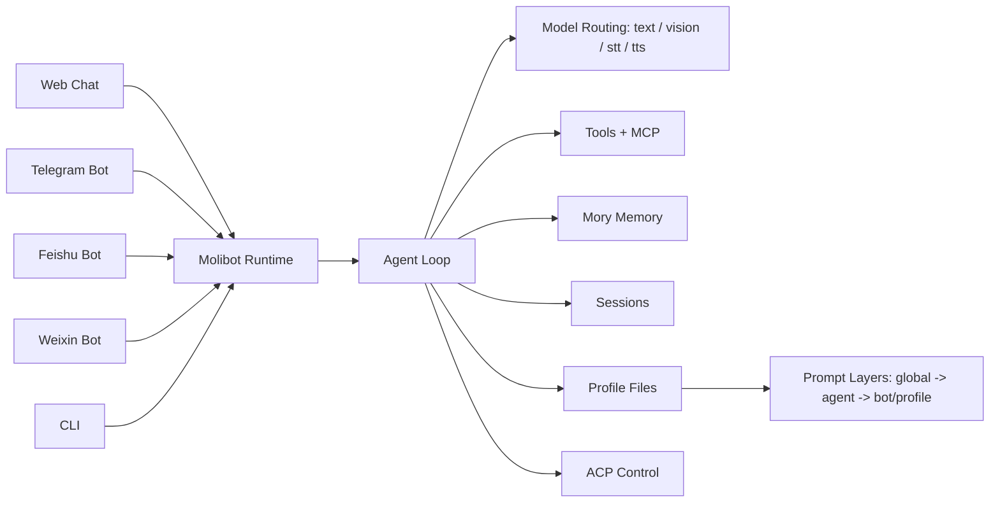

# Molibot

<p align="center">
  
</p>

<h2 align="center">A Simpler OpenClaw-Style Personal AI Assistant</h2>

<p align="center">
  Multi-Channel · Agent Profiles · ACP Control · MCP Ecosystem · Local-First Data
</p>

<p align="center">
  <a href="https://deepwiki.com/gusibi/molibot">
    
  </a>
</p>

<p align="center">
  
  
  
  
  
</p>

Molibot 是一个面向个人和小团队的本地优先 AI 助手。
一套 runtime，同时跑 Web / Telegram / Feishu / Weixin / CLI，并且共享同一套配置与会话能力。

## Table of Contents

- [Key Highlights](#key-highlights)
- [Architecture](#architecture)
- [Feature Snapshot](#feature-snapshot)
- [Quick Start](#quick-start)
- [First-Time Setup Flow](#first-time-setup-flow)
- [Web Chat Usage](#web-chat-usage)
- [Telegram Commands](#telegram-commands)
- [Settings Pages](#settings-pages)
- [Data Layout](#data-layout)
- [Common Commands](#common-commands)
- [Environment](#environment)
- [Docs](#docs)
- [Current Status](#current-status)

## Key Highlights

- **Multi-Channel in One Runtime**: `Web + Telegram + Feishu + Weixin + CLI`
- **ACP (Agent Control Plane)**: Remote coding control via Codex/Claude Code with permission management
- **MCP Ecosystem**: stdio/HTTP transport support, skill-gated tool injection, dynamic loading
- **Profile-Driven Chat**: `global -> agent -> bot/profile` prompt layering with file-based governance
- **Advanced Memory System**: `Mory SDK` with layered storage (`long_term`/`daily`), hybrid retrieval, cognitive control
- **Rich Input Support**: text, image, realtime voice recording (Web), media/file ingestion (all channels)
- **Operational Settings UI**: AI routing, agents, ACP targets, tasks, memory, skills, MCP servers
- **Safer Settings Persistence**: `settings.json + settings.sqlite` split design with relational tables

## Architecture



If Mermaid is not rendered in your viewer, use this static diagram:


## Feature Snapshot

### Multi-Channel Support
- **Web Chat**: Full-featured with image upload, realtime voice recording, thinking controls, profile-only identity, theme/i18n support
- **Telegram Bot**: Runtime commands, multi-session, multi-bot instances, ACP control, model switching, task delivery
- **Feishu Bot**: Complete media/file ingestion and outbound delivery, bot settings
- **Weixin Bot**: SDK-based integration, OGG voice transcoding, CDN media delivery, ACP support
- **CLI**: Local terminal conversation entrypoint

### ACP (Agent Control Plane)
- **Multi-Provider Support**: Codex and Claude Code preset providers
- **Project Management**: Project registration and chat-scoped ACP session lifecycle
- **Permission Control**: Permission request handling with inline approval/denial
- **Remote Execution**: Remote command execution with provider prefix
- **Task Tracking**: Task progress tracking with structured output
- **Multi-Channel**: Telegram, Feishu, QQ, Weixin support

### MCP Ecosystem
- **Transport Support**: stdio and HTTP transport
- **Tool Discovery**: Automatic MCP tool discovery and injection
- **Skill-Gated Activation**: Explicit skill invocation required for MCP activation
- **Dynamic Loading**: `load_mcp` tool for runtime server management
- **Settings UI**: Visual editor for MCP server configuration

### Profile-Driven Architecture
- **Three-Layer System**: Global, Agent, Bot/Profile prompt system
- **File-Based Management**: AGENTS.md, SOUL.md, TOOLS.md, IDENTITY.md, USER.md, etc.
- **Automatic Inheritance**: Profile inheritance and overlay
- **Prompt Preview**: Source attribution in preview

### Advanced Memory System (Mory)
- **Layered Storage**: `long_term` and `daily` tiers
- **Hybrid Retrieval**: Keyword + recency ranking
- **Cognitive Control**: Write scoring, conflict resolution, episodic consolidation
- **Mory SDK**: Standalone Node package with SQLite/pgvector support
- **Gateway API**: Pluggable backends (JSON file default, Mory optional)

### AI Routing and Configuration
- **Multi-Provider**: Support for multiple custom providers
- **Capability Tags**: Per-model tags (text/vision/stt/tts/tool/audio_input)
- **Verification States**: tested/untested/failed status tracking
- **Route-Scoped Switching**: Independent model selection for text/vision/stt/tts
- **Cross-Provider Fallback**: Automatic fallback on retryable errors

### Operational Tools
- **Task Management**: Event-file tasks with manual trigger/retry
- **Memory Management**: Search/flush/edit/delete operations
- **Skills Management**: Global/bot/chat scoped skill inventory
- **Usage Tracking**: Per-request token accounting with dashboards
- **Settings**: Relational tables with single-entity save flow

### Developer Experience
- **Python Sandbox**: Isolated virtualenv for bash tool execution
- **Theme System**: Solar Dusk palette with light/dark mode
- **i18n**: zh-CN/en-US language switching
- **TypeScript**: Full type coverage across codebase

## Product Surfaces

| Surface | Maturity | Key Capabilities |
|---------|----------|------------------|
| **Web Chat** | ⭐⭐⭐ Production-Ready | Image upload + realtime voice recording + thinking controls + profile-only identity + theme/i18n |
| **Telegram** | ⭐⭐⭐ Production-Ready | Multi-bot, ACP control, runtime commands, model switching, task delivery, media handling |
| **Feishu** | ⭐⭐⭐ Production-Ready | Bot settings, media/file ingress and outbound handling |
| **Weixin** | ⭐⭐⭐ Production-Ready | SDK-based integration, OGG voice transcoding, CDN media delivery, ACP support |
| **CLI** | ⭐⭐ Ready | Local terminal conversation entrypoint |
| **ACP** | ⭐⭐⭐ Active | Codex + Claude Code presets, permission management, task tracking, multi-channel |
| **MCP** | ⭐⭐⭐ Active | stdio/HTTP transport, skill-gated injection, dynamic loading |
| **Mory** | ⭐⭐⭐ Active | Layered storage, hybrid retrieval, cognitive control, standalone SDK |

## Quick Start

### 1) Install

```bash
npm install
npm link
```

### 2) Bootstrap

```bash
cp .env.example .env
molibot init
```

### 3) Run

```bash
molibot
# same as: molibot dev
```

Open: `http://localhost:3000`

## First-Time Setup Flow

1. `/settings/ai`: Configure providers and models with capability verification
2. `/settings/agents`: Create agent with identity layer (SOUL.md, IDENTITY.md)
3. `/settings/web`: Create Web Profile and bind to agent
4. (Optional) Configure message channels:
   - `/settings/telegram` - multi-bot support, ACP control
   - `/settings/feishu` - complete media support
   - `/settings/weixin` - SDK-based integration
5. (Optional) Configure advanced features:
   - `/settings/acp` - ACP targets (Codex/Claude Code)
   - `/settings/mcp` - MCP servers
   - `/settings/memory` - memory backend
6. Back to `/` to start chatting

## Web Chat Usage

- `+ New chat`: Select `Web Profile` to create new session (profile-only identity)
- Double-click session name on left: Rename session
- Input area:
  - `+ Image` upload image
  - `Record Voice` record and auto-send voice
  - Thinking level selector (`off/low/medium/high`)
- `Preview System Prompt`: View final assembled system prompt with source attribution
- Theme toggle: `system/light/dark` mode
- Language switch: `zh-CN/en-US`

## Telegram Commands

### Session Management
- `/chatid` - Show current chat ID
- `/new` - Create new session
- `/clear` - Clear current session context
- `/sessions` - List all sessions
- `/sessions <index|sessionId>` - Switch to specific session
- `/delete_sessions` - Delete all sessions
- `/delete_sessions <index|sessionId>` - Delete specific session

### Model and Settings
- `/models` - List available models
- `/models <index|key>` - Switch model
- `/models <text|vision|stt|tts>` - List route-specific models
- `/models <text|vision|stt|tts> <index|key>` - Switch route-specific model
- `/skills` - List loaded skills
- `/status` or `/state` - Show runtime status
- `/thinking <default|off|low|medium|high>` - Override thinking level for session

### ACP (Agent Control Plane)
- `/acp` or `/acp status` - Show ACP status
- `/acp new <project>` - Create new ACP session
- `/acp task <description>` - Create ACP task
- `/acp cancel` or `/acp stop` - Cancel current ACP task
- `/acp mode <proxy|inline>` - Set ACP mode
- `/acp remote <command>` - Execute remote command
- `/acp sessions` - List ACP sessions
- `/acp close` - Close ACP session
- `/approve [note]` - Approve ACP permission request
- `/deny [note]` - Deny ACP permission request

### Utility
- `/help` - Show help
- `/stop` - Stop current run
- `/login` - Login to AI provider
- `/logout` - Logout from AI provider
- `/compact [instructions]` - Compact conversation context

## Settings Pages

### Core Configuration
- `/settings` - Overview and status
- `/settings/ai` - AI providers, models, routing, and usage tracking
- `/settings/agents` - Agent library with Markdown prompt files
- `/settings/web` - Web profiles and identity binding

### Channel Configuration
- `/settings/telegram` - Multi-bot instances, ACP control, and credentials
- `/settings/feishu` - Feishu bot configuration and media settings
- `/settings/weixin` - Weixin SDK integration and CDN settings

### Advanced Features
- `/settings/acp` - ACP targets and project management
- `/settings/mcp` - MCP servers and tool injection
- `/settings/memory` - Memory backend and governance
- `/settings/skills` - Skill inventory and scope management
- `/settings/tasks` - Event tasks and manual operations
- `/settings/plugins` - Plugin catalog and backend selection

## Data Layout

Default data dir: `~/.molibot`

```text
~/.molibot/
  settings.json          # Stable bootstrap configuration
  settings.sqlite        # Dynamic relational configuration
  sessions/              # Session persistence (JSONL entry logs)
  memory/                # Memory data (Mory backend)
  skills/                # Global reusable skills
  usage/                 # Token usage tracking (JSONL)
  tooling/               # Developer tools (Python venv)
  auth.json              # Shared OAuth credentials
  moli-t/                # Telegram workspace
    bots/
      <botId>/
        skills/          # Bot-scoped skills
        <chatId>/
          scratch/       # Chat working directory
          events/        # Watched event files
          contexts/      # Session entry logs
  moli-f/                # Feishu workspace (similar structure)
  moli-w/                # Weixin workspace (similar structure)
```

- `settings.json`: Bootstrap configuration (env paths, feature flags, bootstrap providers)
- `settings.sqlite`: Relational tables for agents, channels, providers, models, ACP targets, MCP servers
- `sessions/`: Per-session entry logs with context reconstruction
- `memory/`: Mory SDK data with layered storage and hybrid retrieval
- `skills/`: Hierarchical skill repository (global/bot/chat scopes)
- `usage/`: Token usage analytics with aggregated dashboards

## Common Commands

### Development
```bash
molibot                 # Start development server (same as: molibot dev)
molibot dev             # Development mode with hot reload
molibot build           # Build for production
molibot start           # Production run (requires build first)
molibot cli             # CLI mode for terminal conversation
```

### Service Management
```bash
# Optional service script for background process management
./bin/molibot-service.sh start    # Start background service
./bin/molibot-service.sh stop     # Stop background service
./bin/molibot-service.sh status     # Check service status
./bin/molibot-service.sh restart  # Restart service
```

### Initialization
```bash
molibot init            # Initialize data directory and bootstrap files
molibot init --force    # Re-initialize (WARNING: may overwrite existing config)
```

## Environment

### Core
- `PORT` (default `3000`) - HTTP server port
- `DATA_DIR` (default `~/.molibot`) - Data directory path
- `NODE_ENV` (`development`|`production`) - Runtime environment

### Settings Storage
- `SETTINGS_FILE` (default `${DATA_DIR}/settings.json`) - Bootstrap config path
- `SETTINGS_DB_FILE` (default `${DATA_DIR}/settings.sqlite`) - Relational DB path

### AI Provider
- `AI_PROVIDER_MODE=pi|custom` - Primary provider mode
- `CUSTOM_AI_BASE_URL` - Custom provider base URL
- `CUSTOM_AI_API_KEY` - Custom provider API key
- `CUSTOM_AI_MODEL` - Default custom model

### Telegram
- `TELEGRAM_BOT_TOKEN` - Bot token from @BotFather
- `TELEGRAM_ALLOWED_CHAT_IDS` - Comma-separated whitelist (empty = allow all)

### Feishu
- `FEISHU_APP_ID` - Feishu app ID
- `FEISHU_APP_SECRET` - Feishu app secret
- `FEISHU_ENCRYPT_KEY` - Optional message encryption key

### Weixin
- `WEIXIN_APP_ID` - Weixin app ID
- `WEIXIN_SECRET` - Weixin app secret
- `WEIXIN_TOKEN` - Message validation token

### ACP (Agent Control Plane)
- `ACP_ENABLED` - Enable ACP feature
- `CODEX_API_KEY` - OpenAI/Codex API key
- `CLAUDE_CODE_API_KEY` - Anthropic API key

### MCP (Model Context Protocol)
- `MCP_SERVERS_CONFIG` - Path to MCP servers JSON config
- `MCP_DEFAULT_TRANSPORT` (`stdio`|`http`) - Default MCP transport

### Memory
- `MEMORY_BACKEND` (`json-file`|`mory`) - Memory backend type
- `MORY_DB_PATH` - Mory SQLite database path

### Security & Safety
- `BASH_TOOL_ENABLED` - Enable bash tool (default: true)
- `BASH_PYTHON_SANDBOX` - Enable Python sandbox (default: true)
- `ALLOWED_FILE_EXTENSIONS` - Comma-separated list of allowed file extensions

### Logging & Debugging
- `LOG_LEVEL` (`debug`|`info`|`warn`|`error`) - Logging level
- `LOG_PRETTY` - Enable pretty-printed logs (default: false in production)
- `MOM_LOG_VERBOSE` - Enable verbose mom-t logs (default: false)
- `EVENT_RUNNING_LOCK_ENABLED` - Enable periodic event running lock (default: true)

See `.env.example` for full list and detailed descriptions.

## Docs

### Core Documentation
- `prd.md` - Product Requirements Document: scope, priorities, and feature specifications
- `features.md` - **Single source of truth**: delivered features, detailed changelog, and implementation notes
- `architecture.md` - Architecture decisions, module structure, and design patterns
- `CHANGELOG.md` - High-level version history and milestone summaries

### Development Documentation
- `docs/plugin-development.md` - Plugin contract and development guide
- `docs/acp-codex-mvp.md` - ACP (Agent Control Plane) documentation
- `docs/molibot-architecture.svg` - Architecture diagram source

### Project Governance
- `AGENTS.md` - Collaboration rules and development guidelines
- `LICENSE` - Project license

### Important Note
> **If docs and behavior differ, trust `features.md` and current code.**
>
> The `features.md` file is maintained as the living document that tracks all delivered features with their implementation dates, detailed descriptions, and current status. When in doubt, refer to:
> - `features.md` for what has been implemented
> - `prd.md` for what was originally planned
> - Current code for actual behavior

## Current Status

### Channel Maturity (as of March 2026)

| Channel | Maturity | Key Capabilities |
|---------|----------|------------------|
| **Web Chat** | ⭐⭐⭐ Production-Ready | Image upload + realtime voice recording + thinking controls + profile-only identity + theme/i18n |
| **Telegram** | ⭐⭐⭐ Production-Ready | Multi-bot, ACP control, runtime commands, model switching, task delivery, media handling |
| **Feishu** | ⭐⭐⭐ Production-Ready | Bot settings, media/file ingress and outbound handling |
| **Weixin** | ⭐⭐⭐ Production-Ready | SDK-based integration, OGG voice transcoding, CDN media delivery, ACP support |
| **CLI** | ⭐⭐ Ready | Local terminal conversation entrypoint |
| **ACP** | ⭐⭐⭐ Active | Codex + Claude Code presets, permission management, task tracking, multi-channel |
| **MCP** | ⭐⭐⭐ Active | stdio/HTTP transport, skill-gated injection, dynamic loading |
| **Mory** | ⭐⭐⭐ Active | Layered storage, hybrid retrieval, cognitive control, standalone SDK |

### Feature Maturity

| Feature | Status | Notes |
|---------|--------|-------|
| **ACP (Agent Control Plane)** | ⭐⭐⭐ Active | Codex + Claude Code presets, permission management, multi-channel support |
| **MCP Ecosystem** | ⭐⭐⭐ Active | stdio/HTTP transport, skill-gated tool injection, dynamic loading |
| **Memory System (Mory)** | ⭐⭐⭐ Active | Layered storage, hybrid retrieval, cognitive control, standalone SDK |
| **AI Routing** | ⭐⭐⭐ Active | Multi-provider, per-model capabilities, verification, cross-provider fallback |
| **Settings System** | ⭐⭐⭐ Active | Relational tables, single-entity save, theme/i18n, unsaved change guards |
| **Python Sandbox** | ⭐⭐⭐ Active | Isolated virtualenv, auto-dependency management, security hardening |

### Development Activity

- **Active Development**: March 2026 (7-week intensive iteration)
- **Version**: 1.0.0 (V1 Release)
- **Total Features**: 250+ delivered features
- **Architecture Refactors**: 3 major (module reorg, layered refactor, ACP enhancement)
- **Channels**: 5 production-ready (Telegram, Web, Feishu, Weixin, CLI)
- **Test Coverage**: Core flows validated on Telegram (most validated channel)

### Known Limitations

1. **WhatsApp / Slack / Lark**: Planned for post-V1 (see `prd.md` backlog)
2. **Vector Memory**: Basic support in Mory, advanced vector operations planned
3. **Distributed Deployment**: Currently single-node, clustering not yet supported
4. **Mobile App**: Web app is PWA-ready but no native mobile app yet

### Trust Priority

> **When docs, code, and behavior differ:**
> 1. **Current code** is the ultimate source of truth
> 2. **`features.md`** is the living document of delivered features
> 3. **`prd.md`** shows original intent (may differ from implementation)
> 4. **This README** is the entry point (updated less frequently than code)

### Community & Support

- **Issues**: GitHub Issues for bug reports and feature requests
- **Discussions**: GitHub Discussions for Q&A and ideas
- **Documentation**: DeepWiki badge at top for AI-powered doc search

---

*Last updated: March 29, 2026*
*Version: 1.0.0*
*Status: Production Ready*
