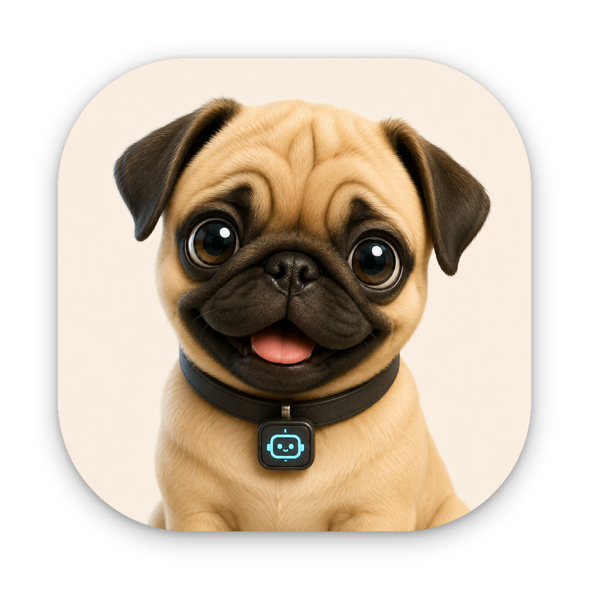
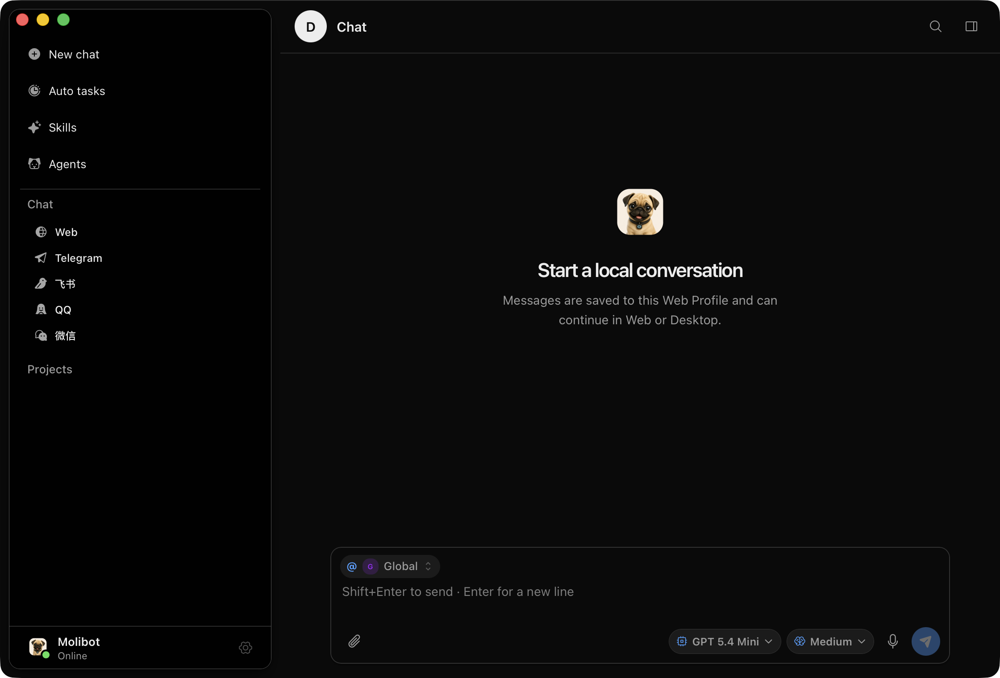
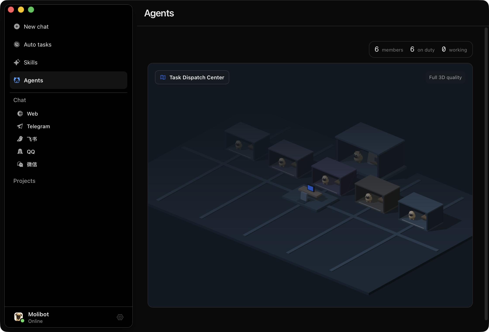
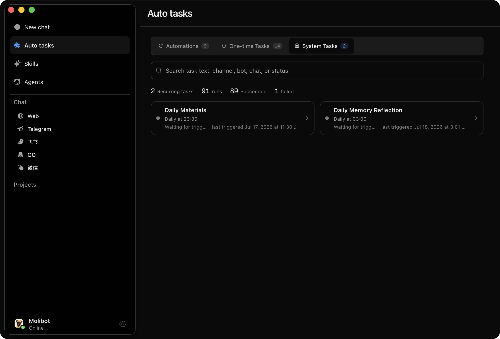
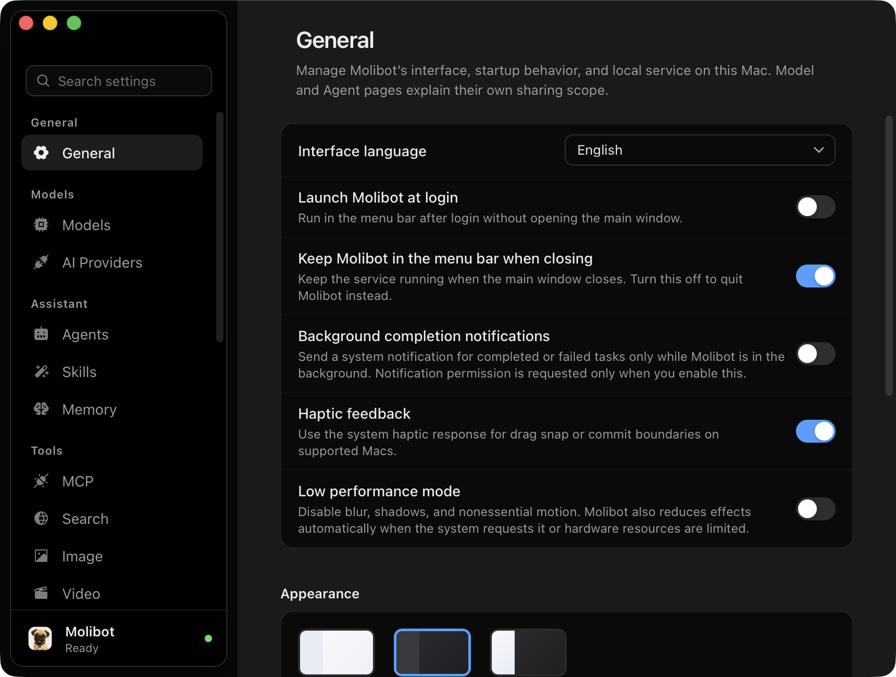
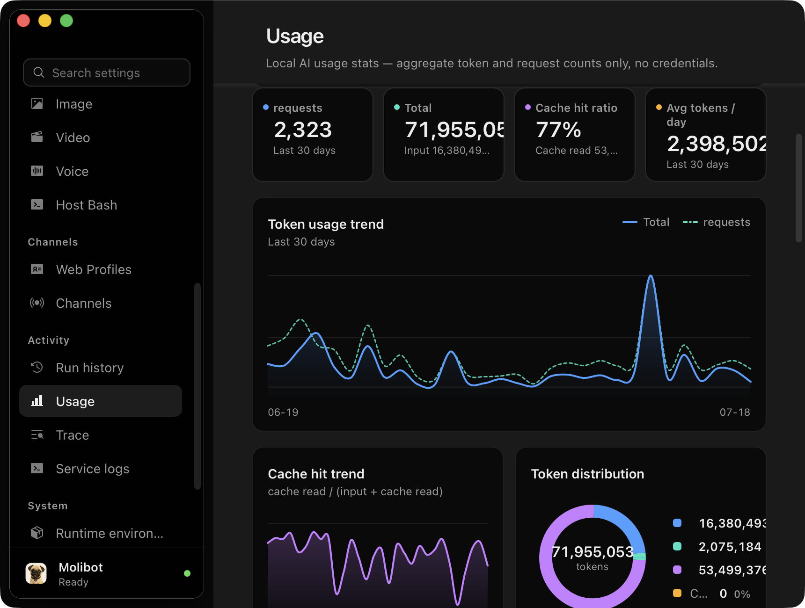

# Molibot

<p align="center">
  
</p>

<h2 align="center">A memory-first personal AI Agent that grows with your work.</h2>

<p align="center">
  Local-first · Long-running context · Configurable agents · Your data, your control
</p>

<p align="center">
  <a href="https://github.com/gusibi/molibot/releases/latest">
    
  </a>
  <a href="https://deepwiki.com/gusibi/molibot">
    
  </a>
</p>

<p align="center">
  
</p>

Molibot is a local-first personal AI Agent for people who want more than a new chat window. It is built around two promises:

- **Easy to start.** Download the macOS app, pick a model provider, and start chatting — one runtime serves the Desktop app, Web, Telegram, Feishu, Weixin, QQ, and the CLI.
- **Grows with you.** Governed long-term memory, daily memory reflection, and reviewable automations mean the Agent learns your preferences, projects, and habits over time — and you always see and control what it remembers.

## Why Molibot?

Most AI chats start from scratch. Molibot focuses on the work that accumulates.

- **Remember what matters.** Governed memory keeps useful preferences and project context available, while giving you visibility and control over what is saved and injected.
- **Shape your own Agent.** Profiles, Skills, tools, and model routes let you define how an Agent should work instead of relying on one fixed assistant.
- **Keep each conversation on its chosen model.** Chat model selection is Session-scoped and restart-persistent, while Settings remains the explicit place for changing global defaults.
- **Work where you already are.** Use one local runtime from Web, macOS Desktop, Telegram, Feishu, Weixin, QQ, or the CLI.
- **Keep execution in your hands.** Tasks, approvals, sandbox policy, and run records make automation visible rather than opaque.
- **Keep the data local.** Your runtime, configuration, conversations, and operational state stay on infrastructure you control.

## Quick start

### Option A · Download the macOS app (recommended)

1. Download the latest `Molibot_*.dmg` from [Releases](https://github.com/gusibi/molibot/releases/latest) (Apple Silicon).
2. Open the app. Molibot starts its local runtime automatically — no terminal setup required.
3. In **Settings → AI Providers**, add a model provider and API key.
4. Start chatting with Momo, the first-use default Agent. The app can also live in the menu bar and keep running in the background.

### Option B · Run from source

Requires Node.js 22.19 or newer. The macOS Desktop release bundles the project's pinned Node 22.23.1 runtime automatically.

```bash
corepack enable
pnpm install
pnpm link --global

cp .env.example .env
molibot init
molibot
```

Then open `http://localhost:3000`, configure an AI provider, and create or confirm an Agent before starting a chat.

Molibot uses pi-mono 0.81 through one shared server runtime: built-in model catalogs, API-key/OAuth resolution, main and sub-Agent streaming, and compaction share the same credential and Provider boundary. Custom OpenAI-compatible and Anthropic-compatible endpoints remain isolated to their saved Bot/settings snapshot, while system instructions stay in pi's top-level context instead of being serialized as transcript messages. OpenAI-compatible requests choose `system` or `developer` from the selected custom model's saved `supportedRoles`, not from SDK URL heuristics.

For provider configuration, channels, deployment, and environment variables, see the [documentation](#documentation).

## A look inside

### One workspace for all your Agents

Every Agent gets a place in Agent City — see at a glance who is on duty and working, then point at a floor to inspect that Agent's live details.

<p align="center">
  
</p>

### An Agent that learns you, on a schedule

System tasks like **Daily Memory Reflection** review recent conversations and distill durable memories — so the Agent gets more useful the more you use it. Your own automations and one-time tasks live alongside them, with full run history.

<p align="center">
  
</p>

### Settings that stay understandable

Language, startup behavior, menu-bar mode, notifications, and appearance — all in plain terms, with each page explaining its own sharing scope. Form controls use one standard size, and time fields open the host-native picker when available. Memory Reflection and Daily Materials share one authorized Telegram/Feishu completion destination, configurable from either plugin card while keeping separate notification switches.

<p align="center">
  
</p>

### Know exactly what your Agent costs

A local usage dashboard tracks requests, token trends, cache hit ratio, and token distribution — aggregate counts only, no credentials ever leave your machine. Range/model/Bot/channel controls keep their own compact filter row, while Trace puts exact diagnostic IDs behind a low-emphasis optional “More filters” disclosure.

<p align="center">
  
</p>

## What you can do today

| Capability | What it gives you |
| --- | --- |
| [Personal Agent and Memory](docs/features/personal-agent-and-memory.md) | Momo as the first-use default, built-in Agent templates including Workplace English Coach, governed long-term memory, and isolated project or Agent context. |
| [Channels and Surfaces](docs/features/channels-and-surfaces.md) | One local runtime across browser, macOS Desktop, chat channels, and the terminal. |
| [Tools, Skills, and MCP](docs/features/tools-skills-and-mcp.md) | Configurable Agent behavior and controlled access to reusable workflows and external tools. |
| [Automation, Approvals, and Sandbox](docs/features/automation-approvals-and-sandbox.md) | Scheduled work and execution controls that stay inspectable and reviewable. |
| [Desktop Project Workspace](docs/features/desktop-project-workspace.md) | Native macOS chat, projects, files, Agent City, automations, and Settings in one local workspace, with one stable live reply per Project turn and Finder-style native sidebar materials. |

Project runs generate `SYSTEM_PROMPT.preview.md` in the Project's Molibot workspace. Its header lists only effective prompt sources: Project rules come from `AGENTS.md`, `AGENT.md`, or `CLAUDE.md`; runtime context retains `USER.md` but excludes Bot/Agent identity and persona profiles.

## How Molibot grows with you

Momo is Molibot's example of the experience this project is building toward: a personal Agent that learns your working context, remembers the projects you return to, and becomes more useful through review and feedback.

Concretely, the loop works like this:

1. **You just chat and work** — across Desktop, Web, or any connected channel, in shared or isolated contexts.
2. **Molibot reflects daily** — system tasks review recent conversations and propose durable memories about your preferences, projects, and habits.
3. **You stay in control** — memory is governed: you can inspect, edit, and delete what is saved, and see what gets injected into each conversation.
4. **The Agent gets sharper** — future conversations start with the context that matters, instead of from zero.

The current runtime already supports durable sessions, memory governance, configurable Agent profiles, tools, tasks, and human control. The next growth-plan experiments build on that foundation with a visible Agent growth log and human-reviewed content candidates. Those experiments are not automatic publishing features, and they are not required to use Molibot.

## Available surfaces

| Surface | Use it for |
| --- | --- |
| macOS Desktop | Native chat, project workspaces, files, automations, and Settings with WKWebView-safe, Finder-calibrated Light sidebar material plus AppKit-derived semantic colors across Light, Dark, and System appearances. |
| Web | Browser chat, Settings, and session access. |
| Telegram | Personal chat access, runtime controls, and file delivery. |
| Feishu | Personal chat access with channel-native media and interaction support. |
| Weixin | Local personal conversations and media delivery. |
| QQ | Local chat access with rich message and media support. |
| CLI | Terminal-based local conversations. |

Conversations follow you: a chat started on the Web can continue on Desktop, and channel sessions share the same local runtime and memory.

## Documentation

### Get started

- [Feature overview](docs/features/)
- [Documentation map](docs/README.md)
- [Environment reference](.env.example)
- [Daily materials guide](docs/guides/daily-materials.md)
- [Session control commands](docs/guides/session-control/session-control-commands.md)

### Build and extend

- [Architecture](docs/designs/architecture/v1-architecture.md)
- [Agent runtime design](docs/designs/architecture/agent-redesign-v2.2.md)
- [Plugin authoring](docs/guides/plugins/plugin-authoring.md)
- [Deferred tool authoring](docs/guides/tools/deferred-tool-authoring.md)
- [Agent development series](docs/agent-dev-series/README.md)

### Track the project

- [Current feature record](features.md)
- [Product roadmap](prd.md)
- [Release notes](CHANGELOG.md)
- [UI Design Guidelines](DESIGN.md) & [Dark Theme Spec](design.dark.md)
- [Collaboration and contribution rules](AGENTS.md)

## Current boundaries

- The desktop app currently ships for macOS on Apple Silicon; other platforms can run from source.
- Molibot is designed for local, single-owner deployments. Configure your own model provider and credentials.
- Channel behavior depends on the credentials and integrations you enable locally.
- Treat destructive, credential-bearing, and public actions as reviewed workflows until you have validated them in your own environment.
- Momo's growth-log and content-candidate experiments are under development. Molibot does not publish to external social platforms by default.

## License and support

Use GitHub Issues for bug reports and feature requests, and GitHub Discussions for questions and ideas.
