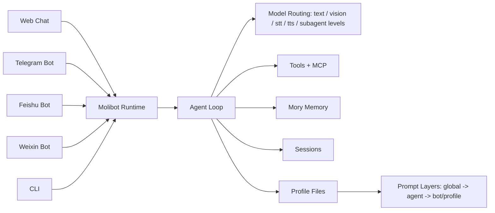

# Molibot

> Mobile Project mode: in Feishu, Telegram, QQ, or Weixin, send `/project` to list registered Projects, `/project <index|id|name>` to enter one, and `/project off` to return to normal Chat. The selection is remembered for that Bot conversation.

<p align="center">
  
</p>

<h2 align="center">A Simpler OpenClaw-Style Personal AI Assistant</h2>

<p align="center">
  Multi-Channel · Agent Profiles · MCP Ecosystem · Local-First Data
</p>

<p align="center">
  <a href="https://deepwiki.com/gusibi/molibot">
    
  </a>
</p>

<p align="center">
  
  
  
  
  
</p>

Molibot 是一个面向个人和小团队的本地优先 AI 助手。
一套 runtime，同时跑 Web / Telegram / Feishu / Weixin / CLI，并且共享同一套配置与会话能力。

## Table of Contents

- [Key Highlights](#key-highlights)
- [Architecture](#architecture)
- [Feature Snapshot](#feature-snapshot)
- [Quick Start](#quick-start)
- [macOS App Development](#macos-app-development)
- [First-Time Setup Flow](#first-time-setup-flow)
- [Web Chat Usage](#web-chat-usage)
- [Telegram Commands](#telegram-commands)
- [Settings Pages](#settings-pages)
- [Data Layout](#data-layout)
- [Common Commands](#common-commands)
- [Production Deployment](#production-deployment)
- [Environment](#environment)
- [Docs](#docs)
- [Documentation Workflow](#documentation-workflow)
- [Current Status](#current-status)

## Key Highlights

- **Clear Web workspace hierarchy**: Web Chat keeps navigation and files on the sidebar surface while the header and transcript form one primary workspace; Web Settings uses a secondary canvas with primary-surface cards and quiet dividers. All surface colors come from the shared theme tokens and adapt to light and dark modes.
- **Clear Desktop provider and automation surfaces**: Built-in and custom AI providers are shown from their own data sources; Automations live in the Chat workspace as bounded task cards instead of a duplicate Settings destination. One-shot deliveries link to their execution-backed conversation, Diagnostics includes the App version, and explicit Skill selections remain compact Markdown references rather than copied Skill bodies.
- **Desktop Usage and Trace observability**: Desktop Settings now provides server-filtered Usage ranges and model/Bot/channel filters, request/token/cache trends, model/API/Bot/channel rankings, and paginated request metadata. Trace adds fact/entity filters, tool/skill/model/Bot/Chat/Session/Run rankings, and paginated sanitized facts while keeping live/stuck/orphan run controls below the dashboard. Initial loading is driven by one endpoint-scoped reactive trigger so request state cannot create a self-refresh loop. Stale requests cannot overwrite the active query, and Trace payloads, previews, blocked-by data, messages, and commands never cross into the WebView.
- **Clean Chat session routing**: Desktop approvals use a dedicated API, one-shot reminders return to the Session that created them, and safely classified historical internal approval/Event records stay out of ordinary Chat without deleting user data. Resizable sidebar titles use the full available width.
- **One-shot reminder inbox**: Desktop Automations separates recurring automations, one-time reminders, and system tasks. Newly delivered one-shot reminders show a sidebar unread badge and become read when the One-time Tasks tab is opened; legacy reminders, recurring schedules, and immediate diagnostics do not create unread noise. Reminder state remains in watched event JSON rather than a second scheduler or memory store.
- **Reliable Project transcripts**: Project Session selection uses one authoritative transcript load and hydrates the pinned Session runtime directly, so existing history cannot appear as an empty new chat when a duplicate request hits a transient service restart.
- **Transparent answer memory**: Completed Assistant messages disclose the exact memories serialized into that turn's context and separately show memories newly added or updated. Details load lazily from immutable snapshots, accept retrieval-quality feedback, and never block the answer path. Desktop Memory is organized into Saved, Pending, and Advanced views, with per-memory control over future automatic injection.
- **Closed-loop governed memory**: One authorized server profile now drives both Desktop and prompt injection; Session snapshots stay byte-stable until explicit governance revokes an item. Verified feedback, privacy suppression, preference evolution, independent maintenance, cross-run evidence, immediate correction quarantine, authorized historical conversation search, and review-only Skill draft suggestions share the upper runtime instead of Channel-specific implementations. Chinese lexical retrieval and conversation search use Jieba search-mode segmentation with a CJK bigram fallback for unknown words.
- **Native macOS Interface System**: GitHub Issue #13 aligns Chat, Models, Providers, Trace, Usage, and Automations around one system-first visual language: shared PageHeaders and compact controls, human-readable status/time/model names, a 720px Chat composer, and a responsive 320px task list with overlay inspector. The same surfaces support Chinese/English, light/dark, reduced motion/transparency, increased contrast, a configurable low-performance mode, macOS keyboard shortcuts, and the 860×620 minimum window without changing runtime contracts.
- **AnySearch and credential-safe tool tests**: Built-in web search supports AnySearch's documented anonymous or Bearer-authenticated `/v1/search` API across Web and Desktop. Desktop search/image/video tests reuse saved server-side credentials without exposing them to the WebView, and image/video tests can select an engine independently from the saved default.
- **Trace Active-Run Control**: Web and macOS Trace pages join persisted run facts with real RunnerPool snapshots every three seconds, distinguishing live, possibly stuck, and orphan records. The macOS page keeps its range, KPI, and chart dashboard first and places active/orphan run records below it. Operators can stop the exact channel/Bot/chat/session runner or mark an orphan fact aborted without deleting audit history. Desktop destructive actions use an in-app confirmation dialog, then refresh the list after the selected run-scoped action completes.
- **Single-Source Conversation History**: Web and Project UI Session files store presentation metadata only. Normal message content, model/tool history, and continuation state come from append-only Agent entries through one shared projection that preserves reasoning, attachments, activity, model labels, and edit-and-resend. Desktop Stop waits for server finalization before detaching the stream, so already generated output remains visible.
- **Three.js Pug Agent City (v2.4.9)**: The macOS Agents workspace is a fixed-isometric miniature city backed by real Agent Activity. Ten stable plots grow from one studio each to 10 floors each, with separate Global headquarters and an owner dispatch center; Agent 101+ is counted without expanding the scene. Names/statuses and hover/focus details remain accessible DOM, Sub-agents share their parent floor, and automatic full/low 3D plus information-equivalent 2D fallback supports dark/light themes, reduced motion, narrow windows, and constrained devices.
- **Focused Desktop Chat disclosure**: Live and historical thinking plus tool activity stay collapsed until requested, while structured tool diagnostics no longer repeat as raw status text. Permission approval buttons (e.g. Host Bash authorization) remain interactive during active SSE streaming turns, with clean inline stream resumption.
- **Governed daily-material pipeline**: An internal watched event turns explicitly authorized conversation projections into a redacted, dated Markdown file inside a registered Project. It uses an independent watermark and Project-owned prompt template, never enters ordinary chat history, and fails closed on invalid paths, credentials, aborts, or disconnected Projects.
- **Reliable project management**: Desktop project creation confirms the selected working directory before submission and keeps it visible for retry. Project-row ellipsis menus support renaming and guarded removal that preserves the local working directory, with optional Molibot conversation cleanup.
- **Resilient governed memory**: Daily reflection runs at a Desktop-configurable local time, processes the previous complete local day, notifies the first allowed chat only when new candidates exist, isolates malformed LLM candidates while preserving infrastructure retries, detects embedding credential rotation without exposing secrets, temporarily falls back to lexical retrieval after provider failures, and keeps 10k-record compaction membership linear-time.
- **Friendly recurring schedules**: Desktop Automations creates daily, weekly multi-select, monthly-by-date, or custom Cron plans while keeping watched-event JSON as the runtime source of truth and preserving existing complex Cron expressions during edits. New tasks select an enabled Bot and one of its configured allowed Chat IDs; their JSON is stored in that Bot's watched `events/` directory while the Chat ID remains the delivery target. Legacy Web scratch events are migrated at scheduler startup.
- **Owner-Level System Automations**: Molibot-managed memory reflection and daily-material schedules each use one owner watched event and discover current enabled Bots at run time, so future Bots participate without creating duplicate tasks. Automations separates User Tasks from localized System Tasks; system schedules remain governed by their plugin settings while retaining manual Run access. Completed system runs persist structured execution results and open a dedicated record with timing, attempts, scan totals, memory candidates, or generated project-relative files instead of linking to a nonexistent internal chat session.
- **Stable Managed Events**: Owner-managed watched events compare semantic content independently of JSON key order, so harmless formatting or legacy ordering does not trigger a rewrite while real configuration changes still do.
- **Dense Automation Workspace**: The Chat-side Automation view opens list-first, with simple task/run/success/failure totals and per-row run count/last-run metadata; selecting a task opens a closable detail pane. Run indicators and controls are task-scoped, and recurring tasks can be paused or resumed without recreation.
- **Clean First Launch**: Fresh Desktop installs now bootstrap a `default` Agent, bind the default Web Profile to it, guide the user through provider setup, default Agent confirmation, preferred name, and AI response style, refresh models immediately after provider creation, and default built-in web search to no-key DuckDuckGo.
- **Multi-Channel in One Runtime**: `Web + Telegram + Feishu + Weixin + CLI`
- **Configurable Local Service**: System Settings stores a validated port (default `3000`, range `1024–65535`) through the granular `/api/settings/system` endpoint shared by Web and Desktop. Desktop-managed installs can save and restart in one action; standalone deployments can override it with `PORT` and keep lifecycle control in their process manager.
- **Shared Desktop Chat Surfaces**: Desktop Chat and Project Chat now share the same input-area, right-pane, sidebar-row, and header building blocks for composer banners, queued messages, pending files, recording UI, model/thinking selectors, approvals, message panes, single-line headers, logo footer status branding, and icon actions, while each surface keeps its own meaningful navigation and context.
- **Desktop Chat Workspace Hierarchy**: Desktop Chat keeps navigation and file panes on the sidebar surface while the Header and transcript form one continuous primary workspace, using DESIGN-derived semantic tokens and shared separators across light and dark themes.
- **Project Session Transcript Isolation**: Selecting a Session activates that Session's pinned Project runtime and transcript in the same shared action, so sidebar selection, header, composer context, messages, background turns, stop, approvals, and queues remain Session-scoped.
- **Slash Commands, Skills, and Project Defaults**: The shared Desktop composer suggests runtime commands and enabled Skills as soon as `/` is typed, with keyboard/IME-safe selection and distinct Command/Skill transcript cards. Each Project has its own settings for instructions, default model, and thinking level; Project turns resolve Session → Project → Global without changing the global model route.
- **Project-Local Skills**: Project conversations discover reusable workflows from `<projectRoot>/.agents/skills/`. Project Skills take precedence on name collisions and are available consistently in slash suggestions, explicit invocation, the system prompt manifest, skillSearch, and `/skills`, while ordinary conversations remain isolated.
- **Reliable Desktop Window Dragging**: Chat and Settings mount a 52px transparent top drag mask that calls Tauri `startDragging()` for macOS overlay titlebars. Project/Workspace headers and sidebar top areas also expose drag regions, while action controls stay clickable above the mask.
- **Compact Composer**: The shared Desktop composer uses a quieter focus state, reduced chrome padding, a multi-line auto-growing text area, and balanced send/record button sizing so more of the input box is usable for actual text.
- **Responsive Chat Startup**: Desktop Chat releases the shell as soon as core service data is ready and shows the current discovery/startup phase; slower conversation-list/default-session loading continues in the background, and sidebar resize cleanup prevents the UI from staying click-blocked. Agents, Skills, and Automations wait for the core bootstrap before issuing their own requests; transient startup failures show a localized retry state and the same navigation click can reconnect instead of remaining on an eternal Loading screen. Opening those workspaces from a running Project Session leaves its pinned runtime safely active in the background instead of letting the Project detail pane hide the requested destination. The Skills grid uses Svelte 5 reactive derivation so asynchronously loaded totals, cards, and search results stay synchronized on the first visit.
- **macOS App Foundation**: `apps/desktop` contains the independent Svelte 5 + Tauri 2 host with native Chat/Settings windows, multi-window dynamic settings synchronization (BroadcastChannel), transient custom provider model pulling before save, menu-bar lifecycle, single-instance behavior, login-start support, a checksum-pinned Node 22 runtime, and tested managed/external service ownership boundaries. Bundled runtimes install into immutable versioned directories so an app upgrade cannot remove lazy-loaded server chunks still used by the previous sidecar generation. Desktop Chat shares Web Profiles, sessions, transcripts, streaming, files, approvals, voice capture, and queue controls. New Chat starts as a Profile-selectable draft and creates its Session on first send, pinning the selected Web Profile; Automations and installed/generated Skills switch the Chat right pane while retaining the Session sidebar instead of opening Settings. Desktop Settings uses the DESIGN-driven macOS Liquid Glass shell with the same five navigation groups as Web Settings, native titlebar spacing, searchable compact navigation, fixed title chrome, consistently spaced inset cards, instant complete Chinese/English switching, adaptive light/dark materials, sticky save footbars, responsive controlled selectors, and dedicated overlay editors with sticky actions for entity forms; Providers, advanced model routing, Web Search, Image, Video, TTS, Web Profiles, Agents, channels, MCP, Skills, Plugins, Memory, Tasks, read-only service Logs, and full Sandbox policy now have real management flows. Local Chat history, external transcripts, and automation sessions share one completed-message renderer for Markdown, bubbles, avatars, timestamps, response models, highlighted/copyable code, long-message disclosure, thinking, inline protected image/audio/video attachments, generic files, and persisted collapsible tool execution; attachment-only turns suppress internal placeholders and failed runs retain a distinct status. Server/client compatibility projection unwraps historical Agent block JSON while filtering internal thinking/tool content. Fresh automation sessions—including pre-existing `task-*` records—remain hidden from normal Session lists while staying available from execution history. Provider management separates built-in providers, self-hosted providers, and custom models, with full create/edit in a dedicated responsive modal. Remaining parity work is concentrated in operational detail pages such as model errors, Host Bash, System, Skill Drafts, and runtime installation. Full App lifecycle verification and the installable unsigned DMG remain under development. Robust validation of external session IDs allows characters like @ and : to safely load WeChat chat transcripts without triggering path-traversal blocks. Desktop Chat supports listing and previewing files/media from external sessions (Feishu, Telegram, WeChat) by decoding external references and recursively scanning their scratch directories. The Project file panel supports direct streaming and native inline rendering of images, audio, and video via raw endpoints, bypassing the 256KB text preview limit.
- **Versioned Desktop DMGs**: Desktop release builds sync the App version from `apps/desktop/package.json`, build separate Apple Silicon and Intel packages, and publish DMGs named `Molibot_<version>_<arch>.dmg` with matching SHA-256 sidecars.
- **Message Return & Display Layout Optimization**: Centralizes message formatting across Telegram, Feishu, QQ, and Weixin. Implements a unified `DisplayFormatter` to render model thinking/reasoning blocks and tool progress cleanly. Supports fine-grained channel instance configurations (`toolProgress` and `showReasoning`) toggleable directly in chat using `/toolprogress` and `/showreasoning` bot-scoped commands, including `/showreasoning new` for live latest-reasoning progress on editable channels.
- **Compact Single-Tool Progress**: When `toolProgress` is set to `new`, the running-state line is now compressed to `⏳ <tool>...` instead of repeating a separate "running" label, so long tool names remain visible.
- **Telegram Overlong Edit Resilience**: Telegram editable status/answer/detail messages share one chunked text-delivery path. If `editMessageText` hits `MESSAGE_TOO_LONG`, Molibot keeps the first chunk in the edited message and sends the rest as follow-up messages instead of aborting the run. Streaming answers retain all chunk message IDs so later refreshes edit existing chunks instead of repeatedly creating a new second message.
- **Telegram Rich Message Output**: Telegram outbound text and shared command output use grammY 1.44 / Bot API 10.1 rich messages (`sendRichMessage` and rich `editMessageText`) when available. Shared commands emit one canonical Markdown shape across channels (`/status` as grouped lists; `/help`, `/queue`, and `/skills` as standard table blocks), and command confirmations/status replies use Markdown headings, lists, command lists, and tables so Telegram does not collapse field-level line breaks. Telegram rich failures fall back to grammY plain text instead of local Markdown detection or Markdown-to-HTML conversion.
- **Telegram Native Media Replies**: Telegram attachment uploads preserve source media extensions when a custom title is provided, and detected MP4/WebM/MOV files use native `sendVideo` with streaming enabled so generated videos arrive as video messages instead of extensionless generic uploads.
- **Feishu Native Video Replies**: Feishu `.mp4` attachment uploads use the official `mp4` file type and native `media` message path. Other video containers are delivered as files, and video attachments are never transcoded into OPUS voice messages.
- **Feishu Card Markdown Rendering**: Final Feishu CardKit replies split headings into separate markdown elements, render markdown tables as native table elements, and protect fenced code blocks from compatibility rewrites so large structured answers stay readable.
- **Feishu Topic-Scoped Run Logs**: When Feishu topic replies generate an archived runlog notice, the notice stays in the same topic thread as the answer instead of appearing in the parent group chat.
- **Runlog Notice Controls**: Run details are always archived, but automatic “查看：/runlog ...” notices are off by default and can be controlled with session, bot, and global `/runlog` switches. `/runlog` still opens the latest record, `/runlog list` shows recent records, and `/status` includes runlog, sandbox, tool-progress, and reasoning-display state.
- **Committed Main Answer Protection**: Runner and channel contexts now distinguish draft answers from committed main answers. If the model returns multiple terminal assistant messages in one turn, Molibot shows them as separate replies instead of overwriting the earlier complete answer.
- **Scheduled Event Runtime Guardrails**: watched event tasks now use channel/bot-scoped SQLite execution leases with a 10-minute default timeout, capped retries, timeout-triggered abort, startup recovery, `/stop` visibility across stale runner states, and suppression of duplicate same-slot retries when a late-running attempt still finishes successfully.
- **Feishu Approval Terminal Cards**: approval clicks return a button-free processing card within Feishu's three-second callback window, then edit the original card into a terminal result after background execution; request-level deduplication prevents HTTP/WebSocket callback races and repeated execution.
- **Reliable Stop Finalization**: `/stop` terminates an aborted bash/Agent run without empty-response retries or model fallback, drops pending progress updates, sends a terminal stopped confirmation, releases the channel busy marker, aborts the run lock, and returns the session to idle so the next message is not queued behind the stopped task.
- **Settings Data Visibility Resilience**: Production `node build` and control/service launches keep `/settings/agents` and `/settings/host-bash` readable even when built-in Subagent Markdown resources are missing from local build chunks or legacy Host Bash whitelist rows have empty metadata.
- **Live-Safe Production Builds**: Server builds are staged before publication, publish hashed chunks before the manifest, and retain chunks needed by an already-running process, so rebuilding no longer makes lazy-loaded Settings endpoints such as model routing fail mid-session.
- **Sandbox Multi-Level Control & Approval Auto-Resume**: Supports sandbox overrides with a resolution priority order of `Session Override > Bot Instance Override > Agent Override > Global Default`. Direct chat control is enabled via the `/sandbox` command; when the effective sandbox is OFF, `bash` runs as Host Bash with full access and does not require Host Bash approval. Approved bash commands auto-rewrite execution context history and dynamically resume runners in the background; stdout/stderr stays in the Agent tool context for the final response instead of being sent as a standalone chat message. If the previous turn is still releasing its session lock, the shared runtime waits for up to one hour before falling back to a visible "session still busy" notice. Common approval replies such as `审批通过` are recognized directly. Built-in tools automatically target isolated venv, GOPATH, and GOCACHE environments in `MOLIBOT_TOOLING_DIR` (defaulting to `~/.molibot/tooling`).
- **Local LaunchAgent Runtime**: Local macOS runs can be managed by `launchd` using the LaunchAgent plist template in `launchd/`, so Molibot is not tied to a foreground terminal session and can be restarted automatically.
- **CLI Shutdown Resilience**: Local CLI readline input now treats Ctrl+C / TTY `read EIO` as a normal shutdown path, so stopping the service or closing the terminal does not leave an unhandled Node `Interface` error stack.
- **Built-In Web Search**: `webSearch` is now a shared Agent-layer tool with route-based fallback across DuckDuckGo, Brave, Tavily, Exa, Serper, Baidu Qianfan, Baidu Fast, Baidu Web, Ark, Grok, and Bocha. Routing is intent-based (`china`, `global`, `official_docs`, `research`) instead of fragile Chinese/news keyword buckets, and automatic engine selection can use priority, random, or in-process round-robin among configured engines. Search stays date-aware through tool guidance without mechanically prepending full current dates to provider keywords, so live lookups keep concise queries unless a specific date is actually useful. The system prompt prioritizes this dedicated tool for current web lookups instead of bash curl, browser search, or legacy skill scripts. `/settings/search` manages engine credentials, routing, timeouts, max results, live test queries, effective default base URLs, and redacted request diagnostics for each test attempt; the test panel can also force a specific engine and shows the exact `WebSearchResponse` payload returned by the runtime, distinguishing successful zero-result searches (yielding "No search results found.") from actual missing configuration/credentials errors. Search results include source-level citations, citation-linked results, and provider metadata so final answers can cite real URLs consistently.
- **Skill Usage Trace Facts**: Trace analytics now records successful `skillSearch` matches as informational triggered candidates, implicit skill loads when the model reads a loaded skill's `SKILL.md`, and optional heuristic executed evidence from declared skill `signals` after load. `skill_usage` facts preserve monotonic confidence via `payload.level` plus `payload.evidenceCsv`, so search-only signals do not imply loaded/executed usage and executed remains evidence rather than proof.
- **Read Tool Schema Compatibility**: The built-in `read` tool treats `label` as an optional display/logging hint, so file reads can validate with `path` alone while `SKILL.md` reads still produce `read_skill_file` trace evidence.
- **Web Tool Attachment Metadata**: Web Chat persists files produced by Agent tools such as `attach` as structured session attachments, preserving source extensions and MIME metadata so generated screenshots and other files appear correctly in the file panel.
- **Built-In Image Generation**: `imageGenerate` is a shared Agent-layer deferred tool supporting Agnes-Image-2.0-Flash, OpenAI Images (`gpt-image-2`), OpenAI-compatible Chat Completions image providers (`openai-chat` via `/v1/chat/completions`), Google Imagen, Volcengine (Seedream), and ModelScope. It standardizes configurations mapping `AGNES_API_KEY`, `OPENAI_API_KEY`, `GOOGLE_API_KEY`, `VOLCENGINE_API_KEY`, and `MODELSCOPE_API_KEY` env variables. Volcengine forwards reference URLs through the official ImageGenerations `image` array, enabling Seedream image-conditioned and multi-reference generation instead of silently dropping `images`. The Agent semantically routes image generation/editing intent in any language through `toolSearch select:imageGenerate` before skill or bash fallbacks. The tool automatically resolves auto engine selection with the configured default engine first, requires an engine to be explicitly enabled and have an API key before routing to it, performs sandbox path guard validation on output files, saves output PNGs to the session's dated scratch directory, returns provider `Remote URL` values when available, and attempts to upload generated images directly back to the active chat channel. Channel upload failures are reported as upload errors while preserving the successful image result. Provider HTTP diagnostics log request URLs, redacted headers, request bodies, response statuses, and response previews for settings-page tests and Agent calls without leaking API keys. Executed image generation tasks are synchronized and saved to the SQLite settings database (`image_tasks` table). Settings are fully manageable via the `/settings/image` UI page, which supports credentials setup, custom base URL endpoints, per-engine enable switches, default engine selection, live image generation tests, a sticky bottom save bar (`.settings-footbar`), and a visual tasks list showing past records with Task ID copy, request parameters display, and visual image preview modal.
- **Built-In Video Generation**: `videoGenerate` is a shared Agent-layer deferred tool supporting Agnes Video and Volcengine (Doubao Seedance) engines. It maps credentials from `AGNES_API_KEY` and `VOLCENGINE_API_KEY`. Users can customize the exact model ID for each provider via the settings UI. The Agent routes video generation intent in any language through `toolSearch select:videoGenerate`. The tool accepts array/string/JSON-string reference images but only submits public HTTP(S) URLs, rejecting local paths and Base64/data URLs before provider calls; for image-to-video, the Agent should use the `Remote URL` returned by `imageGenerate`. Status queries use SQLite as the cache source: completed tasks return the stored remote URL, fresh processing tasks return cached progress, and stale processing tasks query the provider once and write the remote `videoUrl` back to DB without downloading the `.mp4` locally. Settings are fully manageable via the `/settings/video` page, which supports credentials, custom models, custom base URLs, live generation tests, a visual task list with Task ID copying, inline HTML5 video results playback through redirect URLs, and a fault-tolerant background poller that safely stops failed/4xx tasks after 3 consecutive failures to prevent infinite loops.
- **Video Provider Diagnostics**: `videoGenerate` logs provider response status and response body for both successful and failed HTTP calls, while redacting sensitive request headers before printing diagnostics.
- **Built-In TTS Generation**: `ttsGenerate` is a shared Agent-layer deferred text-to-speech tool. It supports macOS system voices on macOS and Xiaomi MiMo TTS, saves generated audio to the runtime artifact directory, and automatically sends the audio file back to the active chat when upload is available. Settings are fully manageable via the `/settings/tts` page, which supports global enable, default provider selection, macOS voice/format configuration, Xiaomi API key/base URL/model/voice/format configuration, and live synthesis testing.
- **Complete Settings Multi-Language (i18n) Support**: Fully migrated all 24 settings sub-pages to support complete reactive translation (English/Chinese) driven by the Svelte `$locale` store. Removed the unstable MutationObserver-based translation (`localizeSettings`), ensuring instant translation updates across dynamic tables, inputs, modals, and charts.
- **Deferred Tool List Consistency**: Prompt-exposed deferred tools and the runtime `deferredEntries` registry stay aligned; `webSearch` is now registered in both places so `toolSearch` can discover the same deferred names the prompt advertises.
- **Deferred-Only Web Search Exposure**: `webSearch` is discoverable through the deferred tool registry, but its lightweight stub is intentionally not exposed as a top-level callable tool. `toolSearch` stays the only load path, which avoids duplicate `webSearch` names in provider `tools` requests.
- **Bot Profile Identity Lock**: When active bot/profile files define an identity or workflow, the generated system prompt no longer reasserts the default assistant identity over them. Identity, workflow, principle, and prohibition answers are anchored to `BOT.md`, `IDENTITY.md`, `SOUL.md`, `SONG.md`, and `USER.md`.
- **Bot + Agent Profile Layering**: Linked agent/global `AGENTS.md` rules and bot `BOT.md` rules render together in the upper operator-directives block before the default runtime prompt. `AGENTS.md` acts as the reusable base and `BOT.md` stacks bot-specific rules on top instead of replacing it. Same-name identity files such as `SOUL.md`, `IDENTITY.md`, and `SONG.md` still use bot > agent > global precedence for bot-specific personality and tone.
- **System Prompt Boundary Refactor**: Simplifies and modularizes the static system prompt by removing duplicated event scheduler details, tool schemas, repeated skill routing rules, and low-level sandbox OS implementation details (such as `sandbox-exec` and `bubblewrap`). The scattered global guardrails are now merged into one `Core Directives` section, skill routing is split between the message pipeline and selected-skill protocol, stale static prompt preview samples are replaced by live generated previews for audits, and rendered prompt length tests guard against prompt bloat regressions.
- **Cross-Channel Prompt Preview Refresh**: Telegram, Feishu, QQ, and Weixin all rewrite the runtime-generated `SYSTEM_PROMPT.preview.md` when channel settings are re-applied, even if credentials are unchanged, so edited bot/profile Markdown is reflected without restarting adapters and visible through `system_prompt_preview_written` logs.
- **ACP Externalized Dependency**: Legacy ACP has been physically cleaned up from the main codebase and relocated to `package/acp/` as an external dependency mapping to `#acp/*`.
- **Minimum Workspace Boundary**: runtime startup creates a default `personal` workspace registry entry, and new run archives carry `workspaceId` for future workspace-scoped tools, approvals, and memory policy
- **Agent v2.2 Runtime Integration & Review Optimization**: TurnOrchestrator now manages the complete turn lifecycle—including session concurrency locking, 10-minute timeout releases, memory synchronizations, context compactions, and status archiving. `runner.ts` has been refactored and slimmed by delegating these concerns to the orchestrator. All built-in and MCP tools are registered to ToolRegistry and wrapped with ToolRuntime to enforce policy/approval checking, supporting subagent approval bubbling, depth tracking (`requestedByDepth` propagation), and documented actor auth boundaries.
- **Hook-Managed Runtime Logs**: `RuntimeLogHook` centralizes hook-covered runner lifecycle and tool execution logs (`run_start`, `run_end`, `tool_start`, `tool_end`, blocked tool calls) without mixing them into Trace storage. Trace recording, terminal logging, run archives, and channel-visible progress remain separate consumers of the runtime event flow.
- **Expanded Trace Facts**: `/settings/ai/trace` now records queryable facts for run lifecycle, tool calls, model calls, skill usage, Sub Agent tasks, runtime notices, Host Bash approval requests, and input enrichment while keeping model/token summaries scoped to real `model_call` facts.
- **Agent runner.ts Slimming & Input Enrichment Extraction**: Extracted top-level helpers and media/vision enrichment blocks from `runner.ts` into standalone modular files (`runnerHelpers.ts` and `runnerInputEnricher.ts`). Completely removed the legacy `blockedOnHostBashApproval` pausing and agent abort logic to transition fully to the new coroutine-blocking model, shrinking `runner.ts` to 1693 lines while preserving all runtime execution pathways.
- **MCP Ecosystem**: stdio/HTTP transport support, URL-only HTTP config inference, header persistence, skill-gated loading, and stable `mcpInvoke` dispatch for loaded MCP tools
- **Profile-Driven Chat**: `global -> agent -> bot/profile` prompt layering with file-based governance
- **Advanced Memory System**: `Mory SDK` with layered storage (`long_term`/`daily`), hybrid retrieval, cognitive control
- **Memory-first reflection and audit**: new installs enable mory by default; internal daily reflection creates reviewable candidates without touching chat history, and Desktop exposes confirmation, suppression, sources, versions, pinning, migration, and embedding backfill. Content memory remains explicit-only and never leaks into ordinary chat prompts.
- **Rich Input Support**: text, image, realtime voice recording (Web), media/file ingestion (all channels)
- **Dedicated Vision Routing**: image turns prefer the configured vision route and surface a separate recovery notice when image-model fallback is used
- **Verified Custom Vision Transport**: custom-provider images use native multimodal transport only after `vision` verification passes; otherwise Molibot keeps the model transport text-only and uses a direct image-understanding fallback payload
- **Workspace Vision Smoke Fixture**: `molibot init` installs a tiny `fixtures/vision-smoke.png` under the active data directory so provider vision tests use real workspace image bytes
- **Queue-Safe Image Fallback**: queued channel messages restore image bytes from saved attachments before runner execution, so fallback sees actual image content instead of only a file path
- **MiMo/Anthropic-Compatible Roles**: providers configured as Anthropic keep system instructions in the top-level `system` field, reserve `messages` for conversational roles, and log redacted image-fallback request payloads for debugging
- **Time-Aware Prompting**: each live user turn can carry structured current-time metadata (`message_received_at` / `timezone` / `today`) for better date-sensitive replies
- **Pi/Pae-Style Agent Session Persistence**: live runs append user prompts, assistant partial/error messages, and completed tool results at message boundaries, so failed or budget-limited turns can be continued without restarting from the beginning while transient runtime notices and empty assistant error turns stay out of model context
- **Readable Agent Session Names**: IM `/new` sessions use date-scoped IDs with a four-letter random suffix such as `s-20260622-yush`; fresh scheduled task sessions use the same shape with `task-20260622-yush`
- **Subagent Model Routing**: delegated scout/planner/worker/reviewer runs use configurable `haiku` / `sonnet` / `opus` / `thinking` model levels plus a subagent fallback route, with early-delegation nudges before parent runs exhaust the 24-tool budget
- **Cross-Channel Subagent Visibility**: delegated runs now emit explicit run/task start/end notices across Web, Telegram, Feishu, Weixin, and other shared text channels, so operators can tell when work moved into a child agent
- **Best-Effort Subagent Progress**: subagent lifecycle notices are UI-only signals delivered through the shared runner queue, so sink failures do not abort delegated work and failed runs still close their visible progress state cleanly
- **Subagent Artifact Routing**: delegated runs inherit the parent message's dated scratch artifact directory, so generated reports and data files default to `scratch/YYYY/MM/DD/` whether they are created by the parent agent or a subagent
- **Subagent Host Bash Inheritance**: delegated runs use the parent Agent's Host Bash approval context, so existing approvals and current-session sandbox fallback apply inside subagents and new approval prompts reuse the same channel UI
- **Agent Bash Sandbox & Profiles**: optional OS-level sandboxing for main and built-in subagent `bash`, with allowlisted env resolution from host env plus `.env.sandbox.local` (env file takes precedence), redacted diagnostics, startup missing-key warnings, execution-path-aware `Sandbox` / `Host Bash` / `Sandbox disabled` tool-output markers, and pre-defined Named Sandbox Profiles (Observe, Build, Strict) with dynamic matching and custom presets on the settings page
- **Archived Run Details**: successful IM runs now collapse bulky detail threads into one archive notice, while structured per-run detail logs stay available through `/runlog latest` or `/runlog <runId>` and Telegram final answers/notice messages can reply to the original user message for easier thread scanning
- **Weixin Long-Poll Restart Safety**: the vendored Weixin SDK now persists conversation context tokens across restarts and lets `getUpdates` abort immediately on channel stop or hot reload, reducing reply loss and reload lag on Weixin bots
- **Chat Host Tool Approval**: host-only external tools are approved from chat through a pending request flow rooted at the `bash` entry; structured approval payloads can render channel-native buttons/cards, approval immediately continues the stored host action through the original shell command so variables and quoting behave like normal bash, and a pending approval now pauses the current turn in an explicit waiting state instead of ending it as if the run were manually stopped
- **Session-Scoped Sandbox Bypass**: host approval now includes a current-session-only option that approves the blocked request without registering a reusable host tool, then auto-falls back from sandbox denial to plain host bash for the rest of that active session only; `/new` or switching bots clears that temporary bypass automatically
- **Lower-Noise Host Approval Flow**: approved Host Bash execution inherits the runtime environment so existing API keys keep working, session-only approvals can execute the current pending action from the same scratch working directory without creating a durable whitelist entry, Telegram approval buttons acknowledge clicks before long host execution starts, QQ/Weixin/Web share the approval execution path, and waiting-for-approval details stay out of the model context
- **Concise Approval Confirmation Copy**: Host Bash approval cards and text fallbacks show only the action, complete command, and clear approve/session/reject choices; internal IDs, classifier details, permissions, and reasons stay in audit records instead of chat prompts
- **Subagent Approval Pause Semantics**: delegated runs preserve `waiting_for_approval` through chain/parallel summaries, stop chained follow-up tasks when a child is waiting or failed, and keep Web waiting prompts out of normal session history
- **SQLite-Backed Host Bash Audit Trail**: Host Bash pending approvals, durable whitelist entries, and approval history now live in dedicated SQLite tables instead of `settings.json`, and operators can review/manage them from `/settings/host-bash`
- **Text Fallback for Non-Interactive Channels**: when a channel such as Weixin or QQ cannot render host-approval buttons, Molibot now sends explicit reply-based approve/reject instructions plus per-request `/hosttools approve|reject <approvalId>` guidance instead of telling operators to click missing UI
- **Two Host Approval Modes**: a single executable command becomes a reusable approved host capability after one approval, while a compound multi-step shell command is treated as a one-time exact host action approval that runs once and is not saved into the reusable host whitelist
- **Compound Host Bash Classification**: simple safe shell decoration no longer forces one-time approval. Pipelines and same-tool chains that only add safe glue/helpers such as `2>&1`, `| head -30`, or `&& sleep 3` now classify back to the real host capability, while redirects, command substitution, invalid helper forms, and non-reducible multi-capability commands still stay one-time
- **Host Bash URL Classification Fix**: quoted URL query strings no longer look like shell globs to the approval classifier, and static `cd <path>` / simple `echo DONE` wrappers can be ignored as safe helpers around an approved capability
- **Skill Draft Governance**: reusable workflow drafts use a dedicated `skill-drafter` subagent plus skill-creator-aware local fallback so draft names stay concise and reusable instead of mirroring raw user messages or retry prompts
- **Parent-Friendly Subagent Output**: delegated runs keep full details in run traces but compress very long child-agent text before returning it to the parent model, reducing context bloat during report and codebase-heavy workflows
- **Settings shadcn-svelte Baseline**: Settings UI is moving toward source-owned shadcn-svelte components for cleaner, consistent forms and admin pages; `/settings/system`, `/settings/web`, `/settings/ai/providers`, `/settings/tasks`, and `/settings/sandbox` now use the shared component baseline for key forms and controls
- **Unified Settings Frame**: the shared `/settings` shell now uses one DESIGN-driven warm-canvas frame for left navigation, top chrome, page hero, card surfaces, and first-screen action hierarchy before deeper per-page cleanup
- **Settings Frame Restraint**: ordinary settings page headers stay compact instead of expanding into oversized hero blocks, and shared dark-mode card borders are intentionally kept soft and low-contrast
- **Providers Header Alignment**: `/settings/ai/providers` now follows the same compact settings-header rhythm as the rest of the settings workspace instead of keeping a special oversized intro block
- **Softer Card Primitive**: the shared shadcn `Card` base now uses a softer border-and-shadow separation instead of a hard ring outline, which keeps reused management surfaces from looking boxed in
- **Tasks Overflow Hardening**: `/settings/tasks` now wraps long operational text instead of letting file paths, ids, errors, and action controls push the layout out of bounds
- **Current-Session File Workspace**: Web chat now includes a real files pane with searchable attachment inventory, inline preview for common formats, downloads, and copy-path actions
- **Operational Settings UI**: AI routing, agents, tasks, memory, skills, MCP servers
- **Host Bash Management UI**: `/settings/host-bash` shows pending Host Bash approvals, current whitelist state, and historical one-time/session/persistent approval records
- **Safer Settings Persistence**: `settings.json + settings.sqlite` split design with relational tables

## Architecture



If Mermaid is not rendered in your viewer, use this static diagram:


## Feature Snapshot

### Multi-Channel Support
- **Web Chat**: Full-featured with general file upload, image upload, realtime voice recording, current-session file workspace, thinking controls, profile-only identity, theme/i18n support
- **Web Live Run Diagnostics**: streaming chat now surfaces tool/subagent runner events in the live diagnostics panel, including delegated task lifecycle notices
- **Telegram Bot**: Runtime commands, multi-session, multi-bot instances, model switching, task delivery, and group replies via direct `@bot` mentions or replies to bot messages
- **Scheduled Tasks**: watched event JSON remains the scheduling source, including each periodic task's persisted enabled/paused state and each newly delivered one-shot reminder's unread state, while active execution is coordinated through `event_execution_leases` in SQLite for timeout, retry, restart/stop visibility, and run correlation. Desktop Automations provides recurring-task creation and maintenance, a separate one-time reminder inbox with read tracking, task-scoped manual execution, and a dedicated on-demand SQLite-backed history modal with pagination.
- **Restart-Safe Memory Plugin Settings**: Desktop persists the complete memory plugin block—including the memory backend switch, daily reflection schedule/notifications, and daily-material enable/time/project settings—and verifies it with an isolated save/reload regression using temporary storage.
- **Selectable Daily Reflection Notices**: the Owner-level daily reflection task can send one aggregate completion/failure notice to a selected authorized Feishu or Telegram chat. Successful zero-message/zero-candidate runs still report that the task executed, while per-Bot scanning and watermarks remain internal and isolated.
- **Desktop Chat Workspace**: Chat, Automations, and the installed Skills inventory share the Geist design system, localized error/status handling, visible keyboard focus, reachable compact-window layouts, and project-local screenshot-based design audits under `docs/audits/`. Assistant reasoning, tool activity, and final output render as one continuous card-free flow; right-aligned user messages use neutral Geist surfaces instead of accent blue. Completed and historical Desktop replies recover structured reasoning from the Agent context by user turn, including multiple reasoning segments separated by tool calls.
- **Telegram Typing Resilience**: `sendChatAction(typing)` timeout exhaustion is treated as non-blocking, so typing-indicator failures do not abort the active run
- **Feishu Bot**: Complete media/file ingestion and outbound delivery, native `.mp4` video messages without voice transcoding, bot settings with credential health check, bot-owned group mention filtering, safe queue recovery with terminal task cleanup, and bot-participated group thread continuation
- **QQ Bot**: SDK-based integration, group policy metadata, quoted-message context, rich media delivery, typing/streaming helpers, channel-local progress/error compaction, and Molibot-owned queue control
- **Weixin Bot**: SDK-based integration, QR pairing-code login, lifecycle notifications, OGG voice transcoding, native image-message replies, Weixin-safe progress/error compaction, and CDN media delivery
- **CLI**: Local terminal conversation entrypoint

### ACP Externalized Dependency
- Legacy ACP is physically removed from the main codebase and moved to `package/acp/` as a relocatable external package.
- Imports mapping is registered under `#acp/*` in `package.json` for future reuse.

### Workspace Boundary
- `settings.sqlite` contains a lightweight `workspaces` registry with a default `personal` workspace.
- New Web/shared-channel runs carry `workspaceId` into run summaries and run detail archives.
- TurnOrchestrator now centralizes initial run/session/workspace metadata preparation without changing existing session/chat directory layout.

### Pluggable Sandbox Runtime
- **Sandbox Decoupling**: Sandbox runner operations are abstracted into a pluggable `SandboxProvider` interface, decoupling the execution path from the Anthropic Sandbox SDK.
- **Dynamic Swapping**: Dynamic registration using `setSandboxProvider` supports swapping out the default Anthropic Sandbox SDK wrapper (`AnthropicSandboxProvider`) with custom backends (such as Docker, Bubblewrap, or gVisor) at runtime.


### MCP Ecosystem
- **Transport Support**: stdio and HTTP transport
- **Tool Discovery**: Automatic MCP tool discovery and injection
- **Skill-Gated Activation**: Explicit skill invocation required for MCP activation
- **Dynamic Loading**: `load_mcp` tool for runtime server management
- **Settings UI**: Visual editor for MCP server configuration

### Skills and Drafts
- **Multi-Scope Skills**: global, bot, and chat skills load with deterministic precedence
- **WeRead Skill Reliability Guard**: the global WeRead skill now must verify `WEREAD_API_KEY` with an actual env preflight before blaming local configuration, and on API failures it should surface the real `api_name` plus request/error context instead of flattening server-side `用户不存在`-style responses into a generic env-missing diagnosis
- **Skill Draft Review**: `/settings/skill-drafts` lists generated drafts for review and promotion
- **skill-drafter Subagent**: automatic draft saves first ask a read-only `haiku`-level subagent to generate frontmatter metadata, then fall back to local normalization if the subagent cannot return valid JSON
- **skill-creator Metadata Rules**: automatic drafts normalize `name`, `description`, and `aliases` separately from raw user text, keeping user messages as trigger context rather than unusable skill identifiers

### Profile-Driven Architecture
- **Three-Layer System**: Global, Agent, Bot/Profile prompt system
- **File-Based Management**: AGENTS.md, SOUL.md, TOOLS.md, IDENTITY.md, USER.md, etc.
- **Reusable Profile Templates**: `src/lib/server/agent/prompts/templates/` includes bundled profile sets such as `treehole-poster`, whose bot-level `BOT.md`, `IDENTITY.md`, and `SOUL.md` split behavior, identity, and tone without duplicating rules.
- **Automatic Inheritance**: Profile inheritance and overlay
- **Prompt Preview**: Source attribution in preview

### Advanced Memory System (Mory)
- **Layered Storage**: `long_term` and `daily` tiers
- **Hybrid Retrieval**: Keyword + recency ranking
- **Cognitive Control**: Write scoring, conflict resolution, episodic consolidation
- **Mory SDK**: Standalone Node package with SQLite/pgvector support
- **Gateway API**: Pluggable backends (JSON file default, Mory optional)

### AI Routing and Configuration
- **Multi-Provider**: Support for multiple custom providers using OpenAI-compatible or Anthropic Messages protocols
- **Capability Tags**: Per-model tags (text/vision/stt/tts/tool/audio_input)
- **Verification States**: tested/untested/failed status tracking
- **Inline Provider Tests**: Single-model connection test results stay inside the tested model card
- **Endpoint Diagnostics**: Model error records show both transport base URL and computed endpoint URL
- **Route-Scoped Switching**: Independent model selection for text/vision/stt/tts and subagent fallback, with subagent level mappings for haiku/sonnet/opus/thinking
- **Subagent Budget Strategy**: codebase-heavy runs are prompted to delegate early, and sustained parent-tool use triggers a transient subagent recommendation before the hard tool-call limit is reached
- **Cross-Provider Fallback**: Automatic fallback on retryable errors
- **Provider Model Discovery**: Custom providers can batch pull remote `/models` and add discovered models one-by-one from the Settings UI
- **Safe Provider Model Save**: settings persistence now tolerates accidental duplicate/empty model rows per provider and prevents SQLite unique-key save failures

### Operational Tools
- **Task Management**: Event-file tasks with manual trigger/retry
- **Memory Management**: Search/flush/edit/delete operations
- **Skills Management**: Global/bot/chat scoped skill inventory
- **Host Tool Approval**: chat-first approval registry and controlled runner for external tools that require host IPC or other host-only capabilities while sandbox is enabled; `bash` first checks approved host capabilities, auto-requests approval after sandbox permission failures for eligible single commands, pauses the current run while that approval is pending, keeps that waiting state distinct from a manual stop, persists approved executables for direct reuse, routes compound shell installs through one-time exact approvals instead of promoting them into the reusable whitelist, and sends an explicit chat acknowledgement when an approval is rejected. When the effective sandbox is OFF, Host Bash executes directly without a second approval layer.
- **Session Approval Override**: non-global `This Session` approval and `/hosttools approve-session <approvalId>` let operators keep sandbox on by default while auto-bypassing repeated sandbox denials only inside the current chat session
- **Usage Tracking**: Per-request token accounting with dashboards
- **Agent Trace Analytics**: `/settings/ai/trace` exposes trace facts for tool/model calls with time-window, Bot, channel, chat ID, session ID, run ID, and fact-type filters, including tool counts, model requests, input/output/cache/total tokens, Bot summaries, channel/chat summaries, session/run summaries, and recent fact rows. Usage tracking remains the token ledger, while trace facts now receive runner message-end usage backfills and split one Agent prompt into per-request model attempts, so tool-result continuation calls can be correlated by run/session/model attempt instead of overwriting the initial model call.
- **Settings**: Relational tables with single-entity save flow

### Developer Experience
- **Python Sandbox**: Isolated virtualenv for bash tool execution
- **OS Tool Sandbox**: Optional `@anthropic-ai/sandbox-runtime` boundary for agent shell execution only; Browser, Computer Use, MCP, and channel transports remain explicit host-access surfaces
- **Theme System**: Solar Dusk palette with light/dark mode
- **i18n**: Global zh-CN/en-US language switching for the Web UI, Web Chat commands, and shared Telegram/Feishu/QQ/Weixin command responses
- **TypeScript**: Full type coverage across codebase

## Product Surfaces

| Surface | Maturity | Key Capabilities |
|---------|----------|------------------|
| **Web Chat** | ⭐⭐⭐ Production-Ready | Image upload + realtime voice recording + thinking controls + profile-only identity + theme/i18n |
| **Telegram** | ⭐⭐⭐ Production-Ready | Multi-bot, runtime commands, model switching, task delivery, media handling |
| **Feishu** | ⭐⭐⭐ Production-Ready | Bot settings, credential health check, media/file ingress and outbound handling, bot-owned group mention filtering, safe queue recovery with terminal task cleanup, bot-participated thread continuation |
| **QQ** | ⭐⭐⭐ Production-Ready | SDK-based gateway, group/private chat, rich media, quoted context, channel-local progress/error compaction, Molibot-owned queue control |
| **Weixin** | ⭐⭐⭐ Production-Ready | SDK-based integration, OGG voice transcoding, native image replies, Weixin-safe progress/error compaction, CDN media delivery |
| **CLI** | ⭐⭐ Ready | Local terminal conversation entrypoint |
| **ACP** | 📦 Externalized | Relocated to `package/acp/` as a relocatable external package |
| **MCP** | ⭐⭐⭐ Active | stdio/HTTP transport, skill-gated injection, dynamic loading |
| **Mory** | ⭐⭐⭐ Active | Layered storage, hybrid retrieval, cognitive control, standalone SDK |

## Quick Start

### 1) Install

```bash
corepack enable
pnpm install
pnpm link --global
```

The root project and `apps/desktop` share one pnpm workspace and one content-addressable package store. Use `pnpm store path` to inspect the shared store and `pnpm store prune` to remove packages no longer referenced by any local project.
Make targets invoke pnpm through Corepack, so `make desktop-dev`, `make desktop-check`, and `make dmg` do not require a separate global pnpm executable. Desktop development uses the root production server build for its managed local service; run `corepack pnpm run build` after server-side changes before launching `make desktop-dev`.

### 2) Bootstrap

```bash
cp .env.example .env
molibot init
```

### 3) Run

```bash
molibot
# same as: molibot dev
```

Open: `http://localhost:3000`

## macOS App Development

`make desktop-dev` builds the shared Server first and only then launches Tauri dev, so backend changes under `src/lib/server` are reflected in the Desktop-managed service. A failed Server build stops startup instead of falling back to an older `build/`.

The macOS implementation is available under `apps/desktop`. It is a separate desktop UI and does not embed the existing Web pages. Its existing surfaces now converge on the flat Geist rules in `DESIGN.md`/`DESIGN.vercel.md`, including shared focus, radius, elevation, motion, typography-floor, theme, and reduced-motion contracts guarded by Desktop UI tests.

```bash
pnpm install
pnpm run desktop:check
pnpm run desktop:test
pnpm run test:desktop-chat
pnpm run test:desktop-release
pnpm run desktop:prepare
pnpm run desktop:dev
pnpm run desktop:build
```

Current status: the native lifecycle and bundled-sidecar foundation compile and test locally. Desktop Chat covers shared Profile/session management, streaming state, files/uploads, run progress, approvals, search, voice capture, and a local follow-up queue. Desktop Settings exposes bilingual, theme-aware management flows for Provider/model routing, profiles, agents, channels, MCP, Skills, Plugins, Memory, Tasks, Web Search, Image, Video, TTS, and full Sandbox policy. Remaining release blockers include operational-detail parity (model errors, Usage/Trace, Host Bash, System, Skill Drafts, and runtime installation), real-provider/device smoke, external real-time events and unified approvals, launched-App lifecycle verification, and production of the unsigned DMG on a real macOS runner. See [`docs/requirements/molibot-macos-app-plan.md`](docs/requirements/molibot-macos-app-plan.md) and the current parity plan under [`docs/designs/desktop-settings-parity-2026-06-29/`](docs/designs/desktop-settings-parity-2026-06-29/).

## First-Time Setup Flow

1. `/settings/ai`: Configure providers and models with capability verification
2. `/settings/agents`: Create agent with identity layer (SOUL.md, IDENTITY.md)
3. `/settings/web`: Create Web Profile and bind to agent
4. (Optional) Configure message channels:
   - `/settings/telegram` - multi-bot support
   - `/settings/feishu` - complete media support, Bot credential health check, and local WebSocket card approvals without exposing a public callback port
   - `/settings/weixin` - SDK-based integration
5. (Optional) Configure advanced features:
   - `/settings/mcp` - MCP servers
   - `/settings/memory` - memory backend
6. Back to `/` to start chatting

## Web Chat Usage

- `+ New chat`: Select `Web Profile` to create new session (profile-only identity)
- Double-click session name on left: Rename session
- Input area:
  - `+` upload images, PDFs, documents, code files, JSON, audio, and other common attachments
  - `Record Voice` record and auto-send voice
  - Thinking level selector (`off/low/medium/high`)
- `Preview System Prompt`: View final assembled system prompt with source attribution
- Runtime injects per-turn `<env>` time metadata before model calls, using the configured runtime timezone
- Right-side `Files` pane: inspect current-session attachments, filter by type, preview common formats inline, download, and copy relative storage paths
- Top-right version popover: shows the running version and read-only GitHub update check; use `molibot manage` for actual updates
- Settings pages are being migrated progressively toward shadcn-svelte components; the main chat page remains on its current conversation-first UI for now
- Theme toggle: `system/light/dark` mode
- Language switch: `zh-CN/en-US`

## Telegram Commands

### Session Management
- `/chatid` - Show current chat ID
- `/new` - Create a new date-scoped session, e.g. `s-20260622-yush`
- `/clear` - Clear current session context
- `/sessions` - List all sessions
- `/sessions <index|sessionId>` - Switch to specific session
- `/delete_sessions` - Delete all sessions
- `/delete_sessions <index|sessionId>` - Delete specific session

### Model and Settings
- `/models` - List available models
- `/models <index|key>` - Switch model
- `/models <text|vision|stt|tts|subagent>` - List route-specific models
- `/models <text|vision|stt|tts|subagent> <index|key>` - Switch route-specific model
- `/skills` - Show a table of loaded skill names and file paths
- `/skills <id>` - Show details for one loaded skill
- `/skills-detail` - Show full details for all loaded skills
- `/status` or `/state` - Show runtime status
- `/runlog latest` - Return the latest archived run detail log, preferably as a `.txt` file on chat channels that support file delivery
- `/runlog <runId>` - Return a specific archived run detail log, preferably as a `.txt` file on chat channels that support file delivery
- `/thinking <default|off|low|medium|high>` - Override thinking level for session

### ACP Legacy Commands
- `/acp`, `/approve`, and `/deny` now return an inactive-path notice instead of entering ACP control flow.

### Live Control and Queue
- `/stop` - Stop current run and clear pending queued tasks
- `/steer <text|queueId>` - Inject a correction into the current running task
- `/followup <text|queueId>` or `/follow_up <text|queueId>` - Queue a live follow-up after the current task
- `/queue` - List running and pending queued tasks
- `/queue front <text>` - Insert a new task at the front of the queue
- `/queue delete <queueId>` - Delete a pending queued task

### Utility
- `/help` - Show help
- `/login` - Login to AI provider (available by direct invocation; hidden from `/help`)
- `/logout` - Logout from AI provider (available by direct invocation; hidden from `/help`)
- `/compact [instructions]` - Manually compact conversation context using the latest persisted session state, forcing an older-context summary even below the automatic keep window
- `/hosttools` - List pending and approved host tool capabilities
- `/hosttools approve <approvalId>` - Approve a specific pending host tool request; when exactly one request is pending in the chat, replying `安装`, `批准`, or `approve` also approves it
- `/hosttools reject <approvalId>` - Reject a specific pending host tool request; when exactly one request is pending in the chat, replying `拒绝` or `reject` also rejects it

## Settings Pages

### Core Configuration
- `/settings` - Overview and workbench entry hub
- `/settings/system` - Language, runtime timezone, and read-only GitHub/deployment version information; migrated to the shadcn-svelte Settings style
- `/settings/sandbox` - Opt-in OS-level sandbox policy for agent and subagent bash, including env allow/deny keys, network domains, filesystem read/write rules, redacted diagnostics, and Named Sandbox Profiles presets (Observe, Build, Strict). Disabling the effective sandbox means Host Bash full access and skips Host Bash approval for ordinary bash execution.
- `/settings/ai` - AI providers, models, routing, including the dedicated subagent fallback route, subagent model-level mappings, usage tracking, Trace analytics, cache-hit trend visibility, auto-refreshing time windows, runtime timezone dropdown, and shadcn-svelte provider/model forms
- `/settings/search` - Built-in web search configuration for route defaults, engine credentials, timeouts, max results, and test queries
- `/settings/agents` - Agent library with Markdown prompt files plus a separate read-only Subagents view for built-in delegation roles, abstract model levels, and their effective model source
- `/settings/skill-drafts` - Review generated reusable workflow drafts with long draft content shown as a 10-line preview and full editing handled in a focused modal form
- `/settings/web` - Web profiles and identity binding; migrated to the shadcn-svelte Settings style

All settings pages (including Core, Channel, and Advanced sub-pages) have been migrated to the Warm Shadcn design system with custom serif typography, centered layouts, full-width fixed footbars, and unified styles located in `settings-custom.css`.

### Channel Configuration
- `/settings/telegram` - Multi-bot instances and credentials
- `/settings/feishu` - Feishu bot configuration and media settings
- `/settings/weixin` - Weixin SDK integration and CDN settings

### Advanced Features
- `/settings/mcp` - MCP servers and tool injection
- `/settings/memory` - Memory backend and governance
- `/settings/skills` - Skill inventory and scope management
- `/settings/tasks` - Event tasks and manual operations
- `/settings/plugins` - Plugin catalog and backend selection

## Data Layout

Default data dir: `~/.molibot`

On a clean Desktop install, the bundled service creates this directory, `settings.json`, required SQLite stores, and the default `AGENTS.md` / `BOOTSTRAP.md` / `IDENTITY.md` / `SOUL.md` / `TOOLS.md` / `USER.md` profiles automatically. Bootstrap is idempotent: existing configuration and profile files are never replaced.

The macOS bundle icon is generated from `apps/desktop/public/molibot-icon.png` (styled as a macOS-compliant squircle with padding and shadows from the raw `momo-happy-icon.png` avatar) into the tracked Tauri PNG/ICNS assets under `apps/desktop/src-tauri/icons/`.

```text
~/.molibot/
  AGENTS.md              # Default global operating rules (created once)
  SOUL.md                # Default global tone/profile (created once)
  USER.md                # Default user context template (created once)
  settings.json          # Stable bootstrap configuration
  db/                    # SQLite databases and sidecar WAL/SHM files
    settings.sqlite      # Dynamic relational configuration
    inbound-queue.sqlite # Shared inbound task queue
    outbox.sqlite        # Shared outbound retry queue
    mory.sqlite          # Mory memory backend storage
  sessions/              # Session persistence (JSONL entry logs)
  memory/                # Memory indexes/cursors and non-SQLite memory files
  skills/                # Global reusable skills
  usage/                 # Token usage tracking (JSONL)
  tooling/               # Developer tools (Python venv)
  auth.json              # Shared OAuth credentials
  moli-t/                # Telegram workspace
    bots/
      <botId>/
        skills/          # Bot-scoped skills
        .env.sandbox.local # Optional sandbox env file; parsed by Molibot and deny-read from sandboxed bash
        <chatId>/
          attachments/   # User-shared files
          contexts/      # Session entry logs
          scratch/       # Chat tool working directory
            YYYY/MM/DD/  # Default ordinary generated artifacts
            events/      # Chat-local watched event files
  moli-f/                # Feishu workspace (similar structure)
  moli-w/                # Web workspace
    ui-sessions/         # UI Session projection (title and presentation metadata only)
      index.json         # UI Session ownership and ordering
      <profile-scope>/   # One directory per sanitized Web identity
        <sessionId>.json
    bots/
      <profileId>/
        <webUserId>/
          contexts/      # Agent context entry logs and snapshots
```

- `settings.json`: Bootstrap configuration (env paths, feature flags, bootstrap providers)
- `db/`: Centralized SQLite storage for settings, queues, trace/run tables, approvals, and Mory memory storage. Legacy root-level DB files are moved here automatically when the default paths are used.
- `db/settings.sqlite`: Relational tables for agents, channels, providers, models, workspaces, MCP servers, and legacy-compatible settings
- `sessions/`: Per-session entry logs with context reconstruction
- `memory/`: Mory SDK data with layered storage and hybrid retrieval
- `skills/`: Hierarchical skill repository (global/bot/chat scopes)
- `usage/`: Token usage analytics with aggregated dashboards
- Chat `scratch/`: tool cwd; ordinary generated artifacts default to dated `YYYY/MM/DD/` folders, including plain `write` outputs and new root-level bash artifacts, while `scratch/events/` remains the watched runtime event directory
- Workspace `.env.sandbox.local`: optional high-precedence env source for sandboxed bash; Molibot resolves allowlisted keys from host env plus this file, lets the file override same-named host variables, reports missing allowlist keys in startup logs and diagnostics, and still denies direct reads of the env file from sandboxed bash

## Common Commands

### Development
```bash
molibot                 # Start development server (same as: molibot dev)
molibot dev             # Development mode with hot reload
molibot build           # Build for production
molibot release         # Build a production release bundle under dist/molibot-release
molibot manage          # Interactive install/update/service manager
molibot start           # Production run (requires build first)
molibot cli             # CLI mode for terminal conversation
```

The source build is expected to complete without Svelte accessibility warnings or adapter-node `node:sqlite` unresolved-import notices; Node's experimental SQLite runtime warning may still appear while Node keeps that API experimental.

### Service Management
```bash
molibot manage                    # Configure, install/update, restart, logs, uninstall runtime files

# Optional service script for supervised background process management
./bin/molibot-service.sh start    # Start supervisor + service
./bin/molibot-service.sh stop     # Stop supervisor + service
./bin/molibot-service.sh status   # Check supervisor/child status
./bin/molibot-service.sh restart  # Restart supervisor + service
```

### Remote Control Daemon (Telegram)

An independent daemon (`bin/molibot-control.js`) lets you start/stop/restart the
service from a **dedicated** Telegram bot, even when the main service is down.
See [docs/designs/operations/control-daemon.md](docs/designs/operations/control-daemon.md)
for the full design and rationale.

Quick start:

```bash
# 1. Create a SEPARATE Telegram bot (BotFather) and set two keys in deploy.env
#    (or run `molibot manage` and answer the control-daemon prompts):
#       MOLIBOT_CONTROL_TG_TOKEN=<token of the separate bot>
#       MOLIBOT_CONTROL_ADMIN_IDS=<your chatId(s), comma-separated>

# 2. Run the control daemon under its own nohup supervisor:
./bin/molibot-control-service.sh start    # auto-restarts on crash
./bin/molibot-control-service.sh status
./bin/molibot-control-service.sh stop
./bin/molibot-control-service.sh restart
```

Bot commands (admin allow-list only; non-admin chats are silently ignored):
`/status`, `/start` (release flow: build latest git ref → deploy → start),
`/start dev` (build the local dev working tree, then start it), `/build`,
`/stop`, `/restart`, `/restart dev`, `/logs [n]`.

Finding your chat id: if `MOLIBOT_CONTROL_ADMIN_IDS` is empty, the daemon starts
in **discovery mode** — it authorizes nothing but logs every incoming chat. Send
any message to the bot, then read the control log
(`MOLIBOT_CONTROL_LOG_FILE`, default `~/logs/molibot-control.log`) for a line like
`ignored non-admin message chat_id=...`. Put that id in
`MOLIBOT_CONTROL_ADMIN_IDS` and restart.

### Initialization
```bash
molibot init            # Initialize data directory and bootstrap files
molibot init --force    # Re-initialize (WARNING: may overwrite existing config)
```

## Production Deployment

Molibot supports two production styles. Development can still run from source with `molibot dev`; production should run from a release bundle or Docker image.

### Interactive Manager

For a simple guided flow, run:

```bash
molibot manage
```

The manager stores deployment settings in `${DATA_DIR}/deploy.env` by default, then can install/update from GitHub, start/stop/restart the service, show status/logs, and uninstall runtime deployment files. Service start uses a lightweight script-level supervisor: after manual start, unexpected child-process exits are restarted after a short delay; manual stop writes an explicit stop marker so the process is not relaunched. Uninstall keeps `DATA_DIR` by default so conversations, settings, credentials, and profile files are not deleted.
If the controlling terminal closes while the menu is waiting for input, the manager now exits quietly instead of crashing on an unhandled `readline` / TTY `EIO` read error.

### Release Bundle

Build a self-contained runtime directory:

```bash
pnpm run release
```

The bundle is written to `dist/molibot-release/` and contains `build/`, production `node_modules/`, package metadata, runtime bootstrap assets, and service scripts. Run it without the source checkout:

```bash
cd dist/molibot-release
NODE_ENV=production pnpm start
```

For background service management:

```bash
MOLIBOT_APP_DIR=dist/molibot-release ./bin/molibot-service.sh restart
```

The service script does not install a boot-time OS service. It only supervises the process after you start it, and stops supervising when you run `stop`.

Keep `.env` and `DATA_DIR` outside the release directory so the `current` release can be replaced safely.

### GitHub Auto Update

On a deployment host, configure the GitHub repository and deploy directory:

```bash
export MOLIBOT_GIT_REPO=https://github.com/gusibi/molibot
export MOLIBOT_GIT_REF=master
export MOLIBOT_DEPLOY_DIR=$HOME/molibot
./bin/molibot-update.sh
```

The updater defaults to `https://github.com/gusibi/molibot` on branch `master`, clones or fetches the repo into a build directory, builds a timestamped release under `releases/`, switches `current` atomically, and restarts the service with `MOLIBOT_APP_DIR=$HOME/molibot/current`.

Safety guard: the updater refuses to use a non-empty deployment directory unless it contains `.molibot-deploy`. This prevents accidentally pointing deployment at an existing development workspace and overwriting accumulated local files. Release packaging also refuses to overwrite an existing non-release output directory.

### Docker

Build and run the production image:

```bash
docker build -t molibot:local .
docker run --rm -p 3000:3000 --env-file .env -v molibot-data:/data molibot:local
```

Or use Compose:

```bash
docker compose up -d --build
```

## Environment

### Core
- `PORT` (default `3000`) - HTTP server port
- `DATA_DIR` (default `~/.molibot`) - Data directory path
- `PORT` / `serverPort` (default `3000`) - Preferred local service port. If occupied, startup increments until it finds an available loopback port; Desktop discovers the selected endpoint automatically.
- `DB_DIR` (default `${DATA_DIR}/db`) - Central SQLite database directory
- `NODE_ENV` (`development`|`production`) - Runtime environment

### Settings Storage
- `SETTINGS_FILE` (default `${DATA_DIR}/settings.json`) - Bootstrap config path
- `SETTINGS_DB_FILE` (default `${DB_DIR}/settings.sqlite`) - Relational DB path

### AI Provider
- `AI_PROVIDER_MODE=pi|custom` - Primary provider mode
- `CUSTOM_AI_BASE_URL` - Custom provider base URL
- `CUSTOM_AI_API_KEY` - Custom provider API key
- `CUSTOM_AI_MODEL` - Default custom model
- `CUSTOM_AI_PATH` - Custom provider endpoint path; defaults to `/v1/chat/completions` for env bootstrap

### Telegram
- `TELEGRAM_BOT_TOKEN` - Bot token from @BotFather
- `TELEGRAM_ALLOWED_CHAT_IDS` - Comma-separated whitelist (empty = allow all)

### Feishu
- `FEISHU_APP_ID` - Feishu app ID
- `FEISHU_APP_SECRET` - Feishu app secret
- `FEISHU_ENCRYPT_KEY` - Optional message encryption key

### Weixin
- `WEIXIN_APP_ID` - Weixin app ID
- `WEIXIN_SECRET` - Weixin app secret
- `WEIXIN_TOKEN` - Message validation token

### ACP Legacy Compatibility
- Existing ACP settings may remain in old configuration files, but ACP is no longer active in the runtime path.

### MCP (Model Context Protocol)
- `MCP_SERVERS_CONFIG` - Path to MCP servers JSON config
- `MCP_DEFAULT_TRANSPORT` (`stdio`|`http`) - Default MCP transport

### Memory
- `MEMORY_BACKEND` (`json-file`|`mory`) - Memory backend type
- `MORY_DB_PATH` - Mory SQLite database path

### Execution Budget
- `MOLIBOT_MAX_TOOL_CALLS` - Max tool calls per session (default: 24)
- `MOLIBOT_MAX_TOOL_FAILURES` - Max allowed tool failures (default: 6)
- `MOLIBOT_MAX_MODEL_ATTEMPTS` - Max model attempts / reasoning loops (default: 6)

### Web Search
- `MOLIBOT_WEB_SEARCH_ENABLED` - Enable the built-in `webSearch` tool (default: true)
- `MOLIBOT_WEB_SEARCH_MAX_RESULTS` - Default result count for `webSearch` (default: 5)
- `BRAVE_API_KEY`, `TAVILY_API_KEY`, `EXA_API_KEY`, `SERPER_API_KEY`, `BAIDU_SEARCH_API_KEY`, `ARK_API_KEY`, `GROK_API_KEY`, `BOCHA_API_KEY` - Optional engine credentials; DuckDuckGo needs no key
- `/settings/search` shows the built-in default base URL for each paid/account-backed provider when `Custom base URL` is left blank

### Image Generation
- `MOLIBOT_IMAGE_GENERATE_ENABLED` - Enable the built-in `imageGenerate` tool (default: true)
- `AGNES_API_KEY`, `GOOGLE_API_KEY`, `VOLCENGINE_API_KEY`, `MODELSCOPE_API_KEY` - Engine credentials for Agnes, Google Imagen, Volcengine, and ModelScope

### Video Generation
- `MOLIBOT_VIDEO_GENERATE_ENABLED` - Enable the built-in `videoGenerate` tool (default: true)
- `AGNES_API_KEY`, `VOLCENGINE_API_KEY` - Engine credentials for Agnes Video and Volcengine
- `MOLIBOT_VIDEO_GENERATE_AGNES_MODEL`, `MOLIBOT_VIDEO_GENERATE_VOLCENGINE_MODEL` - Default model overrides for Agnes and Volcengine (default: `agnes-video-v2.0` and `doubao-seedance-2.0` respectively)

### TTS Generation
- `MOLIBOT_TTS_GENERATE_ENABLED` - Enable the built-in `ttsGenerate` tool (default: true)
- `MOLIBOT_TTS_GENERATE_DEFAULT_PROVIDER` - Default TTS provider: `macos` or `xiaomi` (default: `macos`)
- `MOLIBOT_TTS_MACOS_ENABLED` - Enable macOS system voice provider (default: true on macOS)
- `MOLIBOT_TTS_MACOS_VOICE` - Default macOS system voice, such as `Tingting` or `Samantha`
- `MOLIBOT_TTS_XIAOMI_ENABLED` - Enable Xiaomi MiMo TTS provider (default: enabled when API key is configured)
- `MOLIBOT_TTS_XIAOMI_API_KEY` - Xiaomi MiMo API key
- `MOLIBOT_TTS_XIAOMI_BASE_URL` - Xiaomi MiMo base URL (default: `https://api.xiaomimimo.com/v1`)
- `MOLIBOT_TTS_XIAOMI_MODEL` - Xiaomi TTS model (default: `mimo-v2-tts`)
- `MOLIBOT_TTS_XIAOMI_VOICE` - Xiaomi TTS voice (default: `mimo_default`; also supports `default_zh` and `default_en`)

### Security & Safety
- `BASH_TOOL_ENABLED` - Enable bash tool (default: true)
- `BASH_PYTHON_SANDBOX` - Enable Python sandbox (default: true)
- Agent bash OS sandbox policy is configured in `/settings/sandbox` rather than through environment variables; sandbox allowlist keys are resolved from host env and workspace `.env.sandbox.local`, with the env file overriding host values when both exist
- Agent Python tasks use a shared tooling tree at `~/.molibot/tooling/python` by default: `venv` for the virtual environment, `pip-cache` for pip, `uv-cache` for uv, and `tmp` for temporary build files. Override the Python tooling root with `MOLIBOT_PYTHON_TOOLING_DIR`, or override only the venv with `MOLIBOT_VENV_DIR`.
- Approved host tools bypass sandbox only after chat approval, but execute the original command through shell semantics rather than direct structured argv, so `$ENV_VAR` expansion behaves like ordinary bash
- `ALLOWED_FILE_EXTENSIONS` - Comma-separated list of allowed file extensions

### Logging & Debugging
- `LOG_LEVEL` (`debug`|`info`|`warn`|`error`) - Logging level
- `LOG_PRETTY` - Enable pretty-printed logs (default: false in production)
- `MOM_LOG_VERBOSE` - Enable verbose mom-t logs (default: false)
- `EVENT_RUNNING_LOCK_ENABLED` - Enable periodic event running lock (default: true)

See `.env.example` for full list and detailed descriptions.

## Docs

The macOS app includes a Projects workspace with a name-first creation flow: it can create a unique managed directory automatically or connect an existing working directory through the native folder picker. Project conversations appear directly under each project and use the same Session-row UI, live runtime, transcript, and composer as Chat. Selecting a Session immediately loads it in the detail pane while stale Project requests are ignored. Agents work directly with project files; Molibot session metadata, scratch artifacts, and full tool-output logs remain isolated in the Project runtime instead of being written into or automatically moved around the project root. Desktop permits these APIs only through configured loopback service endpoints. Project Chat now includes a read-only Files / Changes / Attachments panel: Files and Git changes are live Project-global views, while Attachments follow the selected Session. See [`docs/requirements/project-session-provenance-and-inspection.md`](docs/requirements/project-session-provenance-and-inspection.md).

### Core Documentation

| File | Role |
|------|------|
| `README.md` | Project entrypoint: positioning, setup, surface overview, and doc navigation |
| `AGENTS.md` | Long-lived collaboration rules, first-principles and adversarial-review methodology, architecture boundaries, and doc-maintenance rules |
| `DESIGN.md` | UI/page design source of truth, including the Molibot macOS product layer that overrides the generic Geist reference for Desktop shell, layout, interaction, accessibility, and component constraints |
| `DESIGN.vercel.md` | Geist token reference plus Molibot-specific focus, motion, and typography guardrails used by the Desktop implementation |
| `CONTEXT.md` | Canonical product vocabulary, including the UI Session / Agent Context boundary |
| `prd.md` | Planned scope, priorities, acceptance criteria, and still-open implementation requirements |
| `features.md` | Delivered features, implementation notes, and detailed internal update log |
| `CHANGELOG.md` | High-level release history and milestone summaries worth preserving outside `features.md` |
| `docs/README.md` | Documentation taxonomy, filing rules, and high-level docs navigation |
| `docs/designs/architecture/v1-architecture.md` | V1 architecture decisions, module structure, and design patterns |
| `docs/designs/architecture/agent-redesign-v2.2.md` | Agent refactoring design specification: TurnOrchestrator, PiAgentRuntime, ToolRuntime, and ApprovalBroker |
| `docs/requirements/memory-improvement-plan-v3.md` | Delivered memory v3.2 contracts and end-to-end acceptance criteria for profile, governance, reflection, maintenance, conversation search, correction, and Skill suggestions |


### Development Documentation
- `docs/guides/session-control/session-control-commands.md` - Guide for in-chat display layout, reasoning visibility, and OS sandbox override commands
- `docs/guides/plugins/plugin-development.md` - Plugin contract and development guide
- `docs/guides/plugins/plugin-authoring.md` - Practical plugin tutorial: how to write, install, enable, and demo plugins
- `docs/guides/tools/deferred-tool-authoring.md` - Practical guide for implementing, registering, routing, configuring, and testing built-in deferred Agent tools
- `src/lib/server/plugins/cloudflareHtml/README.md` - Cloudflare HTML publish plugin notes, including local-file upload input and Worker mode vs Direct R2 mode
- `docs/requirements/acp-multi-provider-mvp.md` - ACP (Agent Control Plane) MVP documentation
- `docs/requirements/memory-trace-and-memory-center-prd.md` - Delivered Memory Center and per-turn memory disclosure product, data, lifecycle, API, and acceptance contract
- `docs/research/sandbox/subagent-sandbox.md` - Research and product boundary for the next Agent/Subagent sandbox iteration
- `docs/superpowers/specs/2026-06-06-hookmanager-design.md` - Agent HookManager design specification, telemetry trace store, and unified facts table design
- `docs/superpowers/plans/2026-06-06-hookmanager-runtime-extension.md` - Agent HookManager implementation plan, runtime callback bridging, and lifecycle hardening notes
- `docs/images/molibot-architecture.svg` - Architecture diagram source

### Project Governance
- `AGENTS.md` - Collaboration rules and development guidelines
- `LICENSE` - Project license

### Important Note
> **If docs and behavior differ, trust `features.md` and current code.**
>
> The `features.md` file is maintained as the living document that tracks all delivered features with their implementation dates, detailed descriptions, and current status. When in doubt, refer to:
> - `features.md` for what has been implemented
> - `prd.md` for what was originally planned
> - Current code for actual behavior

## Documentation Workflow

1. Before implementing a new feature, confirm the requirement or gap in `prd.md`.
2. After shipping, update `features.md` with the delivered fact and a dated log entry.
3. If the change adds or clarifies a long-lived rule, extract only that evergreen rule into `AGENTS.md`.
4. When mining `CHANGELOG.md` for repeated corrections, extract only recurring, preventable rules into `AGENTS.md`; keep one-off bugs and implementation history in changelog/feature records.
5. If the change affects page/UI implementation, verify it against `DESIGN.md` before editing code or styles.
6. Unless existing `shadcn-svelte` primitives truly cannot support the UI change, prefer `src/lib/components/ui` over non-shadcn components or page-local reimplementations.
7. If the change affects onboarding, project positioning, or doc navigation, update `README.md`.
8. Add or move project docs according to `docs/README.md` so requirements, designs, reviews, research, guides, and reference material stay separated; do not keep temporary execution checklists or progress logs under `docs/`.
9. If the change is meaningful at release-summary level, add a concise entry to `CHANGELOG.md`.

## Current Status

Desktop Chat 以统一三级侧栏展示“对话 → 渠道 → Session”和“项目 → 项目 → Session”；两棵树可独立、多开并在重启后保持展开状态。项目不再有独立页面，项目会话在同一聊天布局中以 `项目名 / 会话名` 打开；新对话会立即保存并在所属 Web Profile 或项目内复用唯一空 Session。一级导航采用图标标题，展开/新增控件只在 hover 或键盘焦点时显示，Session 的右侧时间/菜单不再造成横向滚动。所有列表按最后活动时间倒序显示。

### Channel Maturity (as of March 2026)

| Channel | Maturity | Key Capabilities |
|---------|----------|------------------|
| **Web Chat** | ⭐⭐⭐ Production-Ready | Image upload + realtime voice recording + thinking controls + profile-only identity + theme/i18n |
| **Telegram** | ⭐⭐⭐ Production-Ready | Multi-bot, runtime commands, model switching, task delivery, media handling |
| **Feishu** | ⭐⭐⭐ Production-Ready | Bot settings, credential health check, media/file ingress and outbound handling, bot-owned group mention filtering, safe queue recovery with terminal task cleanup, bot-participated thread continuation |
| **Weixin** | ⭐⭐⭐ Production-Ready | SDK-based integration, OGG voice transcoding, CDN media delivery |
| **CLI** | ⭐⭐ Ready | Local terminal conversation entrypoint |
| **ACP** | 📦 Externalized | Relocated to `package/acp/` as a relocatable external package |
| **MCP** | ⭐⭐⭐ Active | stdio/HTTP transport, skill-gated injection, dynamic loading |
| **Mory** | ⭐⭐⭐ Active | Layered storage, hybrid retrieval, cognitive control, standalone SDK |

### Feature Maturity

| Feature | Status | Notes |
|---------|--------|-------|
| **ACP (Agent Control Plane)** | 📦 Externalized | Relocated to `package/acp/` as a relocatable external package |
| **MCP Ecosystem** | ⭐⭐⭐ Active | stdio/HTTP transport, skill-gated tool injection, dynamic loading |
| **Memory System (Mory)** | ⭐⭐⭐ Active | Layered storage, hybrid retrieval, cognitive control, standalone SDK |
| **AI Routing** | ⭐⭐⭐ Active | Multi-provider, per-model capabilities, verification, cross-provider fallback |
| **Settings System** | ⭐⭐⭐ Active | Relational tables, single-entity save, theme/i18n, unsaved change guards, progressive shadcn-svelte migration |
| **Python Sandbox** | ⭐⭐⭐ Active | Isolated virtualenv, auto-dependency management, security hardening |
| **Agent Sessions** | ⭐⭐⭐ Active | Pi/Pae-style message-boundary persistence for user prompts, assistant partial/error output, completed tool results, compaction, runtime-event separation, and continuation after failed turns |
| **Agent Bash Sandbox** | ⭐⭐ Opt-in | OS-level sandbox for main and built-in subagent bash, redacted diagnostics, allowlisted env injection, execution-path-aware markers, Named Sandbox Profiles presets, and Host Bash full-access execution when disabled |
| **Host Bash Approval** | ⭐⭐ Active | Chat-first approval for sandbox-blocked shell commands while sandbox is enabled; `bash` checks approved entries first, auto-creates approval on eligible sandbox permission failures, waits with `waiting_for_approval` instead of `Stopped.`, and suppresses empty `(no output)` success noise after approval auto-execution |

### Development Activity

- **Active Development**: March 2026 (7-week intensive iteration)
- **Version**: 1.0.0 (V1 Release)
- **Total Features**: 250+ delivered features
- **Architecture Refactors**: 3 major (module reorg, layered refactor, ACP enhancement)
- **Channels**: 5 production-ready (Telegram, Web, Feishu, Weixin, CLI)
- **Test Coverage**: Core flows validated on Telegram (most validated channel)

### Known Limitations

1. **WhatsApp / Slack / Lark**: Planned for post-V1 (see `prd.md` backlog)
2. **Vector Memory**: Basic support in Mory, advanced vector operations planned
   - Stable paths and the v2 foundation are documented in [`docs/requirements/memory-improvement-plan.md`](docs/requirements/memory-improvement-plan.md); the delivered profile/governance/search/maintenance loop is documented in [`docs/requirements/memory-improvement-plan-v3.md`](docs/requirements/memory-improvement-plan-v3.md).
3. **Distributed Deployment**: Currently single-node, clustering not yet supported
4. **Mobile App**: Web app is PWA-ready but no native mobile app yet

### Trust Priority

> **When docs, code, and behavior differ:**
> 1. **Current code** is the ultimate source of truth
> 2. **`features.md`** is the living document of delivered features
> 3. **`prd.md`** shows original intent (may differ from implementation)
> 4. **This README** is the entry point (updated less frequently than code)

### Community & Support

- **Issues**: GitHub Issues for bug reports and feature requests
- **Discussions**: GitHub Discussions for Q&A and ideas
- **Documentation**: DeepWiki badge at top for AI-powered doc search

---

*Last updated: June 28, 2026*
*Version: 2.0.7*
*Status: Production Ready*
