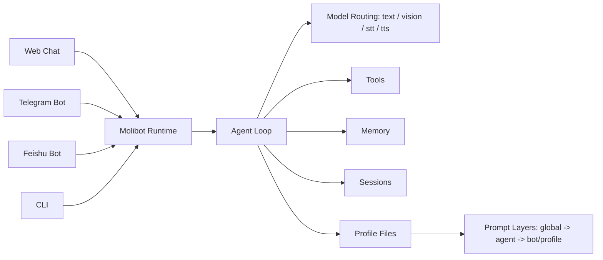
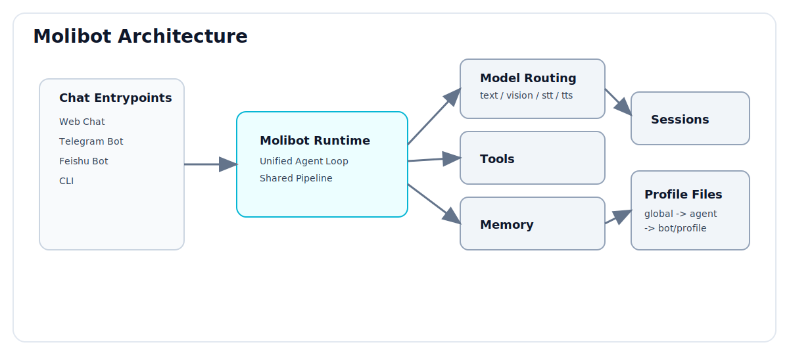

# Molibot

<p align="center">
  
</p>

<h2 align="center">A Simpler OpenClaw-Style Personal AI Assistant</h2>

<p align="center">
  Multi-channel · Agent Profiles · Prompt Layers · Local-First Data
</p>

<p align="center">
  =22" src="https://img.shields.io/badge/node-%3E%3D22-3c873a">
  
  
  
</p>

Molibot 是一个面向个人和小团队的本地优先 AI 助手。  
一套 runtime，同时跑 Web / Telegram / Feishu / CLI，并且共享同一套配置与会话能力。

## Table of Contents

- [Key Highlights](#key-highlights)
- [Architecture](#architecture)
- [Feature Snapshot](#feature-snapshot)
- [Quick Start](#quick-start)
- [First-Time Setup Flow](#first-time-setup-flow)
- [Web Chat Usage](#web-chat-usage)
- [Telegram Commands](#telegram-commands)
- [Settings Pages](#settings-pages)
- [Data Layout](#data-layout)
- [Common Commands](#common-commands)
- [Environment](#environment)
- [Docs](#docs)
- [Current Status](#current-status)

## Key Highlights

- Multi-Channel in One Runtime: `Web + Telegram + Feishu + CLI`
- Profile-Driven Chat: `global -> agent -> bot/profile` prompt layering
- Rich Input Support: text, image, and realtime voice recording (Web)
- Operational Settings UI: AI, agents, profiles, tasks, memory, skills
- Safer Settings Persistence: `settings.json + settings.sqlite` split design

## Architecture



If Mermaid is not rendered in your viewer, use this static diagram:



## Feature Snapshot

- Conversation:
  - Multi-session create/switch/rename/delete
  - Web chat `New Chat` is now profile-only (no user-id confusion)
- Multimodal:
  - Web: image upload + realtime voice recording and send
  - Telegram/Feishu: media/file ingestion
- Configuration:
  - Web Profiles page
  - Telegram / Feishu bot instances
  - Agent library with Markdown prompt files
- AI Routing:
  - Provider management and model routing in `/settings/ai`
  - Runtime model switching and usage tracking
- Operations:
  - Task list and manual trigger/retry
  - Plugin and memory backend controls

## Product Surfaces

| Surface | Current State | Notes |
|---|---|---|
| Web Chat | Ready | Image upload + realtime voice recording + profile-only new chat |
| Telegram | Most validated | Runtime commands, multi-session, model switching, task delivery |
| Feishu | Ready | Bot settings, media/file ingress and outbound handling |
| CLI | Ready | Local terminal conversation entrypoint |

## Quick Start

### 1) Install

```bash
npm install
npm link
```

### 2) Bootstrap

```bash
cp .env.example .env
molibot init
```

### 3) Run

```bash
molibot
# same as: molibot dev
```

Open: `http://localhost:3000`

## First-Time Setup Flow

1. `/settings/ai`: 配置 provider 与模型。
2. `/settings/agents`: 新建 agent（身份层）。
3. `/settings/web`: 新建 Web Profile，并绑定 agent。
4. （可选）配置消息通道：
   - `/settings/telegram`
   - `/settings/feishu`
5. 回到 `/` 开始聊天。

## Web Chat Usage

- `+ New chat`: 只选择 `Web Profile` 创建新会话
- 双击左侧会话名：重命名 session
- 输入区：
  - `+ Image` 上传图片
  - `Record Voice` 录音并自动发送
- `Preview System Prompt`: 查看最终拼装的 system prompt 与来源

## Telegram Commands

- `/chatid`
- `/stop`
- `/new`
- `/clear`
- `/sessions`
- `/sessions <index|sessionId>`
- `/delete_sessions`
- `/delete_sessions <index|sessionId>`
- `/models`
- `/models <index|key>`
- `/models <text|vision|stt|tts>`
- `/models <text|vision|stt|tts> <index|key>`
- `/skills`
- `/help`

## Settings Pages

- `/settings`
- `/settings/ai`
- `/settings/agents`
- `/settings/web`
- `/settings/telegram`
- `/settings/feishu`
- `/settings/memory`
- `/settings/skills`
- `/settings/tasks`
- `/settings/plugins`

## Data Layout

Default data dir: `~/.molibot`

```text
~/.molibot/
  settings.json
  settings.sqlite
  sessions/
  memory/
  skills/
  moli-t/
  moli-f/
  moli-w/
```

- `settings.json`: 稳定配置（bootstrap 类）
- `settings.sqlite`: 动态配置（agents/channels/providers）
- `sessions/`: 会话持久化
- `memory/`: 记忆数据
- `moli-t / moli-f / moli-w`: 通道运行区

## Common Commands

```bash
molibot                 # dev
molibot build           # build
molibot start           # production run
molibot cli             # cli mode
```

Optional service script:

```bash
./bin/molibot-service.sh start
./bin/molibot-service.sh stop
./bin/molibot-service.sh status
./bin/molibot-service.sh restart
```

## Environment

- `PORT` (default `3000`)
- `DATA_DIR` (default `~/.molibot`)
- `SETTINGS_FILE` (default `${DATA_DIR}/settings.json`)
- `SETTINGS_DB_FILE` (default `${DATA_DIR}/settings.sqlite`)
- `AI_PROVIDER_MODE=pi|custom`
- `TELEGRAM_BOT_TOKEN`
- `TELEGRAM_ALLOWED_CHAT_IDS`

See `.env.example` for full list.

## Docs

- `prd.md`: scope and priorities
- `features.md`: delivered features and changelog
- `architecture.md`: architecture notes
- `docs/plugin-development.md`: plugin contract
- `AGENTS.md`: collaboration rules

## Current Status

- Telegram is currently the most validated channel in real usage.
- Web/Feishu/CLI are available and actively iterated.
- If docs and behavior differ, trust `features.md` and current code.
