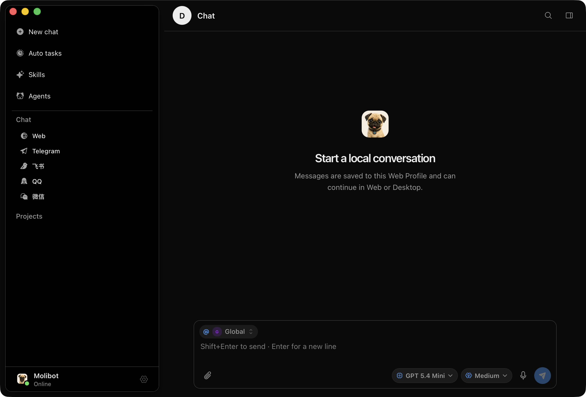
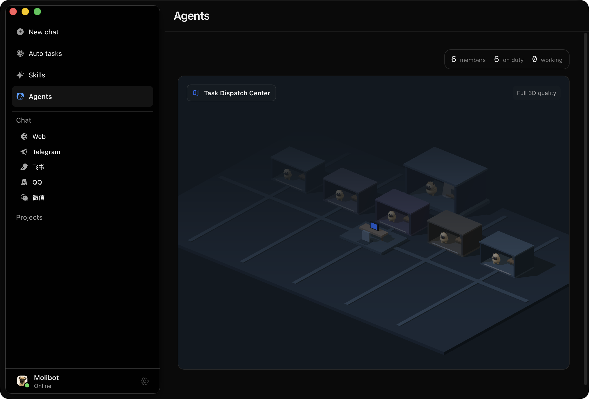
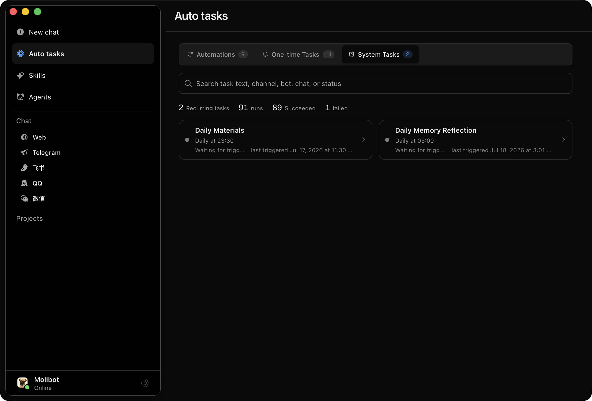
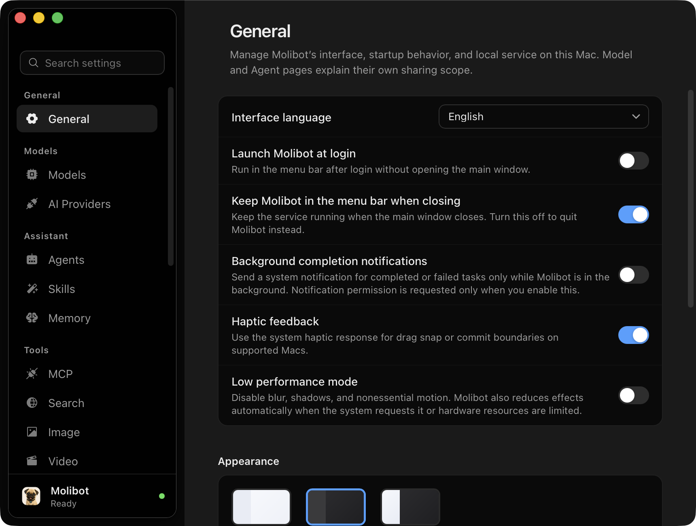
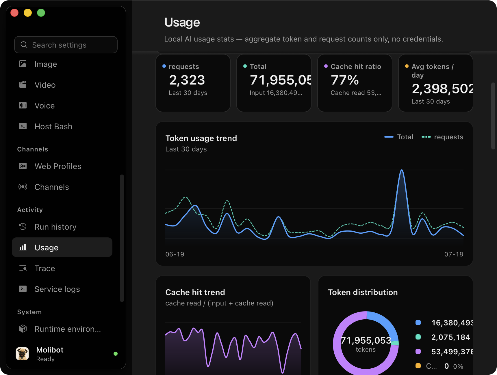

# Molibot

<p align="center">
  <strong>English</strong> · <a href="./readme.zh-CN.md">简体中文</a>
</p>

<p align="center">
  
</p>

<h2 align="center">A memory-first personal AI Agent that grows with your work.</h2>

<p align="center">
  Local-first · Long-running context · Configurable agents · Your data, your control
</p>

<p align="center">
  <a href="https://github.com/gusibi/molibot/releases/latest">
    
  </a>
  <a href="https://deepwiki.com/gusibi/molibot">
    
  </a>
</p>

<p align="center">
  
</p>

Molibot is a local-first personal AI Agent for people who want more than a new chat window. It is built around two promises:

- **Current release.** v2.9.14 (Desktop v0.9.11)

- **Easy to start.** Download the macOS app, pick a model provider, and start chatting — one runtime serves the Desktop app, Web, Telegram, Feishu, Weixin, QQ, and the CLI.
- **Grows with you.** Governed long-term memory, daily memory reflection, and reviewable automations mean the Agent learns your preferences, projects, and habits over time — and you can keep or reject each daily candidate directly from private Telegram or Feishu buttons without opening the app.

## 🚀 Major Features in Latest Upgrade (V2.8+)

This release introduces two major runtime and UI pillars that make Molibot significantly more powerful and extensible:

### 🔌 OpenConnector: Unified Third-Party Integrations
OpenConnector integrates Cloudflare and Molibot to connect external services seamlessly. It enables safe runtime credential configuration and connected-account discovery.
- **Local-First & Secure:** Saved access tokens are kept safely in your local workspace and are never sent in summaries or exposed to standard LLM prompts.
- **Agent Gateway Integration:** When configured, it derives a managed, real-time remote MCP connection for your Agents, automatically registering connected services with zero manual configuration.
- **Category Filter Catalog:** Navigate third-party providers with a responsive, double-column settings interface with category counts, active indicators, and safe homepage deep links.

### 📦 Mini App Platform: Local-First Application Runtime
Molibot now runs **Mini Apps** inside the desktop client and Agent loop, letting you extend the agent's tools and UI.
- **Hosted UI & Unified Runtimes:** Mini Apps run inside a highly locked-down iframe sandbox on a custom local origin, sharing the same state module and SQLite database as their background agent tools.
- **Automated Installation & Provenance:** Install instantly from local folders, `.zip` archives, or GitHub repositories. Manifest and directory checks protect the host system during install and upgrade, and new code activates without restarting Molibot.
- **Unified Composer Integration:** Call installed apps using `@app-id` in the composer (with syntax-highlighted pills) or check the Sidebar's Mini Apps section to view and open recent apps.
- **Explicit Host Bridges:** Apps can contribute message/selection/attachment actions, fill an editable chat draft or attach a file to it without ever sending, jump to a conversation, and use host-routed text/transcription through `ctx.ai` while credentials stay inside Molibot.
- **Results You Can Act On:** A tool result can carry a compact summary card, deep-link back into its own app panel (`molibot://miniapp/<id>/<path>`), and set a quiet unread count or dot on its sidebar row — no system notifications, no interrupting popups.
- **Working Reference Apps:** Todo demonstrates deterministic capture, and the opt-in Meeting Notes app demonstrates retained audio segments, restart recovery, transcription, and generated notes.
- **Developer Scaffolding:** Includes a built-in `miniapp-creator` Skill and Agent template with a runnable template, database WAL mutation, and code scaffolds.

## Why Molibot?

Most AI chats start from scratch. Molibot focuses on the work that accumulates.

- **Remember what matters.** Governed memory keeps useful preferences and project context available, while giving you visibility and control over what is saved and injected.
- **Choose what survives a turn.** Explicit “do not remember”, “not searchable”, and “this turn only” instructions independently control memory, conversation search, and future model context; deleting data remains a separate, target-specific action.
- **Shape your own Agent.** Profiles, Skills, tools, and model routes let you define how an Agent should work instead of relying on one fixed assistant.
- **Keep each conversation on its chosen model.** Chat model selection is Session-scoped and restart-persistent, while Settings remains the explicit place for changing global defaults.
- **Choose model and thinking depth without leaving the composer.** One compact, themed menu replaces separate native dropdowns in Desktop Chat and Project Chat while keeping each Session's model choice intact.
- **Use consistent controls everywhere.** Desktop settings, Project settings, and onboarding share one accessible, theme-aware macOS-style selection menu with independently clickable rows, keyboard navigation, checked state, and enough width for long model names.
- **Verify a model where you configure it.** Each Provider model editor tests its saved connection and keeps the passed/failed result beside the test action inside the dialog, without leaking transient feedback onto the Provider page behind it.
- **Turn repeated Project prompts into readable shortcuts.** Project settings keeps custom commands in one aligned, labeled editor; typing `/` in Project Chat lists them without auto-sending, and controls use a quiet neutral focus treatment instead of blue or nested outlines.
- **Keep Chat context visible without visual noise.** A vertically aligned `# source / title` header distinguishes Web, Feishu, Telegram, QQ, Weixin, and Project conversations; its full passive surface drags the native window, the safely inset compact sidebar shares Settings' `228px` navigation baseline (older narrower saved widths clamp to it), and contextual timestamps add yesterday or the date once a message is no longer from today.
- **Inspect external conversations without duplicated chrome.** Read-only Telegram, Feishu, QQ, and Weixin transcripts combine their source and Desktop read-only state into one quiet footer line.
- **Inspect code like a repository.** The right-side Artifact Inspector now follows a GitHub / Primer workspace language: a source tree on a neutral canvas, flat file tabs, a path/action header, GitHub-colored code/preview surfaces, and recognizable language/media file icons without any online icon fetch. JSON opens as the original highlighted source by default; parsing into a collapsible tree is an explicit action, with bounded fallbacks for large or invalid documents. CSV/TSV and XLS/XLSX files use read-only tables with sheet tabs where applicable, while DOCX and PPTX use lazy read-only document/slide previews. Project file rows stay on one line, Agent-touched files use filename color instead of a separate status dot, Changes rows show per-file `+added / −deleted` counts, and diff gutters scroll with their code.
- **Stay oriented in long sidebars.** Conversation and Project share one sticky first-level title slot, so the visible heading follows the section currently being scrolled without stacking extra chrome.
- **Open Mini Apps like real applications.** Desktop presents manifest icons in the bounded Mini App manager, the recent-first 10-item sidebar section, and Inspector chrome; its sidebar section uses the same compact header rhythm as Conversation and Project, staying transparent in normal flow and showing edge-faded glass only while pinned, while installation, enablement, opening, and removal stay together in one discoverable application-library surface.
- **Build Mini Apps with receipts, not promises.** The Creator builds in Session scratch, runtime-smokes against temporary data, atomically installs through the shared manager, and reads back the installed version and manifest hash before it can report completion.
- **Trust what each message shows.** Desktop transcripts retain provider errors and completed replies with their actual response model, while message links open safely in the system browser without navigating away from Molibot.
- **Navigate long conversations by turn.** Desktop Chat, Project Chat, and external transcripts gain a quiet left-edge user-prompt rail after five turns, with immediate Dock-style hover, a readable user/reply preview, keyboard access, and history-safe streaming.
- **Use each model's real thinking depths.** Built-in models follow pi 0.82's per-model levels; custom models and built-ins without capability metadata expose all seven canonical choices (`off / minimal / low / medium / high / xhigh / max`) without guessed remapping.
- **Configure providers without losing context.** Web and Desktop use the same searchable provider-first workspace, with connection/auth status and a scan-friendly model inventory in one place; newly saved models appear in the Desktop Chat selector immediately without restarting.
- **Recover local MCP tools without restarting Molibot.** Web and Desktop distinguish enabled configuration from the live connection, show disconnect/error details, and provide immediate enable, disable, reconnect, and delete controls. Explicit reconnect now fails honestly when that server remains unavailable, and Session loading checks the requested server rather than aggregate connection counts; Agent tool exposure remains explicitly gated.
- **Explore without destroying history.** Editing and resending an earlier turn in main Chat creates a visible child Session, leaving the original conversation intact.
- **Work where you already are.** Use one local runtime from Web, macOS Desktop, Telegram, Feishu, Weixin, QQ, or the CLI.
- **Diagnose media failures at the shared boundary.** Voice-transcription errors carry safe provider/model, audio, timing, and upstream trace details across every channel without logging credentials or cookies.
- **Keep execution in your hands.** Tasks, approvals, sandbox policy, and run records make automation visible rather than opaque; Desktop resolves Host Bash and high-risk Agent-tool approvals through the same Session-scoped card flow.
- **Manage Agent todos, reminders, and automations as real resources.** Runtime Tasks support create, list, inspect, update, and delete by stable id; unscheduled todos never trigger, and the optional Todo Mini App keeps its own data and never becomes a dependency of the base Agent.
- **Deliver formal documents with a verification receipt.** The Agent can generate DOCX, XLSX, and PDF files in Project or Session scratch, then re-open and validate their text, sheets, and typed cells before it reports success or attaches them; PPTX export remains deferred.
- **Treat a reminder as delivered only when the channel agrees.** Short restart gaps catch up once, expired reminders skip explicitly, offline transports fail visibly, and the live acceptance probe covers Desktop/Web, Telegram, and Feishu without coupling Runtime Tasks to the optional Todo Mini App.
- **Contain third-party runtime failures.** Mini Apps—including Agent-side scratch validation before install—and installed Pi extensions execute outside the service process with memory limits, deadlines, cancellation, and process-tree termination, so an extension exit or infinite loop cannot take down every channel; this is fault isolation, not an OS permission sandbox.
- **Reference Project files without turning UI syntax into a path.** Composer references display as `@[file](path)`, resolve against the registered Project root at runtime, and file-change claims require a successful write/edit receipt.
- **Fail closed when isolation is unavailable.** With Bash sandbox enabled, a missing or failed sandbox blocks the command instead of running it on the host. Host execution requires either an explicit sandbox-off choice or Host Bash approval.
- **Filter and inspect operational logs without reading a wall of text.** Desktop Service Logs separates LLM calls, tool use, Subagent work, severity, status, and Run correlation; every row opens full pretty JSON or original text while long IDs stay compact in the list. The active file rolls automatically at 20 MiB with five retained archives, independently of SQLite Trace.
- **Let long work fail safely.** Parent and delegated budgets are separate, completed tool results survive context recovery, and interrupted inbound tasks wait for an explicit retry instead of disappearing or replaying side effects automatically.
- **Reject oversized context before it reaches a model.** The Runtime budgets the final system prompt, tools, history, and current turn, compacts or caps only the model-facing copy when needed, and preserves the user's original message for audit.
- **Control messages sent during a running task with one tap.** Telegram and Feishu queue the new message and show Stop / Steer buttons: stop the current work or inject that exact message immediately, without copying queue IDs or typing commands. Feishu immediately acknowledges the click and replaces the card with the final result, falling back to a text receipt if card updating fails. Once accepted, the injected text also survives provider timeouts and whole-attempt retries instead of disappearing before the successful response.
- **Keep every completed reply.** When one Agent run produces a primary answer plus terminal supplements, Chat displays each one instead of letting the last message hide an earlier complete result; tool-loop progress remains compact.
- **Keep the data local.** Your runtime, configuration, conversations, and operational state stay on infrastructure you control.

## Quick start

### Option A · Download the macOS app (recommended)

1. Download the latest `Molibot_*.dmg` from [Releases](https://github.com/gusibi/molibot/releases/latest) (Apple Silicon).
2. Open the app. Molibot starts its local runtime automatically — no terminal setup required.
3. In **Settings → AI Providers**, use **Sign in now** for a supported account (including Kimi Coding, ChatGPT/Codex, Claude, Copilot, OpenRouter, Radius, and xAI), or add an API key.
4. Start chatting with Momo, the first-use default Agent. The app can also live in the menu bar and keep running in the background.

### Option B · Run from source

Requires Node.js 22.19 or newer. The macOS Desktop release bundles the project's pinned Node 22.23.1 runtime automatically.

```bash
corepack enable
pnpm install
pnpm link --global

cp .env.example .env
molibot init
molibot
```

Then open `http://localhost:3000`, configure an AI provider, and create or confirm an Agent before starting a chat.

Molibot uses pi-mono 0.82 through one shared server runtime: built-in model catalogs, API-key/OAuth resolution, main and sub-Agent streaming, compaction, and readable context identity share the same upper-layer boundary. New ordinary Sessions use `s-YYYYMMDD-xxxx` across App/Web, Projects, and channels; automation contexts use `t-YYYYMMDD-xxxx`, while existing legacy ids remain readable. OAuth-capable providers can be connected from Web or Desktop Settings with browser, device-code, or manual-redirect flows; regular Moonshot global/China endpoints continue to use `MOONSHOT_API_KEY`, while Kimi subscription login uses `kimi-coding`. Custom OpenAI-compatible and Anthropic-compatible endpoints remain isolated to their saved Bot/settings snapshot, while system instructions stay in pi's top-level context instead of being serialized as transcript messages. OpenAI-compatible requests choose `system` or `developer` from the selected custom model's saved `supportedRoles`, not from SDK URL heuristics.

For provider configuration, channels, deployment, and environment variables, see the [documentation](#documentation).

## A look inside

### One workspace for all your Agents

Every Agent gets a place in Agent City — see at a glance who is on duty and working, then point at a floor to inspect that Agent's live details.

<p align="center">
  
</p>

### An Agent that learns you, on a schedule

System tasks like **Daily Memory Reflection** review recent conversations and distill durable memories — so the Agent gets more useful the more you use it. The configured private Telegram or Feishu destination receives the usual summary followed by numbered Keep / Don't keep cards; other channels and group chats never receive candidate content. Your own automations and one-time tasks live alongside them, with full run history.

<p align="center">
  
</p>

### Settings that stay understandable

Language, startup behavior, menu-bar mode, notifications, and appearance — all in plain terms, with each page explaining its own sharing scope. Form controls use one standard size, and time fields open the host-native picker when available. Memory Reflection and Daily Materials share one authorized Telegram/Feishu completion destination, configurable from either plugin card while keeping separate notification switches.

<p align="center">
  
</p>

### Know exactly what your Agent costs

A local usage dashboard tracks requests, token trends, cache hit ratio, and token distribution — aggregate counts only, no credentials ever leave your machine. Range/model/Bot/channel controls keep a compact, evenly spaced filter row without overlapping at the supported minimum window, while Trace puts exact diagnostic IDs behind a low-emphasis optional “More filters” disclosure.

<p align="center">
  
</p>

## What you can do today

| Capability | What it gives you |
| --- | --- |
| [Personal Agent and Memory](docs/features/personal-agent-and-memory.md) | Momo as the first-use default, built-in Agent templates including Workplace English Coach, governed long-term memory, and isolated project or Agent context. |
| [Channels and Surfaces](docs/features/channels-and-surfaces.md) | One local runtime across browser, macOS Desktop, chat channels, and the terminal. |
| [Tools, Skills, and MCP](docs/features/tools-skills-and-mcp.md) | Configurable Agent behavior, guarded web access, route-driven image/OCR analysis, PDF/DOCX/XLSX extraction, and controlled access to reusable workflows and external tools. |
| [Assistant Capability Matrix](docs/requirements/personal-assistant-capability-matrix.md) | The single current four-state view of delivered, partial, pending-verification, and not-started work/life assistant capabilities. |
| [Automatic Durable Execution](docs/requirements/automatic-durable-execution-prd.md) | Persistent, inspectable long-task foundation with tiered lazy promotion, virtual Web profile routing, versioned progress, side-effect receipts, fail-closed recovery, bounded untrusted evidence reads, source-channel approvals, short-handle controls, and Desktop status surfaces; full cold-start/cross-channel acceptance remains in progress. |
| [OpenConnector](docs/requirements/openconnector-cloudflare-and-molibot-plan.md) | Connect third-party services with secure runtime tokens and dynamic remote MCP integration. |
| [Mini App Platform](docs/guides/miniapps/authoring.md) | Build local-first apps with tools, hosted UI, message actions, the composer bridge, controlled uploads and host AI. |
| [Automation, Approvals, and Sandbox](docs/features/automation-approvals-and-sandbox.md) | Scheduled work and execution controls that stay inspectable and reviewable. |
| [Desktop Project Workspace](docs/features/desktop-project-workspace.md) | Native macOS chat, projects, files, Agent City, automations, and Settings in one local workspace, with one stable live reply per Project turn and Finder-style native sidebar materials. |

OpenConnector is available in Desktop under **Settings → Tools → OpenConnector**. Its connection settings stay collapsed until needed; the compact local-cached catalog exposes category counts, active services, and Provider logos, supports explicit manual refresh and saved-token reveal/hide, opens Provider setup, and exposes the real-time managed remote MCP to Agents through the bundled read-only Skill. See the [deployment and integration design](docs/requirements/openconnector-cloudflare-and-molibot-plan.md).
The Provider directory uses a readable two-column layout with one compact search/status/multi-category filter row; selecting several categories includes Providers from any selected category.
Each Provider owns its card boundary, so odd result counts leave a clean empty column instead of drawing an empty row cell.
Provider identity stays left-aligned while connection state and management actions form a consistent right-aligned group.
When OpenConnector supplies a Provider homepage, its logo and name open that official site in the system browser.
When enabled and configured, the derived `open-connector` service also appears in **Settings → Tools → MCP** with its live connection state and a Managed label. Reconnect is available there; configuration remains owned by the OpenConnector page.

Project runs generate `SYSTEM_PROMPT.preview.md` in the Project's Molibot workspace. Its header lists only effective prompt sources: Project rules come from `AGENTS.md`, `AGENT.md`, or `CLAUDE.md`; runtime context retains `USER.md` but excludes Bot/Agent identity and persona profiles.
When a user explicitly invokes a Skill, that choice takes precedence over automatic outcome routing; otherwise media, current-information, and scheduling requests use their dedicated runtime tools before generic Skill discovery.

## How Molibot grows with you

Momo is Molibot's example of the experience this project is building toward: a personal Agent that learns your working context, remembers the projects you return to, and becomes more useful through review and feedback.

Concretely, the loop works like this:

1. **You just chat and work** — across Desktop, Web, or any connected channel, in shared or isolated contexts.
2. **Molibot reflects daily** — system tasks review recent conversations and propose durable memories about your preferences, projects, and habits.
3. **You stay in control** — memory is governed: you can inspect, edit, and delete what is saved, and see what gets injected into each conversation.
4. **The Agent gets sharper** — future conversations start with the context that matters, instead of from zero.

The current runtime already supports durable sessions, memory governance, configurable Agent profiles, tools, tasks, and human control. The next growth-plan experiments build on that foundation with a visible Agent growth log and human-reviewed content candidates. Those experiments are not automatic publishing features, and they are not required to use Molibot.

## Available surfaces

| Surface | Use it for |
| --- | --- |
| macOS Desktop | Native chat, project workspaces, files, automations, and Settings with WKWebView-safe, Finder-calibrated Light sidebar material plus AppKit-derived semantic colors across Light, Dark, and System appearances. |
| Web | Browser chat, Settings, and session access. |
| Telegram | Personal chat access, runtime controls, and file delivery. |
| Feishu | Personal chat access with channel-native media and interaction support. |
| Weixin | Local personal conversations and media delivery. |
| QQ | Local chat access with rich message and media support. |
| CLI | Terminal-based local conversations. |

Conversations follow you: a chat started on the Web can continue on Desktop, and channel sessions share the same local runtime and memory.

## Documentation

### Get started

- [Feature overview](docs/features/)
- [Documentation map](docs/README.md)
- [Environment reference](.env.example)
- [Daily materials guide](docs/guides/daily-materials.md)
- [Session control commands](docs/guides/session-control/session-control-commands.md)
- [Automatic Durable Execution PRD](docs/requirements/automatic-durable-execution-prd.md)

### Build and extend

- [Architecture](docs/designs/architecture/v1-architecture.md)
- [Agent runtime design](docs/designs/architecture/agent-redesign-v2.2.md)
- [Memory namespace and turn-retention decision](docs/adr/0001-memory-namespace-and-turn-retention.md)
- [Plugin authoring](docs/guides/plugins/plugin-authoring.md)
- [Mini App authoring](docs/guides/miniapps/authoring.md) — build in scratch, validate the Runtime, and atomically install an app with its own agent tools, UI and data
- [Mini App shortcuts](docs/guides/miniapps/authoring.md#using-an-installed-mini-app) — use `/miniapps` to list apps, then `@app-id` to target one directly for a turn
- [Deferred tool authoring](docs/guides/tools/deferred-tool-authoring.md)
- [Agent development series](docs/agent-dev-series/README.md)

### Track the project

- [Current feature record](features.md)
- [Product roadmap](prd.md)
- [Release notes](CHANGELOG.md)
- [UI Design Guidelines](DESIGN.md) & [Dark Theme Spec](design.dark.md)
- [Collaboration and contribution rules](AGENTS.md)

## Current boundaries

- The desktop app currently ships for macOS on Apple Silicon; other platforms can run from source.
- Molibot is designed for local, single-owner deployments. Configure your own model provider and credentials.
- Channel behavior depends on the credentials and integrations you enable locally.
- Treat destructive, credential-bearing, and public actions as reviewed workflows until you have validated them in your own environment.
- Momo's growth-log and content-candidate experiments are under development. Molibot does not publish to external social platforms by default.

## License and support

Use GitHub Issues for bug reports and feature requests, and GitHub Discussions for questions and ideas.
